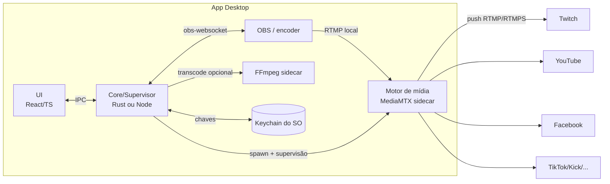

# Multi-Stream Studio — Planejamento de Desenvolvimento

> Documento de planejamento técnico e de produto para transformar o atual setup de
> *restream* baseado em `nginx-rtmp` + Docker em um **aplicativo desktop multiplataforma**
> que torne a configuração de multi-streaming **intuitiva, eficiente, bonita e didática**.

- **Status:** Rascunho para discussão (v0.1)
- **Data:** 2026-06-22
- **Autor/Responsável:** Pitrol
- **Público-alvo do app:** streamers (do iniciante ao semiprofissional) que querem transmitir
  simultaneamente para Twitch, YouTube, Facebook, TikTok, Kick etc. sem editar arquivos de configuração.

---

## 1. Sumário executivo

Hoje o projeto é um relay RTMP funcional, porém **operado por arquivo de texto**: o streamer
precisa editar `nginx.conf`, conhecer URLs RTMP de cada plataforma, ter Docker e configurar o
OBS manualmente. Funciona, mas a barreira de entrada é alta e não há feedback de status.

A proposta é um **app desktop (Windows/macOS/Linux)** que encapsula toda essa complexidade:

- Cadastro visual de plataformas com **presets prontos** (URLs corretas, RTMP/RTMPS).
- **Armazenamento seguro** das stream keys no cofre do sistema operacional (nada de chave em texto puro).
- **Motor de mídia embutido** (sem exigir Docker): o app sobe e supervisiona o relay sozinho.
- **Assistente de configuração do OBS** (didático) — inclusive auto-configuração via obs-websocket.
- **Painel de status ao vivo**: o que está no ar, bitrate, frames perdidos, uptime, reconexão.
- **Calculadora/alerta de banda de upload**, o principal limitante do restream local.

> **Recomendação de stack (resumo):** **Tauri 2 + React/TypeScript** para o app, **MediaMTX**
> (embutido como *sidecar*) como motor de ingestão/relay, **FFmpeg** (sidecar) para transcodificação
> opcional por plataforma. Detalhes e alternativas nas seções 5 e 6.

---

## 2. Estado atual (análise dos arquivos)

| Arquivo | Função | Limitação |
|---|---|---|
| `nginx.conf` | Servidor RTMP que recebe 1 stream e dá `push` para N plataformas | Config estática; precisa editar à mão; sem RTMPS nativo; módulo `nginx-rtmp` praticamente sem manutenção |
| `docker-compose.yml` | Sobe `tiangolo/nginx-rtmp` na porta 1935 | Exige Docker instalado e rodando |
| `START_SERVICE.bat` / `STOP.bat` | `docker-compose up -d` / `down` | Só Windows; zero feedback de status |

**Fluxo atual do streamer:**

```
OBS ──rtmp://localhost:1935/multi_live──▶ nginx-rtmp ──push──▶ Twitch
                                                        ──push──▶ YouTube
                                                        ──push──▶ (Facebook/TikTok comentados)
```

**Dores identificadas (que o app precisa eliminar):**

1. Editar `nginx.conf` manualmente é intimidador e propenso a erro.
2. É preciso saber a URL de ingestão e o formato da chave de cada plataforma.
3. Dependência de Docker.
4. Sem validação ("a chave está certa?"), sem status ("estou no ar?").
5. Sem liga/desliga por plataforma sem reeditar config e reiniciar.
6. **Facebook hoje exige RTMPS** (TLS) — o `nginx-rtmp-module` não suporta RTMPS nativamente
   (precisa de `stunnel` como gambiarra). A linha comentada com `rtmp://...:80` do Facebook
   **não funcionaria** atualmente. Forte argumento para trocar o motor.

---

## 3. Visão de produto

### 3.1 Princípios de UX
- **Didático por padrão:** todo passo explica *o que* e *por quê*, com botões de "copiar" e tooltips.
- **Zero terminal:** nenhuma etapa exige linha de comando ou editar arquivos.
- **Feedback imediato:** status verde/amarelo/vermelho por plataforma, em tempo real.
- **Falha graciosa:** se uma plataforma cai, as outras continuam; reconecta sozinho.
- **Honestidade técnica:** avisar sobre banda de upload antes de o usuário descobrir do jeito ruim.

### 3.2 Personas
- **Iniciante:** nunca configurou RTMP. Precisa de wizard e auto-config do OBS.
- **Hobbyista recorrente:** quer perfis salvos e liga/desliga rápido por plataforma.
- **Semipro:** quer bitrate/resolução por plataforma (transcodificação) e métricas.

### 3.3 Jornada-alvo (do download ao "no ar")
```
Instalar ▶ Onboarding ▶ Adicionar plataformas (presets + colar chave)
        ▶ Testar conexão ▶ Configurar OBS (manual guiado OU automático)
        ▶ Iniciar relay ▶ Painel ao vivo ▶ Encerrar
```

---

## 4. Escopo de funcionalidades

### 4.1 MVP (v1) — "substituir o nginx.conf com dignidade"
- [ ] Gerenciar plataformas de destino (adicionar/editar/remover/ativar-desativar).
- [ ] **Presets** de plataforma: Twitch, YouTube, Facebook (RTMPS), Kick, TikTok, X/Twitter, Instagram, **Custom RTMP**.
- [ ] Armazenamento **seguro** das stream keys (keychain do SO).
- [ ] Motor de relay embutido (passthrough, sem reencode) — **sem Docker**.
- [ ] Endpoint de ingestão local fixo + **wizard de configuração do OBS** (copiar URL/chave).
- [ ] Iniciar/parar relay; painel de status por plataforma (conectado, uptime, bitrate, reconexões).
- [ ] **Calculadora de banda**: soma dos bitrates × nº de plataformas, com alerta.
- [ ] Bandeja do sistema (tray) + iniciar minimizado.

### 4.2 v1.x
- [ ] **Auto-configuração do OBS** via `obs-websocket` (define serviço/URL/chave e até inicia o stream).
- [ ] Perfis ("Live de sexta", "Podcast") com conjuntos diferentes de destinos.
- [ ] i18n (PT-BR + EN), tema claro/escuro.
- [ ] Teste de banda de upload integrado + recomendação de bitrate.
- [ ] Auto-update assinado.

### 4.3 v2 (avançado)
- [ ] **Transcodificação por plataforma** (resolução/bitrate diferentes via FFmpeg) — ex.: TikTok vertical 720p, YouTube 1080p.
- [ ] **Modo cloud relay** ("traga seu VPS"): provisiona/configura um servidor remoto para o fork
      acontecer na nuvem e **não estourar o upload doméstico** (ver §7).
- [ ] Suporte a **SRT** como ingestão (mais resiliente que RTMP em redes ruins).
- [ ] Sobreposição de chat unificado / métricas de espectadores por plataforma (via APIs oficiais).
- [ ] Gravação local simultânea (arquivo de backup).

### 4.4 Fora de escopo (explicitamente)
- Compositing/cenas de vídeo (isso é trabalho do OBS — não vamos reinventar).
- Mixagem de áudio avançada.
- Hospedagem gerenciada paga (podemos integrar serviços, não virar um).

---

## 5. Arquitetura proposta

### 5.1 Componentes



- **UI:** camada visual (web tech), responsável por toda a experiência.
- **Core/Supervisor:** orquestra o motor, lê/grava config, fala com o keychain e com o OBS,
  monitora saúde e reinicia processos.
- **Motor de mídia (sidecar):** recebe o stream do OBS e replica para os destinos.
- **FFmpeg (sidecar):** apenas quando o usuário pedir qualidade diferente por plataforma.

### 5.2 Por que "motor como sidecar" e não Docker
- Elimina a dependência de Docker (maior atrito de instalação para o público-alvo).
- Binário único embarcado, multiplataforma, com ciclo de vida controlado pelo app.
- Permite status/estatísticas via API do motor, em vez de "fé no `docker logs`".

### 5.3 Modelo de dados (config)
```jsonc
{
  "ingest": { "protocol": "rtmp", "host": "127.0.0.1", "port": 1935, "app": "live", "key": "obs" },
  "profiles": [{
    "id": "default",
    "name": "Live padrão",
    "targets": [
      { "platform": "twitch",  "enabled": true,  "url": "rtmp://live.twitch.tv/app",  "keyRef": "vault://twitch" },
      { "platform": "youtube", "enabled": true,  "url": "rtmp://a.rtmp.youtube.com/live2", "keyRef": "vault://youtube" },
      { "platform": "facebook","enabled": false, "url": "rtmps://live-api-s.facebook.com:443/rtmp", "keyRef": "vault://facebook" }
    ],
    "transcode": { "enabled": false }
  }]
}
```
> As **chaves nunca ficam no JSON**: só uma referência (`keyRef`); o valor real vive no cofre do SO.

---

## 6. Análise de stacks e tradeoffs

### 6.1 Framework do app desktop

| Critério | **Tauri 2** (recomendado) | **Electron** | **Flutter Desktop** | **Wails (Go)** | **Avalonia (.NET)** |
|---|---|---|---|---|---|
| Linguagem core | Rust | Node/JS | Dart | Go | C# |
| UI | Webview do SO + web stack | Chromium embutido + web stack | Renderizador próprio (Skia) | Webview + web stack | XAML nativo |
| Tamanho do binário | ~3–10 MB | ~85–150 MB | ~20–40 MB | ~8–20 MB | ~30–60 MB |
| Uso de memória | Baixo | Alto | Médio | Baixo | Médio |
| Gerência de *sidecar* (FFmpeg/MediaMTX) | **Excelente** (suporte nativo a binários externos) | Boa (`child_process`) | Manual/possível | Boa | Boa |
| Acesso a keychain do SO | Plugins oficiais | `keytar`/`safeStorage` | Pacotes da comunidade | Libs Go | Libs .NET |
| Maturidade desktop | Alta (2.x) | **Altíssima** | Média | Média | Alta |
| Curva de aprendizado | Média (Rust no core) | **Baixa** | Média | Baixa-média | Média |
| Consistência visual entre SOs | Boa (varia: WebView2/WKWebView/WebKitGTK) | **Altíssima** (mesmo Chromium) | **Altíssima** (pixel-perfect) | Boa | Alta |
| "Bonito" com pouco esforço | Alto (qualquer lib web) | Alto | **Altíssimo** | Alto | Médio-alto |

**Recomendação:** **Tauri 2**. Razões: app leve e eficiente (requisito explícito), gestão de
*sidecars* de primeira classe (essencial para embutir MediaMTX/FFmpeg), cofre seguro e auto-update
prontos. Como o core de mídia é um processo externo, o "peso" do Rust no nosso código é pequeno —
a maior parte da lógica vive na UI.

**Fallback pragmático:** **Electron**, se o time já dominar Node e quiser velocidade máxima de
desenvolvimento e consistência visual idêntica entre SOs — ao custo de binário grande e mais RAM.

**Curinga "bonito":** **Flutter** se a prioridade nº 1 for UI premium e animada e o time topar Dart;
o atrito está na integração com processos nativos (FFmpeg/MediaMTX) e keychain.

### 6.2 Motor de mídia (o coração do relay)

| Opção | Como funciona | Prós | Contras |
|---|---|---|---|
| **MediaMTX** (recomendado) | Servidor de mídia em Go, binário único. Recebe RTMP/RTMPS/SRT e republica para destinos (via `runOnReady`→FFmpeg ou forward nativo) | Mantido ativamente; **RTMPS/SRT/WebRTC/HLS**; binário multiplataforma; API e hooks de status | Forward para múltiplos destinos normalmente orquestra FFmpeg por trás |
| **FFmpeg puro (tee)** | `ffmpeg -i <ingest> -c copy -f tee "[f=flv]rtmp://...|[f=flv]rtmps://..."` | Onipresente; transcodificação trivial; **RTMPS** ok; controle total via args | Modo "ouvir RTMP" (`-listen 1`) é frágil para reconexão; reconectar = relançar processo |
| **nginx-rtmp** (atual) | Módulo RTMP no nginx | Battle-tested; HLS | Módulo estagnado; **sem RTMPS nativo**; config estática; rebuild/Docker |
| **Node Media Server** | Servidor RTMP em Node (npm) | Trivial de embutir no Electron | Menos performático; projeto menor |
| **SRS / OvenMediaEngine** | Servidores de mídia robustos | Muito poderosos | Pesados; orientados a servidor, não a desktop |

**Recomendação:** **MediaMTX como ingestão + relay passthrough** (cópia de stream = zero perda de
qualidade e CPU baixíssima), com **FFmpeg sidecar acionado só quando o usuário quiser transcodificar**
por plataforma. Isso mata a dependência de Docker, resolve RTMPS (Facebook/Kick) e abre caminho para SRT.

> **Passthrough vs. transcodificação:** no passthrough, o mesmo pacote codificado é copiado para todos
> os destinos — leve, mas todos recebem a mesma qualidade que sai do OBS. A transcodificação por
> plataforma custa CPU/GPU, mas permite, p.ex., enviar 1080p60 ao YouTube e 720p vertical ao TikTok.

### 6.3 Demais escolhas

| Camada | Recomendado | Alternativas | Observação |
|---|---|---|---|
| UI lib | React + TypeScript | Svelte, Vue, SolidJS | TS pela robustez; React pelo ecossistema |
| Componentes/estilo | Tailwind + shadcn/ui (Radix) | Mantine, Chakra, MUI | "Bonito" e acessível com baixo esforço |
| Animação | Framer Motion | GSAP | Microinterações didáticas |
| Estado | Zustand | Redux Toolkit, Jotai | Simples e suficiente |
| Cofre de chaves | Plugin keychain do Tauri / `keytar` | Stronghold (Tauri) | **Nunca** texto puro |
| Integração OBS | `obs-websocket-js` (v5) | — | OBS 28+ já traz o servidor WebSocket |
| Empacotamento/updates | Tauri updater | electron-updater | Exige **assinatura de código** (ver §10) |
| Testes | Vitest + Playwright | Jest | E2E cobrindo o fluxo "no ar" |

---

## 7. O elefante na sala: banda de upload

No **restream local**, o app recebe 1 stream do OBS (tráfego de *loopback*, praticamente grátis) e
**envia N cópias** para a internet. O upload necessário é a **soma dos bitrates de todos os destinos ativos**:

```
upload necessário ≈ Σ (bitrate de cada plataforma ativa)
Ex.: 3 plataformas a 6 Mbps  ≈ 18 Mbps de upload sustentado
```

Isso é uma limitação **física**, não de software. O app precisa ser honesto sobre isso:

- **Calculadora/alerta de banda** no MVP (some os bitrates ativos e compare com um teste de upload).
- Sugerir reduzir bitrate ou nº de plataformas quando o upload não comporta.
- **Modo cloud relay (v2):** OBS envia **um único** stream para um servidor na nuvem (MediaMTX/FFmpeg
  num VPS) e **o fork acontece lá**, onde a banda é farta. Resolve o gargalo doméstico ao custo de
  hospedagem.

### Arquiteturas de restream — tradeoffs

| Arquitetura | Upload doméstico | Custo recorrente | Controle/privacidade | Complexidade |
|---|---|---|---|---|
| **Relay local** (foco do app) | Alto (N×) | Zero | Total | Baixa |
| **Cloud relay próprio** (VPS) | Baixo (1×) | VPS (~US$/mês) | Alto | Média (provisionamento) |
| **SaaS de restream** (ex.: serviços gerenciados) | Baixo (1×) | Assinatura | Menor | Baixíssima (mas terceiriza) |

O app pode começar **local** (v1) e evoluir para oferecer o **modo "traga seu VPS"** (v2),
cobrindo os dois mundos sem virar um SaaS.

---

## 8. Integração com plataformas (presets)

| Plataforma | Protocolo | URL de ingestão (exemplo) | Notas |
|---|---|---|---|
| Twitch | RTMP | `rtmp://live.twitch.tv/app` | Há *ingests* regionais; permitir seleção |
| YouTube | RTMP | `rtmp://a.rtmp.youtube.com/live2` | Chave por transmissão; backup ingest disponível |
| Facebook Live | **RTMPS** | `rtmps://live-api-s.facebook.com:443/rtmp` | RTMP puro **descontinuado**; precisa TLS |
| Kick | **RTMPS** | fornecido no painel do criador | TLS |
| TikTok Live | RTMP | fornecido (acesso ao Live exige elegibilidade) | Chave nem sempre é auto-serviço |
| X (Twitter) | RTMP/RTMPS | fornecido pelo Media Studio | — |
| Instagram | — | sem ingestão RTMP oficial estável | Tratar como "não suportado/experimental" |
| Custom | RTMP/RTMPS/SRT | definido pelo usuário | Campo livre + validação |

> Os presets reduzem erro humano, mas **URLs mudam**: tratar a lista de presets como **dado
> atualizável remotamente** (um JSON versionado baixado pelo app), não hard-coded no binário.

---

## 9. Roadmap por fases

| Fase | Objetivo | Entregáveis-chave | Critério de pronto |
|---|---|---|---|
| **0 — Prova de conceito** | Validar motor sem Docker | Spawnar MediaMTX/FFmpeg como sidecar e dar fork para 2 plataformas | Stream chega no ar em 2 plataformas a partir do app |
| **1 — MVP** | Substituir o `nginx.conf` | Config visual, cofre de chaves, relay passthrough, status, calculadora de banda, wizard OBS manual | Streamer leigo coloca 3 plataformas no ar sem tocar em arquivo |
| **2 — Polimento** | "Uau" e conforto | Auto-config OBS (websocket), perfis, i18n PT/EN, temas, auto-update assinado | Onboarding < 5 min; updates automáticos |
| **3 — Avançado** | Poder e escala | Transcodificação por plataforma, modo cloud relay (VPS), SRT, gravação local | Qualidade por plataforma + opção de não estourar upload |

---

## 10. Riscos e mitigações

| Risco | Impacto | Mitigação |
|---|---|---|
| **Banda de upload** insuficiente (N×) | Alto | Calculadora/alerta no MVP; modo cloud relay na v2 |
| **Assinatura de código** (custo/burocracia: certificado Windows, Apple Developer) | Médio | Orçar cedo; sem assinatura, SmartScreen/Gatekeeper assustam o usuário |
| **Licenciamento do FFmpeg** (LGPL/GPL conforme build) | Médio | Usar build LGPL e documentar; isolar como processo externo, não linkar |
| **URLs/regras de plataforma mudam** (ex.: Facebook→RTMPS) | Médio | Presets como JSON remoto versionado; testes de conexão |
| **Inconsistência de webview entre SOs** (se Tauri) | Baixo-médio | QA por plataforma; evitar CSS exótico; fallback Electron documentado |
| **TikTok/Instagram** sem chave auto-serviço | Baixo | Marcar como "manual/experimental"; não prometer o que a plataforma não entrega |
| **Suporte/expectativa** de virar SaaS | Baixo | Escopo claro: ferramenta local + "traga seu VPS", não hospedagem gerenciada |

---

## 11. Decisões

### 11.1 Decididas (2026-06-22)
1. **Framework:** ✅ **Tauri 2 + React/TypeScript** — prioridade em app leve e eficiente, com gestão nativa de sidecars.
2. **SO no v1 (MVP):** ✅ **Windows-first** — foco no público atual (os `.bat` são Windows); macOS/Linux nas fases seguintes.
3. **Modelo:** ✅ **Gratuito / open-source** — ferramenta local livre, sem infra recorrente.

**Implicações dessas decisões:**
- **Open-source:** escolher licença cedo (ex.: MIT/Apache-2.0 para o app) e **manter o FFmpeg como processo
  externo** (não linkado) para conviver com a licença LGPL/GPL dele. Repositório público desde a Fase 0.
- **Windows-first:** priorizar **WebView2** (já presente no Win 11) e empacotamento **MSI/NSIS**; ainda assim,
  escrever o código de forma **portável** (sem APIs exclusivas de Windows no core) para não bloquear macOS/Linux depois.
- **Gratuito:** **modo cloud relay** deixa de ser produto pago e passa a ser **"traga seu VPS"** (config assistida,
  sem billing). O foco do app continua sendo o **relay local**.
- **Assinatura de código (Windows):** mesmo gratuito, vale orçar um certificado para evitar o alerta do SmartScreen;
  alternativa inicial é distribuir não assinado e documentar o aviso.

### 11.2 Ainda em aberto
1. **Auto-config do OBS** (via obs-websocket): entra já no MVP ou fica para v1.x? Alto valor didático, custo médio.
2. **Nome e identidade visual** do app (requisito "bonito" começa aqui).

---

## 12. Próximos passos imediatos

1. Fechar as **decisões em aberto** (§11) — sugiro um rápido alinhamento.
2. **Fase 0 (spike):** protótipo que sobe MediaMTX como sidecar e faz fork para 2 plataformas,
   provando o caminho "sem Docker".
3. Definir a **identidade visual** (nome, logo, paleta) — o requisito "bonito" começa aqui.
4. Esqueleto do projeto (Tauri + React + Tailwind/shadcn) com a tela de "Plataformas" e o cofre.

---

### Apêndice A — Equivalência com o setup atual

| Hoje (`nginx.conf`) | No app |
|---|---|
| `application multi_live { live on; }` | Endpoint de ingestão local (configurável) |
| `push rtmp://live.twitch.tv/app/KEY;` | Destino "Twitch" (preset) + chave no cofre |
| Editar arquivo + `docker-compose up` | Botões "Adicionar plataforma" + "Iniciar" |
| Facebook comentado em `rtmp://...:80` | Preset Facebook **RTMPS:443** funcional |
| Sem status | Painel ao vivo por plataforma |
