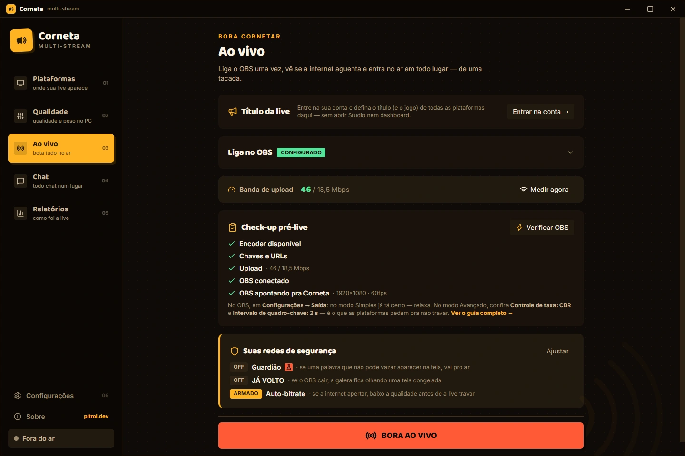
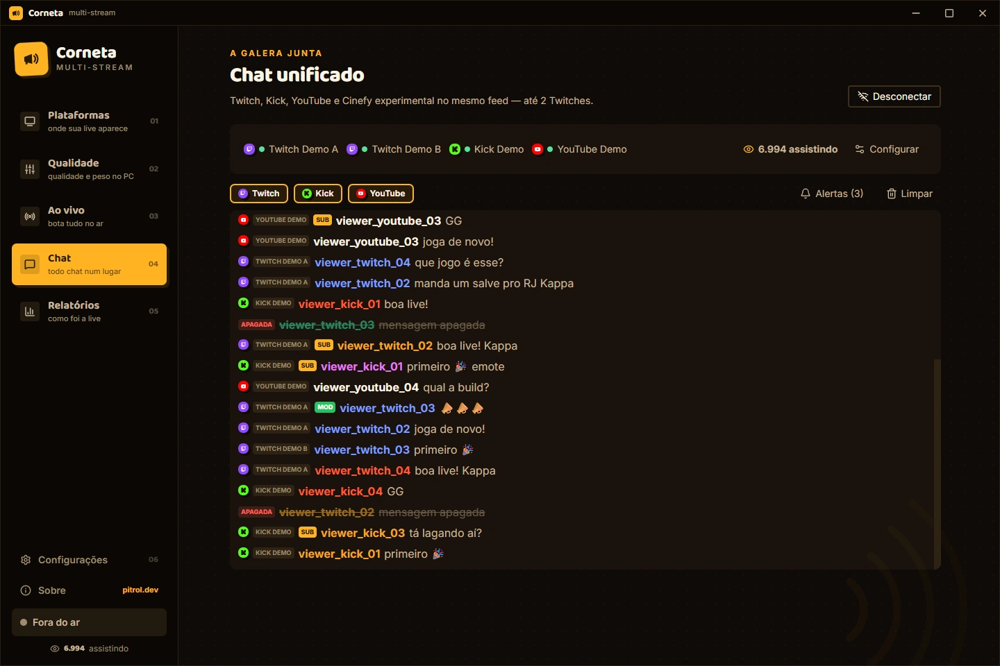
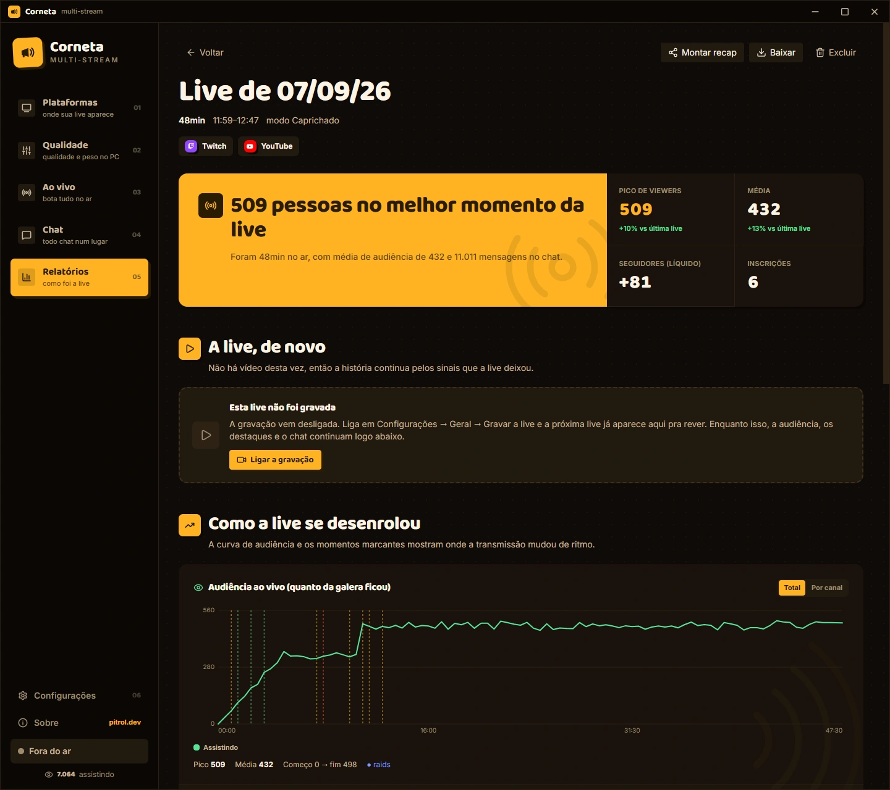

<p align="center">
  
</p>

<a name="corneta"></a>
<h1 align="center">Corneta</h1>

<p align="center">
  <strong>A sua live, do primeiro sinal ao último replay.</strong><br>
  Transmita do OBS para várias plataformas, reúna o chat e reviva os melhores momentos.<br>
  Um app no seu PC, com código aberto.
</p>

<p align="center">
  <a href="#conheça-a-corneta">Conheça</a> ·
  <a href="#testar-sem-rust-obs-ou-contas">Experimente</a> ·
  <a href="#desenvolva-e-contribua">Contribua</a> ·
  <a href="#documentação">Documentação</a>
</p>

> **Windows x64 · Código aberto.** [Experimente a demo](#testar-sem-rust-obs-ou-contas) ou veja [como usar na sua live](#quero-usar-na-minha-live).

[](docs/images/readme/live.webp)

_Interface real da versão 0.7.0 em modo de demonstração, com dados fictícios. Clique nos prints para ampliar._

## Conheça a Corneta

Você continua criando suas cenas no OBS. A Corneta recebe esse sinal no seu computador e o envia aos destinos escolhidos, enquanto mantém a conversa e a história da transmissão por perto.

**O vídeo vai do seu PC para as plataformas.** O site da Corneta ajuda na configuração e no login das integrações; não recebe nem retransmite a sua live.

### Antes da live: prepare cada destino

Adicione plataformas por URL e chave de transmissão, conecte as contas com integração disponível e confira o OBS e o upload antes de entrar no ar. Destinos personalizados também têm lugar.

Escolha como o sinal chega a cada plataforma:

| Modo           | O que faz                                                            |
| -------------- | -------------------------------------------------------------------- |
| **Na lata**    | Repassa o sinal do OBS, sem reencodificar o vídeo.                   |
| **Esperto**    | Repassa onde o sinal é compatível e adapta os destinos que precisam. |
| **Caprichado** | Reencodifica conforme a qualidade escolhida para cada destino.       |

Quando disponível, a aceleração da GPU ajuda no processamento. Cada destino consome upload; adaptar o vídeo também exige recursos do computador. A Corneta mostra estimativas antes da live — a capacidade real depende da sua conexão, máquina e configuração.

### Durante a live: a conversa fica por perto

Acompanhe o chat de **Twitch, YouTube e Kick** numa mesma interface, com identificação de plataforma, emotes e opções de moderação conforme a integração. Chat e alertas também podem abrir em janelas separadas.

[](docs/images/readme/chat.webp)

_Conversa simulada, com fontes identificadas por plataforma._

O painel da live acompanha o estado dos destinos e as métricas disponíveis do OBS. Reconexão por destino, gravação local opcional e marcação de momentos ajudam você a cuidar da transmissão sem perder o fio da conversa.

> Transmissão, login e chat são capacidades diferentes. Enviar vídeo para uma plataforma não garante OAuth, chat, envio de mensagens ou moderação nela. Consulte a [matriz de integrações](docs/SUPERFICIE-DE-REDE.md#as-três-funções-são-independentes).

### Depois da live: uma história para revisitar

O relatório começa pela sua live: duração, audiência disponível, participação do chat e momentos marcados. Gráficos mostram como ela evoluiu; os detalhes técnicos ficam num capítulo próprio, para quando você quiser investigar.

[](docs/images/readme/report.webp)

_Relatório de demonstração de 48 minutos, com dados fictícios e sem gravação de vídeo._

**Gravou?** Reveja o vídeo local junto do chat registrado e navegue pelos momentos. **Não gravou?** O relatório continua com os dados que foram salvos, sem depender de um vídeo. Você também pode exportá-lo para consultar depois.

Vídeo e histórico do chat são opcionais e vêm desligados. Ative o que quiser guardar antes da transmissão; o replay depende desses arquivos continuarem disponíveis no disco.

## Testar sem Rust, OBS ou contas

O caminho mais curto para conhecer a interface e começar a contribuir é a **demonstração no navegador**. Ela usa dados fictícios e não exige conectar nenhuma conta.

Com **Node.js 24.18.1** e **pnpm 11.18.0** instalados:

```sh
git clone https://github.com/pitroldev/corneta.git
cd corneta
pnpm install --frozen-lockfile
pnpm contrib:demo
```

Abra **http://127.0.0.1:1420**. Explore a preparação da live, o chat e os relatórios de exemplo pelo menu lateral.

O perfil de contribuição não carrega seu `.env` pessoal e desativa a telemetria. Não copie credenciais nem configurações reais para experimentar. A demo simula a transmissão: ela não valida OBS, encoder, cofre ou login real.

## Quero usar na minha live

Consulte as [releases do projeto](https://github.com/pitroldev/corneta/releases) para instaladores e notas de versão. **Windows x64 é a plataforma atual**; macOS, Linux e Windows ARM ainda não têm distribuição validada. Builds de contribuição são destinados ao desenvolvimento e não substituem os instaladores de release.

Para testar o aplicativo nativo a partir do código, siga o caminho de [desktop para desenvolvimento](#desktop-nativo--windows-x64) abaixo. Faça os testes fora de uma live real.

## Desenvolva e contribua

A interface desktop usa **React, TypeScript e Tailwind CSS**; o aplicativo nativo, **Tauri 2 e Rust**. O site e a API de configuração ficam no workspace **Next.js** em `web/`.

Você não precisa configurar o projeto inteiro para ajudar. Comece pela área que quer melhorar e pelo [guia de contribuição](CONTRIBUTING.md). Documentação, relatos reproduzíveis e ajustes de interface também contam.

### Validar uma contribuição

Em um clone limpo, sem `.env`, contas ou arquivos pessoais:

```sh
pnpm contrib:check
```

Esse comando valida app e site sem os segredos da operação oficial. Os requisitos e testes nativos adicionais estão no [guia de desenvolvimento](docs/DESENVOLVIMENTO.md).

### Site e API local — Next.js

```sh
pnpm contrib:web
```

Abra **http://127.0.0.1:7390**. É possível trabalhar no site sem configurar OAuth; autenticar contas de verdade exige a configuração dos provedores.

O perfil recusa arquivos reais `web/.env*`. Se já tiver uma operação configurada, use um clone limpo — não mova nem apague suas credenciais. Para hospedagem própria e OAuth, consulte [configuração](docs/CONFIGURACAO.md) e [contratos de rede](docs/SUPERFICIE-DE-REDE.md).

### Desktop nativo — Windows x64

<details>
<summary><strong>Requisitos e comandos para rodar o app nativo</strong></summary>

Além de Node/pnpm, instale **Rust 1.97.1**, **Visual Studio Build Tools com C++/MSVC e Windows SDK**, **PowerShell 7** (`pwsh`) e **WebView2 Runtime**. OBS com obs-websocket v5 é necessário para testar a integração com ele.

```powershell
pwsh -NoProfile -File scripts/fetch-binaries.ps1
pnpm contrib:app:dev
```

O script baixa e verifica as versões fixadas de FFmpeg e MediaMTX. O primeiro build compila dependências Rust/OCR e é mais pesado que a demo; tempo, memória e espaço necessários variam conforme máquina e cache.

Para compilar somente o executável local, sem criar nem instalar um pacote de distribuição:

```sh
pnpm contrib:app:build
```

O perfil usa identidade e cofre de contribuição separados, com updater e telemetria desativados. **OBS e portas de rede continuam compartilhados:** não teste durante uma live real. Não é necessário ter a chave privada oficial do updater.

Consulte [desenvolvimento](docs/DESENVOLVIMENTO.md) para os limites do perfil. Empacotamento e distribuição seguem os guias de [publicação](docs/PUBLICACAO.md) e [assinatura](docs/ASSINATURA.md), não o fluxo de contribuição.

</details>

### Onde cada coisa vive

| Diretório                    | Responsabilidade                                                       |
| ---------------------------- | ---------------------------------------------------------------------- |
| [`src/`](src/)               | Interface desktop, design system, chat, relatórios e motor simulado.   |
| [`src-tauri/`](src-tauri/)   | Motor nativo, OBS, processamento de mídia, cofre e persistência local. |
| [`web/`](web/)               | Site, conteúdo e API de configuração/OAuth. Não retransmite vídeo.     |
| [`scripts/`](scripts/)       | Ferramentas de desenvolvimento, validação e preparação de releases.    |
| [`docs/`](docs/README.md)    | Guias e contratos mantidos do projeto.                                 |
| [`compliance/`](compliance/) | Inventários e evidências de conformidade da distribuição.              |

O fluxo de mídia usa **MediaMTX local → processamento Rust/FFmpeg → destinos**, com supervisão por destino. Cópia, reencodificação e compartilhamento de processamento dependem do modo e da compatibilidade. Veja a [arquitetura](docs/ARQUITETURA.md) para os detalhes.

**Código e comentários são em inglês.** Issues e documentação podem ser em português ou inglês. Antes de mudanças maiores, abra uma conversa numa issue; para bugs, inclua passos de reprodução com dados fictícios. Siga o [código de conduta](CODE_OF_CONDUCT.md).

## Documentação

| Quero…                                       | Por onde começar                                                                                                                 |
| -------------------------------------------- | -------------------------------------------------------------------------------------------------------------------------------- |
| Entender o que funciona e o que mudou        | [Compatibilidade](docs/COMPATIBILIDADE.md) · [Changelog](CHANGELOG.md) · [Roadmap](docs/ROADMAP.md)                              |
| Preparar o ambiente e encontrar tarefas      | [Desenvolvimento](docs/DESENVOLVIMENTO.md) · [Contribuição](CONTRIBUTING.md)                                                     |
| Entender o código e testar cenários          | [Arquitetura](docs/ARQUITETURA.md) · [Performance](docs/PERFORMANCE.md) · [Fixtures de relatórios](docs/RELATORIOS-FICTICIOS.md) |
| Configurar integrações ou uma distribuição   | [Configuração](docs/CONFIGURACAO.md) · [Publicação](docs/PUBLICACAO.md)                                                          |
| Pedir ajuda ou comunicar uma vulnerabilidade | [Suporte](SUPPORT.md) · [Canal de segurança](SECURITY.md)                                                                        |

O [índice completo](docs/README.md) reúne os demais guias, incluindo design, conteúdo, privacidade e operação.

## Privacidade e segurança

Credenciais usam o cofre nativo; gravações e relatórios ficam no computador. Os prints deste README foram feitos em perfil descartável, apenas com dados fictícios — [procedência e revisão das imagens](docs/MATERIAIS-PUBLICOS.md#capturas-do-readme).

Na distribuição oficial com telemetria configurada, **uso e falhas são finalidades independentes, ativas por padrão e desativáveis**. Builds de contribuição desativam o envio. Veja a [política de telemetria](docs/LGPD-LEGITIMO-INTERESSE-TELEMETRIA.md) e o [runbook](docs/RUNBOOK-POSTHOG.md) para configuração, limites e operação.

Nunca publique stream keys, tokens, `.env`, relatórios pessoais ou logs brutos em issues. Suspeitas de vulnerabilidade devem seguir o [canal privado de segurança](SECURITY.md).

## Licença

O código próprio da Corneta é [MIT](LICENSE). Dependências, fontes, ícones, modelos e sidecars mantêm suas licenças e avisos: consulte [THIRD_PARTY_NOTICES.md](THIRD_PARTY_NOTICES.md). A distribuição do FFmpeg também exige cumprir as obrigações do binário utilizado.

Forks são bem-vindos, mas não devem se apresentar como a distribuição oficial nem reutilizar suas chaves e serviços sem configuração própria.

---

[Experimentar a Corneta](#testar-sem-rust-obs-ou-contas) · [Contribuir com o projeto](CONTRIBUTING.md) · [Voltar ao início](#corneta)
