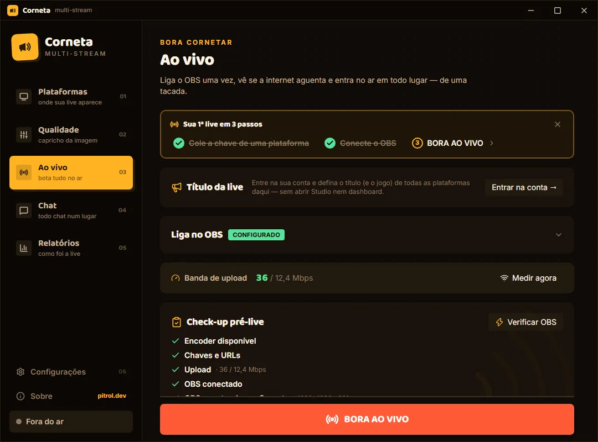

# 📣 Corneta

Transmita do OBS para várias plataformas, acompanhe o chat e reveja a história da sua live em um só app.

Corneta é um aplicativo desktop feito com **Tauri 2, Rust, React e Tailwind CSS**. Recebe o sinal do OBS localmente e o distribui para os destinos configurados, com modos de qualidade, reconexão, gravação e relatórios. O site e a API de setup OAuth ficam em um workspace Next.js separado, em `web/`.

**Status: experimental, em preparação para beta público.** O código e a demonstração podem ser estudados e testados; isso não representa uma certificação de estabilidade para lives de produção. Windows x64 é o alvo atual. macOS, Linux e Windows ARM não têm distribuição validada pelo projeto.

[Testar a demonstração](#testar-sem-rust-obs-ou-contas) · [Contribuir](CONTRIBUTING.md) · [Suporte](SUPPORT.md) · [Relatar uma vulnerabilidade](SECURITY.md) · [Documentação](docs/README.md) · [Changelog](CHANGELOG.md)



_Captura do modo de demonstração da versão 0.6.0, com dados fictícios. O código atual do desktop está na versão 0.7.0; alguns detalhes da interface evoluíram._

## Quero usar na minha live

Consulte o [site oficial](https://www.corneta.live) e as [releases do projeto](https://github.com/pitroldev/corneta/releases). A existência deste repositório não significa que já exista um instalador público aprovado. Não use artefatos de desenvolvimento como se fossem uma release estável.

Antes de uma distribuição, precisam estar concluídos o pacote de fontes/avisos dos componentes incluídos e a validação real de instalação, atualização e plataformas. Veja os [gates de release](docs/GATES-DE-RELEASE.md) e o [runbook beta](docs/RUNBOOK-BETA.md). O lançamento inicial pode não ter Authenticode, conforme a [política de assinatura](docs/ASSINATURA.md); a assinatura criptográfica do updater continua obrigatória.

## O que já existe

- Destinos de transmissão por URL/chave, incluindo serviços conhecidos e destinos personalizados. A disponibilidade de ingestão depende da sua conta e da plataforma.
- Modos de cópia, reencodificação e combinação dos dois, com compartilhamento de processamento quando os destinos são compatíveis. Suporte a encoders de hardware depende da GPU e do driver.
- Conexão com OBS, medição de upload, métricas durante a live e reconexão de destinos.
- Cofre nativo para credenciais e fluxos de autenticação para as integrações implementadas.
- Chat integrado, gravação local, relatórios com replay/chat, momentos e exportação.
- Recursos de proteção de transmissão. Recursos marcados como experimentais exigem teste antes do uso real.

Transmitir para uma plataforma **não implica** ter OAuth, moderação ou todas as funções de chat disponíveis nela. A demonstração usa um motor simulado: ela não testa o OBS, o cofre, o encoder nem o login real.

## Testar sem Rust, OBS ou contas

Instale **Node.js 24.18.1** e **pnpm 11.18.0**, conforme `.node-version`, `engines` e `packageManager`.

```sh
git clone https://github.com/pitroldev/corneta.git
cd corneta
pnpm install --frozen-lockfile
pnpm contrib:demo
```

Abra `http://localhost:1420`. O perfil de contribuição não carrega o `.env` pessoal e desativa a telemetria; não é necessário copiar exemplos de ambiente ou fornecer credenciais. Em repositório ainda privado, o clone naturalmente exige acesso.

Para validar app e site sem os segredos da operação oficial:

```sh
pnpm contrib:check
```

Esse caminho é o indicado para um clone novo. Os comandos normais de desenvolvimento/release continuam disponíveis para quem configura a própria operação; leia [desenvolvimento](docs/DESENVOLVIMENTO.md) antes de usá-los com um `.env` real.

## Site e API local — Next.js

```sh
pnpm contrib:web
```

Abra `http://localhost:7390`. O site pode ser desenvolvido sem configurar OAuth. Endpoints que precisam de provedores não passam a autenticar contas por serem executados localmente.

O perfil de contribuição recusa arquivos reais `web/.env*`, para que o carregamento automático do Next.js não introduza segredos; use um clone limpo se já tiver uma operação local configurada. Não mova nem apague suas credenciais para experimentar o projeto.

O build de contribuição fornece a origem pública esperada para validar o site. Isso **não** anuncia suporte pronto a qualquer domínio de fork nem desativa as validações da produção oficial. Configuração de hospedagem própria e operação do OAuth: [guia de desenvolvimento](docs/DESENVOLVIMENTO.md) e [decisão de OAuth](docs/DECISAO-OAUTH-VIA-API.md).

## Desktop nativo — Windows x64

Além de Node/pnpm, instale **Rust 1.97.1** pelo rustup, **Visual Studio Build Tools com C++/MSVC e Windows SDK**, **PowerShell 7** (`pwsh`) e **WebView2 Runtime**. As versões estão fixadas no repositório. OBS com obs-websocket v5 é necessário apenas para testar sua integração real.

```powershell
pwsh -NoProfile -File scripts/fetch-binaries.ps1
pnpm contrib:app:dev
```

O download fixa e verifica FFmpeg e MediaMTX. O primeiro build nativo é significativamente mais pesado que a demo: baixa dependências e compila Rust/OCR. Tempo, memória e espaço em disco dependem da máquina e do cache; o projeto ainda não publica uma medição universal de requisitos mínimos.

Para compilar o executável local, **sem gerar nem instalar um pacote de distribuição**:

```sh
pnpm contrib:app:build
```

Esse perfil usa identidade e cofre de contribuição separados, com updater e telemetria desativados. Isso não torna o OBS e suas portas exclusivos de cada app: não rode testes nativos ao lado de uma live real. Consulte os limites de isolamento no [guia](docs/DESENVOLVIMENTO.md).

Não é necessário ter a chave privada oficial do updater. `pnpm app:build` é o caminho de empacotamento configurado pelo mantenedor, não um requisito de contribuição.

## Arquitetura em poucas linhas

```text
OBS → MediaMTX local → pipeline de mídia Rust/FFmpeg → destinos
                              ↕
                        UI React via IPC
                              ↘ relatórios, chat e gravações locais

Site/API Next.js → bootstrap de configuração pública e suporte ao OAuth
                  (não recebe nem retransmite o vídeo da live)
```

O modo de qualidade e a compatibilidade dos destinos determinam cópia, reencodificação e compartilhamento de rendições. Os processos de envio mantêm supervisão por destino; não existe uma regra universal de “decodificar uma vez” para todos os modos. Processamento auxiliar não deve comprometer a transmissão.

```text
src/                    frontend desktop e demonstração
  components/           design system e componentes reutilizáveis
  screens/reports/      componentes e hooks dos relatórios
  lib/                  contratos IPC/mock, estado, análise e testes
src-tauri/              backend Rust, capabilities e configuração Tauri
web/                    site, conteúdo e API Next.js
scripts/                desenvolvimento, testes e preparação de release
compliance/             manifestos de conformidade
docs/                   guias, decisões, runbooks e planos
```

## Privacidade e segurança

Na distribuição oficial com telemetria configurada, uso e falhas são finalidades independentes, **ativas por padrão e desativáveis**. A preferência `unset` não representa opt-in pendente. Builds de contribuição desativam o envio, e ausência de configuração também impede a inicialização pertinente. Veja a [política documentada](docs/LGPD-LEGITIMO-INTERESSE-TELEMETRIA.md) e o [runbook](docs/RUNBOOK-POSTHOG.md); isso não substitui revisão jurídica da operação.

Não publique stream keys, tokens, `.env`, relatórios pessoais ou logs brutos em issues. Para vulnerabilidades, use [SECURITY.md](SECURITY.md).

## Licença

O código próprio é [MIT](LICENSE). Dependências, fontes, ícones, modelos e sidecars mantêm suas licenças e avisos; consulte [THIRD_PARTY_NOTICES.md](THIRD_PARTY_NOTICES.md). Executar FFmpeg em processo separado não dispensa as obrigações relativas ao binário distribuído. Um fork não deve se apresentar como a distribuição oficial nem reutilizar suas chaves e serviços sem configuração apropriada.
