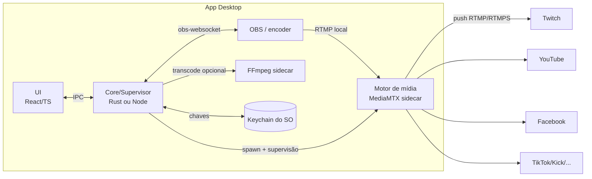

# Multi-Stream Studio — Planejamento de Desenvolvimento

> Documento de planejamento técnico e de produto para transformar o atual setup de
> *restream* baseado em `nginx-rtmp` + Docker em um **aplicativo desktop multiplataforma**
> que torne a configuração de multi-streaming **intuitiva, eficiente, bonita e didática**.

- **Status:** Rascunho para discussão (v0.1)
- **Data:** 2026-06-22
- **Autor/Responsável:** Pitrol
- **Público-alvo do app:** streamers (do iniciante ao semiprofissional) que querem transmitir
  simultaneamente para Twitch, YouTube, Facebook, TikTok, Kick etc. sem editar arquivos de configuração.

---

## 1. Sumário executivo

Hoje o projeto é um relay RTMP funcional, porém **operado por arquivo de texto**: o streamer
precisa editar `nginx.conf`, conhecer URLs RTMP de cada plataforma, ter Docker e configurar o
OBS manualmente. Funciona, mas a barreira de entrada é alta e não há feedback de status.

A proposta é um **app desktop (Windows/macOS/Linux)** que encapsula toda essa complexidade:

- Cadastro visual de plataformas com **presets prontos** (URLs corretas, RTMP/RTMPS).
- **Armazenamento seguro** das stream keys no cofre do sistema operacional (nada de chave em texto puro).
- **Motor de mídia embutido** (sem exigir Docker): o app sobe e supervisiona o relay sozinho.
- **Assistente de configuração do OBS** (didático) — inclusive auto-configuração via obs-websocket.
- **Painel de status ao vivo**: o que está no ar, bitrate, frames perdidos, uptime, reconexão.
- **Calculadora/alerta de banda de upload**, o principal limitante do restream local.

> **Recomendação de stack (resumo):** **Tauri 2 + React/TypeScript** para o app, **MediaMTX**
> (embutido como *sidecar*) como motor de ingestão/relay, **FFmpeg** (sidecar) para transcodificação
> opcional por plataforma. Detalhes e alternativas nas seções 5 e 6.

---

## 2. Estado atual (análise dos arquivos)

| Arquivo | Função | Limitação |
|---|---|---|
| `nginx.conf` | Servidor RTMP que recebe 1 stream e dá `push` para N plataformas | Config estática; precisa editar à mão; sem RTMPS nativo; módulo `nginx-rtmp` praticamente sem manutenção |
| `docker-compose.yml` | Sobe `tiangolo/nginx-rtmp` na porta 1935 | Exige Docker instalado e rodando |
| `START_SERVICE.bat` / `STOP.bat` | `docker-compose up -d` / `down` | Só Windows; zero feedback de status |

**Fluxo atual do streamer:**

```
OBS ──rtmp://localhost:1935/multi_live──▶ nginx-rtmp ──push──▶ Twitch
                                                        ──push──▶ YouTube
                                                        ──push──▶ (Facebook/TikTok comentados)
```

**Dores identificadas (que o app precisa eliminar):**

1. Editar `nginx.conf` manualmente é intimidador e propenso a erro.
2. É preciso saber a URL de ingestão e o formato da chave de cada plataforma.
3. Dependência de Docker.
4. Sem validação ("a chave está certa?"), sem status ("estou no ar?").
5. Sem liga/desliga por plataforma sem reeditar config e reiniciar.
6. **Facebook hoje exige RTMPS** (TLS) — o `nginx-rtmp-module` não suporta RTMPS nativamente
   (precisa de `stunnel` como gambiarra). A linha comentada com `rtmp://...:80` do Facebook
   **não funcionaria** atualmente. Forte argumento para trocar o motor.

---

## 3. Visão de produto

### 3.1 Princípios de UX
- **Didático por padrão:** todo passo explica *o que* e *por quê*, com botões de "copiar" e tooltips.
- **Zero terminal:** nenhuma etapa exige linha de comando ou editar arquivos.
- **Feedback imediato:** status verde/amarelo/vermelho por plataforma, em tempo real.
- **Falha graciosa:** se uma plataforma cai, as outras continuam; reconecta sozinho.
- **Honestidade técnica:** avisar sobre banda de upload antes de o usuário descobrir do jeito ruim.

### 3.2 Personas
- **Iniciante:** nunca configurou RTMP. Precisa de wizard e auto-config do OBS.
- **Hobbyista recorrente:** quer perfis salvos e liga/desliga rápido por plataforma.
- **Semipro:** quer bitrate/resolução por plataforma (transcodificação) e métricas.

### 3.3 Jornada-alvo (do download ao "no ar")
```
Instalar ▶ Onboarding ▶ Adicionar plataformas (presets + colar chave)
        ▶ Testar conexão ▶ Configurar OBS (manual guiado OU automático)
        ▶ Iniciar relay ▶ Painel ao vivo ▶ Encerrar
```

---

## 4. Escopo de funcionalidades

### 4.1 MVP (v1) — "substituir o nginx.conf com dignidade"
- [ ] Gerenciar plataformas de destino (adicionar/editar/remover/ativar-desativar).
- [ ] **Presets** de plataforma: Twitch, YouTube, Facebook (RTMPS), Kick, TikTok, X/Twitter, Instagram, **Custom RTMP**.
- [ ] Armazenamento **seguro** das stream keys (keychain do SO).
- [ ] Motor de relay embutido (*decode-once → encode-N*) — **sem Docker**.
- [ ] **Encoding por plataforma com presets recomendados** (o modo didático/*headline*) + **detecção de
      encoder de hardware** (NVENC/QSV/AMF/VideoToolbox) — ver §8.
      *(O modo "Encodar uma vez"/passthrough entra numa fase seguinte — ver §4.2.)*
- [ ] Endpoint de ingestão local fixo + **wizard de configuração do OBS** com
      **auto-configuração via `obs-websocket`** (define serviço/URL/chave) **já no MVP** + opção manual guiada.
- [ ] Iniciar/parar relay; painel de status por plataforma (conectado, uptime, bitrate, reconexões).
- [ ] **Calculadora de banda**: soma dos bitrates × nº de plataformas, com alerta.
- [ ] Bandeja do sistema (tray) + iniciar minimizado.

### 4.2 v1.x
- [ ] **Modo "Encodar uma vez" (passthrough) + híbrido** com **cálculo do "menor denominador comum"** —
      a otimização leve de CPU/banda que complementa o encoding por plataforma do MVP (ver §8).
- [ ] Auto-config do OBS evolui: **iniciar/parar o stream** pelo app (além de configurar).
- [ ] Perfis ("Live de sexta", "Podcast") com conjuntos diferentes de destinos.
- [ ] i18n (PT-BR + EN), tema claro/escuro.
- [ ] Teste de banda de upload integrado + recomendação de bitrate.
- [ ] Auto-update assinado.

### 4.3 v2 (avançado)
- [ ] **Modo cloud relay** ("traga seu VPS"): provisiona/configura um servidor remoto para o fork
      acontecer na nuvem e **não estourar o upload doméstico** (ver §7).
- [ ] Suporte a **SRT** como ingestão (mais resiliente que RTMP em redes ruins).
- [ ] Sobreposição de chat unificado / métricas de espectadores por plataforma (via APIs oficiais).
- [ ] Gravação local simultânea (arquivo de backup).

### 4.4 Fora de escopo (explicitamente)
- Compositing/cenas de vídeo (isso é trabalho do OBS — não vamos reinventar).
- Mixagem de áudio avançada.
- Hospedagem gerenciada paga (podemos integrar serviços, não virar um).

---

## 5. Arquitetura proposta

### 5.1 Componentes



- **UI:** camada visual (web tech), responsável por toda a experiência.
- **Core/Supervisor:** orquestra o motor, lê/grava config, fala com o keychain e com o OBS,
  monitora saúde e reinicia processos.
- **Motor de mídia (sidecar):** recebe o stream do OBS e replica para os destinos.
- **FFmpeg (sidecar):** apenas quando o usuário pedir qualidade diferente por plataforma.

### 5.2 Por que "motor como sidecar" e não Docker
- Elimina a dependência de Docker (maior atrito de instalação para o público-alvo).
- Binário único embarcado, multiplataforma, com ciclo de vida controlado pelo app.
- Permite status/estatísticas via API do motor, em vez de "fé no `docker logs`".

### 5.3 Modelo de dados (config)
```jsonc
{
  "ingest": { "protocol": "rtmp", "host": "127.0.0.1", "port": 1935, "app": "live", "key": "obs" },
  "profiles": [{
    "id": "default",
    "name": "Live padrão",
    "targets": [
      { "platform": "twitch",  "enabled": true,  "url": "rtmp://live.twitch.tv/app",  "keyRef": "vault://twitch" },
      { "platform": "youtube", "enabled": true,  "url": "rtmp://a.rtmp.youtube.com/live2", "keyRef": "vault://youtube" },
      { "platform": "facebook","enabled": false, "url": "rtmps://live-api-s.facebook.com:443/rtmp", "keyRef": "vault://facebook" }
    ],
    "encoding": {
      "mode": "passthrough",            // "passthrough" | "per-platform" | "hybrid"
      "perTarget": {                     // usado em per-platform/hybrid
        "twitch": { "action": "copy" },
        "tiktok": { "action": "transcode", "preset": "tiktok-vertical-720p", "encoder": "auto" }
      }
    }
  }]
}
```
> As **chaves nunca ficam no JSON**: só uma referência (`keyRef`); o valor real vive no cofre do SO.

---

## 6. Análise de stacks e tradeoffs

### 6.1 Framework do app desktop

| Critério | **Tauri 2** (recomendado) | **Electron** | **Flutter Desktop** | **Wails (Go)** | **Avalonia (.NET)** |
|---|---|---|---|---|---|
| Linguagem core | Rust | Node/JS | Dart | Go | C# |
| UI | Webview do SO + web stack | Chromium embutido + web stack | Renderizador próprio (Skia) | Webview + web stack | XAML nativo |
| Tamanho do binário | ~3–10 MB | ~85–150 MB | ~20–40 MB | ~8–20 MB | ~30–60 MB |
| Uso de memória | Baixo | Alto | Médio | Baixo | Médio |
| Gerência de *sidecar* (FFmpeg/MediaMTX) | **Excelente** (suporte nativo a binários externos) | Boa (`child_process`) | Manual/possível | Boa | Boa |
| Acesso a keychain do SO | Plugins oficiais | `keytar`/`safeStorage` | Pacotes da comunidade | Libs Go | Libs .NET |
| Maturidade desktop | Alta (2.x) | **Altíssima** | Média | Média | Alta |
| Curva de aprendizado | Média (Rust no core) | **Baixa** | Média | Baixa-média | Média |
| Consistência visual entre SOs | Boa (varia: WebView2/WKWebView/WebKitGTK) | **Altíssima** (mesmo Chromium) | **Altíssima** (pixel-perfect) | Boa | Alta |
| "Bonito" com pouco esforço | Alto (qualquer lib web) | Alto | **Altíssimo** | Alto | Médio-alto |

**Recomendação:** **Tauri 2**. Razões: app leve e eficiente (requisito explícito), gestão de
*sidecars* de primeira classe (essencial para embutir MediaMTX/FFmpeg), cofre seguro e auto-update
prontos. Como o core de mídia é um processo externo, o "peso" do Rust no nosso código é pequeno —
a maior parte da lógica vive na UI. **As boas práticas oficiais de implementação (sidecars de longa
duração, segurança/ACL, updater e assinatura) estão consolidadas na §14.**

**Fallback pragmático:** **Electron**, se o time já dominar Node e quiser velocidade máxima de
desenvolvimento e consistência visual idêntica entre SOs — ao custo de binário grande e mais RAM.

**Curinga "bonito":** **Flutter** se a prioridade nº 1 for UI premium e animada e o time topar Dart;
o atrito está na integração com processos nativos (FFmpeg/MediaMTX) e keychain.

### 6.2 Motor de mídia (o coração do relay)

| Opção | Como funciona | Prós | Contras |
|---|---|---|---|
| **MediaMTX** (recomendado) | Servidor de mídia em Go, binário único. Recebe RTMP/RTMPS/SRT e republica para destinos (via `runOnReady`→FFmpeg ou forward nativo) | Mantido ativamente; **RTMPS/SRT/WebRTC/HLS**; binário multiplataforma; API e hooks de status | Forward para múltiplos destinos normalmente orquestra FFmpeg por trás |
| **FFmpeg puro (tee)** | `ffmpeg -i <ingest> -c copy -f tee "[f=flv]rtmp://...|[f=flv]rtmps://..."` | Onipresente; transcodificação trivial; **RTMPS** ok; controle total via args | Modo "ouvir RTMP" (`-listen 1`) é frágil para reconexão; reconectar = relançar processo |
| **nginx-rtmp** (atual) | Módulo RTMP no nginx | Battle-tested; HLS | Módulo estagnado; **sem RTMPS nativo**; config estática; rebuild/Docker |
| **Node Media Server** | Servidor RTMP em Node (npm) | Trivial de embutir no Electron | Menos performático; projeto menor |
| **SRS / OvenMediaEngine** | Servidores de mídia robustos | Muito poderosos | Pesados; orientados a servidor, não a desktop |

**Recomendação:** **MediaMTX como ingestão + relay passthrough** (cópia de stream = zero perda de
qualidade e CPU baixíssima), com **FFmpeg sidecar acionado só quando o usuário quiser transcodificar**
por plataforma. Isso mata a dependência de Docker, resolve RTMPS (Facebook/Kick) e abre caminho para SRT.

> **Passthrough vs. transcodificação:** no passthrough, o mesmo pacote codificado é copiado para todos
> os destinos — leve, mas todos recebem a mesma qualidade que sai do OBS. A transcodificação por
> plataforma custa CPU/GPU, mas permite, p.ex., enviar 1080p60 ao YouTube e 720p vertical ao TikTok.

### 6.3 Demais escolhas

| Camada | Recomendado | Alternativas | Observação |
|---|---|---|---|
| UI lib | React + TypeScript | Svelte, Vue, SolidJS | TS pela robustez; React pelo ecossistema |
| Componentes/estilo | Tailwind + shadcn/ui (Radix) | Mantine, Chakra, MUI | "Bonito" e acessível com baixo esforço |
| Animação | Framer Motion | GSAP | Microinterações didáticas |
| Estado | Zustand | Redux Toolkit, Jotai | Simples e suficiente |
| Cofre de chaves | Plugin **keyring** (keychain do SO) | `keytar` (mundo Electron) | **Nunca** texto puro; **Stronghold será removido na v3** — evitar (ver §14.6) |
| Integração OBS | `obs-websocket-js` (v5) | — | OBS 28+ já traz o servidor WebSocket |
| Empacotamento/updates | Tauri updater | electron-updater | Exige **assinatura de código** (ver §11) |
| Testes | Vitest + Playwright | Jest | E2E cobrindo o fluxo "no ar" |

---

## 7. O elefante na sala: banda de upload

No **restream local**, o app recebe 1 stream do OBS (tráfego de *loopback*, praticamente grátis) e
**envia N cópias** para a internet. O upload necessário é a **soma dos bitrates de todos os destinos ativos**:

```
upload necessário ≈ Σ (bitrate de cada plataforma ativa)
Ex.: 3 plataformas a 6 Mbps  ≈ 18 Mbps de upload sustentado
```

Isso é uma limitação **física**, não de software. O app precisa ser honesto sobre isso:

- **Calculadora/alerta de banda** no MVP (some os bitrates ativos e compare com um teste de upload).
- Sugerir reduzir bitrate ou nº de plataformas quando o upload não comporta.
- **Modo cloud relay (v2):** OBS envia **um único** stream para um servidor na nuvem (MediaMTX/FFmpeg
  num VPS) e **o fork acontece lá**, onde a banda é farta. Resolve o gargalo doméstico ao custo de
  hospedagem.

### Arquiteturas de restream — tradeoffs

| Arquitetura | Upload doméstico | Custo recorrente | Controle/privacidade | Complexidade |
|---|---|---|---|---|
| **Relay local** (foco do app) | Alto (N×) | Zero | Total | Baixa |
| **Cloud relay próprio** (VPS) | Baixo (1×) | VPS (~US$/mês) | Alto | Média (provisionamento) |
| **SaaS de restream** (ex.: serviços gerenciados) | Baixo (1×) | Assinatura | Menor | Baixíssima (mas terceiriza) |

O app pode começar **local** (v1) e evoluir para oferecer o **modo "traga seu VPS"** (v2),
cobrindo os dois mundos sem virar um SaaS.

> A **estratégia de encoding** (§8) também mexe diretamente nesta conta: transcodificar por
> plataforma pode **reduzir** o upload total (cada destino recebe só o que precisa) — em troca de CPU/GPU.

---

## 8. Estratégias de encoding e presets (eficiência × flexibilidade)

> Esta é a seção que mais define o "eficiente **e** flexível". A pergunta central é:
> **quantas vezes o vídeo é codificado, e onde?** A resposta é um **espectro**, não um botão liga/desliga —
> e o app precisa **explicar cada opção** e recomendar a melhor para o setup do streamer.

### 8.1 Onde o encoding acontece

O vídeo é **sempre** codificado pelo menos uma vez — no OBS — para chegar ao relay. A partir daí, o
relay tem duas opções **por destino**:

- **Copiar** o stream já codificado (`-c copy`): nenhum reprocessamento.
- **Recodificar** (decode + encode): gera um stream sob medida para aquele destino.

Combinando essas opções nascem os três modos abaixo.

### 8.2 Os três modos (com tradeoffs)

| Modo | O que faz | CPU/GPU no relay | Qualidade | Latência extra | Banda de upload | Quando usar |
|---|---|---|---|---|---|---|
| **Encodar uma vez** (passthrough) | OBS codifica 1×; relay **copia** para todos | ~Nulo | Sem perda extra | ~Zero | N × bitrate da fonte | Padrão; máquinas modestas; plataformas com specs parecidas |
| **Um por plataforma** (per-platform) | Relay **decodifica 1×** e **recodifica N×**, um output sob medida por destino | Alto (N encodes) | Ótima por destino; leve perda geracional | Centenas de ms | Σ dos bitrates escolhidos (pode ser **menor**) | Specs bem diferentes (ex.: TikTok vertical); há encoder de hardware |
| **Híbrido** (selective) | **Copia** onde a fonte já serve e **recodifica só** onde precisa | Médio (só os que transcodam) | Ótima | Só nos transcodados | Mix | Melhor custo-benefício na maioria dos casos reais |

> **"Encodar uma vez e reaproveitar"** = passthrough. **"Um encoding por plataforma com as configs
> recomendadas"** = per-platform usando os presets da §8.5. O **híbrido** é o atalho esperto entre os dois.

> 🗺️ **Faseamento (decisão de produto):** o **MVP entrega primeiro o encoding por plataforma** (a feature
> didática de maior valor). O modo **"Encodar uma vez"/passthrough** — embora seja o mais leve em CPU —
> chega numa **fase seguinte** como otimização (ver §4.1/§4.2 e §12.1).

### 8.3 A chave da eficiência: *decode-once, encode-N*

Mesmo no modo per-platform, um **único processo FFmpeg** lê e decodifica a fonte **uma só vez** e
emite vários outputs (copiados e/ou recodificados). Isso evita o erro comum de subir um FFmpeg por
plataforma (que decodificaria N vezes e desperdiçaria CPU).

```bash
# Conceitual: 1 decode, outputs mistos (copy + transcode) — modo híbrido
ffmpeg -i rtmp://127.0.0.1:1935/live/obs \
  -map 0 -c copy                                          -f flv "rtmp://live.twitch.tv/app/KEY"       \  # copy
  -map 0 -c copy                                          -f flv "rtmp://a.rtmp.youtube.com/live2/KEY" \  # copy
  -map 0:v -vf "scale=720:1280" -c:v h264_nvenc -b:v 3000k -g 120 \
  -map 0:a -c:a aac -b:a 128k                             -f flv "rtmps://tiktok/KEY"                     # transcode vertical
```

> Transformar um vídeo horizontal em **vertical** (TikTok/Reels) exige `crop`/`scale`/`pad` e,
> idealmente, uma **prévia visual** no app — não dá para "adivinhar" o enquadramento.

### 8.4 Encoders de hardware (essenciais no modo transcode)

Fazer N recodificações em software derrete a CPU. O app deve **detectar** o hardware disponível e recomendar:

| Encoder | Hardware | Notas |
|---|---|---|
| **NVENC** | GPUs NVIDIA | Ótimo; nº de sessões simultâneas era limitado em placas de consumo (subiu nos drivers recentes) |
| **Quick Sync (QSV)** | iGPU Intel | Onipresente em CPUs Intel; ótimo custo-benefício |
| **AMF/VCE** | GPUs AMD | Bom; qualidade historicamente atrás do NVENC |
| **VideoToolbox** | Apple Silicon / Mac Intel | Padrão no macOS |
| **x264 (software)** | CPU | Melhor qualidade por bit, porém pesadíssimo — viável só para 1 stream ou CPUs fortes |

> Regra que o app deve comunicar: **passthrough** quase não usa CPU; **cada** transcode consome uma
> "sessão" de encoder. Mostrar algo como *"2 de 8 sessões de NVENC em uso"*.

### 8.5 Presets recomendados por plataforma (valores de referência)

> ⚠️ **Valores de partida**, não absolutos: variam com status de parceiro e **mudam com o tempo**.
> Devem viver no **JSON remoto versionado** (mesma estratégia da §9) e ser validados pelo app — nunca
> "chumbados" no binário.

| Plataforma | Resolução típica | FPS | Bitrate de vídeo | Codec | Keyframe | Áudio | Protocolo |
|---|---|---|---|---|---|---|---|
| Twitch | 1080p / 720p | 60/30 | ~4500–6000 kbps | H.264 | 2 s | AAC 160 kbps | RTMP |
| YouTube | 1080p (até 4K) | 60/30 | ~4500–9000 kbps | H.264 | 2 s (máx 4) | AAC 128–256 kbps | RTMP |
| Facebook | 720p–1080p | 30 | até ~4000 kbps | H.264 | 2 s | AAC 128 kbps | **RTMPS** |
| Kick | 1080p | 60/30 | ~6000 kbps | H.264 | 2 s | AAC 160 kbps | **RTMPS** |
| TikTok | **720×1280 vertical** | 30 | ~2500–4000 kbps | H.264 | 2 s | AAC 128 kbps | RTMP |
| X (Twitter) | 720p | 30 | ~2500–3500 kbps | H.264 | 2 s | AAC 128 kbps | RTMP/RTMPS |
| Instagram | vertical | 30 | baixo | H.264 | 2 s | AAC 128 kbps | experimental |

### 8.6 Regras quase universais (a camada didática)

O app ensina e aplica por padrão — e **avisa** quando o usuário desvia:

- **Keyframe (GOP) de 2 s**: praticamente todas as plataformas exigem; é o que permite a segmentação HLS do lado delas.
- **CBR** (bitrate constante) para live: evita picos que estouram o buffer das plataformas.
- **H.264 High profile**: o denominador comum de compatibilidade. (HEVC/AV1 só onde houver suporte explícito.)
- **Áudio AAC, 48 kHz, estéreo, 128–160 kbps**: aceito em todo lugar; quase sempre dá para **copiar**.

### 8.7 O "menor denominador comum" (no modo Encodar uma vez)

No passthrough, **todos recebem o mesmo stream**, então o único encode do OBS precisa caber na
plataforma **mais restritiva**. O app calcula isso sozinho e **explica**:

> *"Você ativou **Twitch** (máx ~6000) e **YouTube** (até 9000). No modo **Encodar uma vez**,
> usamos **6000 kbps** para caber no Twitch. Quer mandar **9000** ao YouTube sem prejudicar o Twitch?
> Mude para **Otimizado (um por plataforma)**."*

Esse cálculo automático + a frase explicativa são um dos maiores ganhos didáticos do produto.

### 8.8 Como o app apresenta a escolha (UX)

Três cartões num seletor guiado, cada um com **estimativas ao vivo** que se recalculam conforme o
usuário liga/desliga plataformas:

```
┌──────────────────────────┐ ┌──────────────────────────┐ ┌──────────────────────────┐
│ ✅ SIMPLES               │ │ ⚙️  OTIMIZADO            │ │ 🛠️  AVANÇADO             │
│ "Encodar uma vez"        │ │ "Um por plataforma"      │ │ Híbrido / manual         │
│                          │ │                          │ │                          │
│ CPU/GPU:  ▁ baixíssimo   │ │ CPU/GPU:  ▇ alto         │ │ você no controle         │
│ Qualidade: igual p/ todas│ │ Qualidade: sob medida    │ │ copia onde dá,           │
│ Upload:   N × 6 Mbps     │ │ Upload:   pode ser menor │ │ transcoda onde precisa   │
│ Latência: ~0             │ │ Latência: + alguns ms    │ │                          │
│ [Recomendado p/ você]    │ │ [Precisa de NVENC/QSV]   │ │                          │
└──────────────────────────┘ └──────────────────────────┘ └──────────────────────────┘
```

Cada cartão traz tooltips em cada termo (bitrate, keyframe, CBR, NVENC...), um **diagrama do pipeline**
mostrando os caminhos *copy* vs *encode*, e os números atualizados em tempo real.

### 8.9 Reflexo na banda (liga com §7)

Contraintuitivamente, **transcodar pode reduzir** o upload total, porque cada plataforma recebe só o
que precisa:

| Cenário (4 plataformas) | Conta | Upload total |
|---|---|---|
| Encodar uma vez @ 6000 | 4 × 6000 | **24 Mbps** |
| Otimizado | YT 6000 + Twitch 6000 + FB 4000 + TikTok 2500 | **18,5 Mbps** |

Troca: menos upload e melhor "encaixe" por plataforma, **ao custo de CPU/GPU**. O app mostra os dois
números lado a lado para a decisão ser informada.

### 8.10 Como isso vira comando no motor

O **Supervisor** monta dinamicamente a invocação do FFmpeg (orquestrada pelo MediaMTX via `runOnReady`
ou diretamente) a partir de: **modo escolhido** + **presets** + **destinos ativos** + **encoder detectado**.
Passthrough vira `-c copy`; per-platform/híbrido vira outputs mistos num **único decode**. Reconexão e
supervisão de saúde ficam por conta do Core.

---

## 9. Integração com plataformas (presets)

| Plataforma | Protocolo | URL de ingestão (exemplo) | Notas |
|---|---|---|---|
| Twitch | RTMP | `rtmp://live.twitch.tv/app` | Há *ingests* regionais; permitir seleção |
| YouTube | RTMP | `rtmp://a.rtmp.youtube.com/live2` | Chave por transmissão; backup ingest disponível |
| Facebook Live | **RTMPS** | `rtmps://live-api-s.facebook.com:443/rtmp` | RTMP puro **descontinuado**; precisa TLS |
| Kick | **RTMPS** | fornecido no painel do criador | TLS |
| TikTok Live | RTMP | fornecido (acesso ao Live exige elegibilidade) | Chave nem sempre é auto-serviço |
| X (Twitter) | RTMP/RTMPS | fornecido pelo Media Studio | — |
| Instagram | — | sem ingestão RTMP oficial estável | Tratar como "não suportado/experimental" |
| Custom | RTMP/RTMPS | definido pelo usuário | Campo livre + validação; SRT só após implementação e matriz real |

> Os presets reduzem erro humano, mas **URLs mudam**: tratar a lista de presets como **dado
> atualizável remotamente** (um JSON versionado baixado pelo app), não hard-coded no binário.

---

## 10. Roadmap por fases

| Fase | Objetivo | Entregáveis-chave | Critério de pronto |
|---|---|---|---|
| **0 — Prova de conceito** | Validar motor sem Docker | Spawnar MediaMTX/FFmpeg como sidecar e dar fork para 2 plataformas | Stream chega no ar em 2 plataformas a partir do app |
| **1 — MVP** | Substituir o `nginx.conf` | Config visual, cofre de chaves, **encoding por plataforma com presets + detecção de encoder**, **auto-config do OBS (`obs-websocket`)**, status ao vivo, calculadora de banda | Streamer leigo coloca 3 plataformas no ar sem tocar em arquivo |
| **2 — Polimento** | "Uau" e conforto | **Modo "Encodar uma vez"/passthrough + híbrido + menor denominador comum**, perfis, i18n PT/EN, temas, auto-update assinado | Onboarding < 5 min; updates automáticos |
| **3 — Avançado** | Poder e escala | Modo **cloud relay (VPS)**, **SRT**, gravação local simultânea, chat/métricas unificados | Não estourar o upload doméstico; resiliência |

---

## 11. Riscos e mitigações

| Risco | Impacto | Mitigação |
|---|---|---|
| **Banda de upload** insuficiente (N×) | Alto | Calculadora/alerta no MVP; modo cloud relay na v2 |
| **Assinatura de código** (custo/burocracia: certificado Windows, Apple Developer) | Médio | Orçar cedo; sem assinatura, SmartScreen/Gatekeeper assustam o usuário |
| **Licenciamento do FFmpeg** (LGPL/GPL conforme build) | Médio | Usar build LGPL e documentar; isolar como processo externo, não linkar |
| **Transcode pesa demais** (N encodes esgotam CPU/sessões de NVENC) | Médio | Detectar encoder, estimar custo no seletor (§8.8), preferir passthrough/híbrido por padrão |
| **Processos órfãos** (FFmpeg/MediaMTX seguem rodando após fechar o app) | Médio | Matar a **árvore** de processos no shutdown; `single-instance`; minimizar para a bandeja (ver §14.2/§14.8) |
| **URLs/regras de plataforma mudam** (ex.: Facebook→RTMPS) | Médio | Presets como JSON remoto versionado; testes de conexão |
| **Inconsistência de webview entre SOs** (se Tauri) | Baixo-médio | QA por plataforma; evitar CSS exótico; fallback Electron documentado |
| **TikTok/Instagram** sem chave auto-serviço | Baixo | Marcar como "manual/experimental"; não prometer o que a plataforma não entrega |
| **Suporte/expectativa** de virar SaaS | Baixo | Escopo claro: ferramenta local + "traga seu VPS", não hospedagem gerenciada |

---

## 12. Decisões

### 12.1 Decididas (2026-06-22)
1. **Framework:** ✅ **Tauri 2 + React/TypeScript** — prioridade em app leve e eficiente, com gestão nativa de sidecars.
2. **SO no v1 (MVP):** ✅ **Windows-first** — foco no público atual (os `.bat` são Windows); macOS/Linux nas fases seguintes.
3. **Modelo:** ✅ **Gratuito / open-source** — ferramenta local livre, sem infra recorrente.
4. **Auto-config do OBS:** ✅ **entra já no MVP** (via `obs-websocket`) — alto valor didático.
5. **Encoding:** ✅ **o MVP lidera com encoding por plataforma (presets recomendados)**; o modo
   *"Encodar uma vez"* (passthrough) + híbrido entram **numa fase seguinte** (v1.x).

**Implicações dessas decisões:**
- **Encoding por plataforma no MVP:** exige **detecção de encoder de hardware** (NVENC/QSV/AMF) e o
  *builder* de comando FFmpeg desde o dia 1. Em compensação, entrega logo a feature didática de maior
  valor; o passthrough (mais leve) é **barato de somar depois**, então a ordem é defensável.
- **Open-source:** escolher licença cedo (ex.: MIT/Apache-2.0 para o app) e **manter o FFmpeg como processo
  externo** (não linkado) para conviver com a licença LGPL/GPL dele. Repositório público desde a Fase 0.
- **Windows-first:** priorizar **WebView2** (já presente no Win 11) e empacotamento **MSI/NSIS**; ainda assim,
  escrever o código de forma **portável** (sem APIs exclusivas de Windows no core) para não bloquear macOS/Linux depois.
- **Gratuito:** **modo cloud relay** deixa de ser produto pago e passa a ser **"traga seu VPS"** (config assistida,
  sem billing). O foco do app continua sendo o **relay local**.
- **Assinatura de código (Windows):** mesmo gratuito, vale orçar um certificado para evitar o alerta do SmartScreen;
  alternativa inicial é distribuir não assinado e documentar o aviso.

### 12.2 Ainda em aberto
1. **Nome e identidade visual** — em definição. Ver **`NOMES.md`** (20 propostas com racional) para a escolha.

---

## 13. Próximos passos imediatos

1. Fechar as **decisões em aberto** (§12) — sugiro um rápido alinhamento.
2. **Fase 0 (spike):** protótipo que sobe MediaMTX como sidecar e faz fork para 2 plataformas,
   provando o caminho "sem Docker".
3. Definir a **identidade visual** (nome, logo, paleta) — o requisito "bonito" começa aqui.
4. Esqueleto do projeto (Tauri + React + Tailwind/shadcn) com a tela de "Plataformas" e o cofre.

---

## 14. Boas práticas de implementação (Tauri 2) — pesquisa aplicada ao nosso caso

> Levantamento das práticas **oficiais do Tauri 2** e como cada uma se aplica ao Multi-Stream Studio
> (sidecars de longa duração, chaves sensíveis, app Windows-first). Fontes no fim da seção.

### 14.1 Sidecars (MediaMTX/FFmpeg): empacotamento
- Declarar em `externalBin` no `tauri.conf.json`; binários em `src-tauri/binaries/`.
- **Sufixo obrigatório de *target triple*** no nome: `ffmpeg-x86_64-pc-windows-msvc.exe` (Windows),
  `ffmpeg-aarch64-apple-darwin` (Mac ARM), etc. Descobrir com `rustc --print host-tuple`.
  → criar um **script de "baixar & renomear"** os binários por plataforma no CI.
- Rodar pelo plugin shell: `app.shell().sidecar("mediamtx")` + **`.spawn()`** (não `.execute()`, que
  bloqueia esperando o fim — nosso processo é **contínuo**).

### 14.2 Sidecars: ciclo de vida ⚠️ (o ponto mais crítico para nós)
- A doc oficial é explícita: **você é responsável por matar o processo filho ao fechar o app**, senão
  deixa FFmpeg/MediaMTX **órfãos** consumindo CPU e segurando a porta 1935.
- Guardar o handle do filho no **state gerenciado do Tauri** como `Arc<Mutex<Option<CommandChild>>>`;
  no shutdown e no `WindowEvent::CloseRequested`, fazer `take()` + `kill`.
- FFmpeg/MediaMTX podem **gerar subprocessos** → matar só o pai deixa "netos" órfãos. Usar **kill de
  árvore de processos** (crate `sysinfo` ou `taskkill /T /F` no Windows).
- **`tauri-plugin-single-instance`**: impedir duas instâncias do app disputando a porta de ingestão
  ou subindo motores duplicados.

### 14.3 Sidecars: stdout/stderr → status ao vivo
- Ler `CommandEvent::Stdout/Stderr` num task async e **parsear o progresso do FFmpeg**
  (`frame=`, `fps=`, `bitrate=`, `drop=`/`dup=`) → **emitir eventos** para a UI alimentar o painel ao
  vivo (§4.1) com bitrate, frames perdidos e reconexões reais.
- Em produção não há terminal: **redirecionar logs para arquivo rotativo** (`tauri-plugin-log`); não
  confiar em "herdar o stdout".

### 14.4 Segurança: capabilities, permissions e escopo
- Arquivos de *capability* em `src-tauri/capabilities/`, **um por área**, referenciados por
  identificador no `tauri.conf.json`; **princípio do menor privilégio**.
- **Escopar o shell ao mínimo**: permitir só os sidecars (`"sidecar": true`) e **restringir os
  argumentos** com `validator` (regex) — nada de execução de shell arbitrária.
- Vincular permissões a **labels de janela específicas** (evitar `"*"`).
- ⚠️ **Código Rust ignora a ACL** (ela protege o *frontend*). Portanto, **montar o comando do FFmpeg no
  Rust** a partir de *modo + presets + destinos*, e **nunca** aceitar a linha de comando crua vinda da UI.

### 14.5 Segurança: CSP
- App é *local-first* → **CSP bem restritiva**: sem scripts remotos/CDN, evitar `unsafe-inline`
  (usar nonce/hash). Começar restritivo e afrouxar só se necessário.
- **Buscar o JSON de presets remoto pelo lado Rust** (`reqwest`), não pela webview — mantém a CSP
  fechada e permite **validar/versão-checar** o conteúdo antes de usar.

### 14.6 Chaves de stream: armazenamento seguro
- ⚠️ **Atualização importante:** o **Stronghold está sendo descontinuado e será removido no Tauri v3** —
  **não** adotar como base (corrige a menção anterior em §6.3).
- **Recomendado:** **plugin keyring** → cofre nativo do SO (Credential Manager no Windows, Keychain no
  macOS, libsecret no Linux). Guarda a *stream key* (ou a chave de criptografia).
- **Plugin Store** apenas para **config não sensível**. O JSON mantém só o `keyRef` (§5.3); o valor real
  nunca toca o arquivo nem o frontend.

### 14.7 Updater e assinatura (Windows-first)
- São **duas assinaturas diferentes** — não confundir:
  1. **Assinatura do updater** (par de chaves próprio, estilo minisign): garante que o update veio de
     você e não foi adulterado. **Perder a chave privada = nunca mais conseguir atualizar quem já
     instalou.** Guardar com cuidado; a **pública** vai no config; `"createUpdaterArtifacts": true`;
     a **privada** entra como **variável de ambiente** no build (`.env` **não** funciona).
  2. **Code signing do Windows** (instalação): certificado **EV** elimina o aviso do SmartScreen de
     imediato; OV/auto-assinado ainda alerta até ganhar reputação. Caminho moderno:
     **Azure Key Vault / Trusted Signing**.
- Sendo **gratuito/OSS**: no começo, distribuir **não assinado + documentar o aviso**, ou avaliar um
  certificado **OV** (a reputação melhora com o uso). Decidir cedo por causa do orçamento.

### 14.8 Arquitetura & qualidade
- **Tudo que é pesado fica no Rust** (supervisão de processo, IO, montagem do comando FFmpeg, fetch de
  presets); a **UI React fica fina**, comunicando por **commands async + events**.
- Plugins úteis: `single-instance`, **`autostart`** (streamer quer subir junto com o sistema),
  `window-state`, `log`, `updater`.
- **Minimizar para a bandeja em vez de fechar** (o relay continua no ar); garantir o **kill dos
  sidecars** apenas no *quit* real.

### 14.9 Checklist de boas práticas (rápido)
- [ ] `externalBin` + nomes com *target triple* + script de empacotamento no CI.
- [ ] Handle do sidecar em `state` + **kill de árvore** no `CloseRequested`/quit.
- [ ] `single-instance` ativo; minimizar-para-bandeja.
- [ ] Shell *capability* só para os sidecars, com `validator` de args; comando montado no Rust.
- [ ] CSP restritiva; presets buscados via Rust.
- [ ] Chaves no **keyring** (não Stronghold); Store só p/ config.
- [ ] Updater com chave privada protegida; plano de assinatura Windows definido.
- [ ] Logs em arquivo rotativo; progresso do FFmpeg parseado → eventos p/ a UI.

### Fontes
- [Embedding External Binaries (sidecar) — Tauri v2](https://v2.tauri.app/develop/sidecar/)
- [Process plugin — Tauri v2](https://v2.tauri.app/plugin/process/)
- [Capabilities — Tauri v2](https://v2.tauri.app/security/capabilities/)
- [Permissions — Tauri v2](https://v2.tauri.app/security/permissions/)
- [Content Security Policy (CSP) — Tauri v2](https://v2.tauri.app/security/csp/)
- [Security overview — Tauri v2](https://v2.tauri.app/security/)
- [Stronghold plugin (será descontinuado) — Tauri v2](https://v2.tauri.app/plugin/stronghold/)
- [Store plugin — Tauri v2](https://v2.tauri.app/plugin/store/)
- [tauri-plugin-keyring (keychain do SO)](https://github.com/HuakunShen/tauri-plugin-keyring)
- [Updater plugin — Tauri v2](https://v2.tauri.app/plugin/updater/)
- [Windows Code Signing — Tauri v2](https://v2.tauri.app/distribute/sign/windows/)
- [Tauri — start/stop a sidecar e pipe de stdout/stderr (Samuel Magny)](https://medium.com/@samuelint/tauri-how-to-start-stop-a-sidecar-and-pipe-sidecar-stdout-stderr-to-app-logs-from-rust-8f81a92111ad)
- [Kill process on exit — Tauri Discussion #3273](https://github.com/orgs/tauri-apps/discussions/3273)

---

### Apêndice A — Equivalência com o setup atual

| Hoje (`nginx.conf`) | No app |
|---|---|
| `application multi_live { live on; }` | Endpoint de ingestão local (configurável) |
| `push rtmp://live.twitch.tv/app/KEY;` | Destino "Twitch" (preset) + chave no cofre |
| Editar arquivo + `docker-compose up` | Botões "Adicionar plataforma" + "Iniciar" |
| Facebook comentado em `rtmp://...:80` | Preset Facebook **RTMPS:443** funcional |
| Sem status | Painel ao vivo por plataforma |
