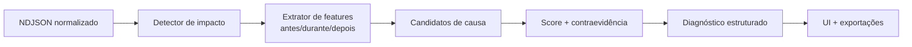

# Plano: diagnóstico de causa-raiz nos relatórios

> Como evoluir o relatório de “onde a live sofreu” para “o que provavelmente causou o impacto, por que acreditamos nisso e o que fazer antes da próxima live”.

- **Status:** fundação implementada (schema v4)
- **Data:** 2026-09-01
- **Relacionado:** [`RELATORIO-POS-LIVE.md`](./RELATORIO-POS-LIVE.md)

## Implementado em 2026-09-01

A primeira entrega segura deste plano já está no aplicativo:

- coleta adaptativa de CPU, memória, GPU 3D e GPU de codificação por processo;
- ranking limitado aos três aplicativos relevantes, normalmente persistido a cada
  ~6 segundos e antecipado apenas quando há mudança material;
- nomes internos como `ffmpeg` e `mediamtx` agrupados como **Corneta**;
- nenhum caminho, argumento, título de janela, URL ou segredo persistido;
- consulta de GPU nativa e persistente no Windows, com `nvidia-smi` apenas como
  fallback único por live;
- schema de relatório v4, compatível com sessões v1–v3;
- deltas de quadros atrasados do OBS e dos destinos em vez de picos cumulativos;
- correlação temporal entre pressão de um aplicativo e atraso real da live;
- níveis “causa provável”, “possível causa” e “pista, ainda sem confirmação”;
- evidências e ação sugerida em linguagem simples, dentro dos bastidores técnicos;
- memória incluída no gráfico da máquina;
- fixture “Cyberpunk 2077 ocupou a placa de vídeo” e testes contra falsa acusação
  quando o uso está alto, mas a transmissão continua saudável.

Sondas externas de rota e códigos estruturados de falha continuam como evolução
posterior: sem esses dados, rede e plataforma aparecem deliberadamente com confiança
baixa. Isso evita trocar ausência de dados por uma acusação forte.

## Resumo executivo

A Corneta já detecta janelas problemáticas e atribui categorias amplas como `rede`, `render`, `encoding`, `plataforma` e `sinal`. Isso é um bom começo, mas ainda não é um diagnóstico de causa-raiz: a regra atual usa poucos sinais, olha principalmente para picos dentro da janela e não mostra a evidência que levou à conclusão.

A evolução recomendada é criar um **motor determinístico de diagnóstico**, baseado em quatro princípios:

1. **Separar sintoma, mecanismo e causa provável.** “A Twitch ficou sem receber vídeo” é o sintoma; internamente, a Corneta sabe qual parte do envio parou; “a conexão até a Twitch ficou instável” é a causa provável que o streamer entende.
2. **Explicar cada conclusão.** Toda causa precisa carregar evidências, contraevidências, cobertura dos dados e confiança. Se não houver evidência suficiente, o produto deve dizer isso.
3. **Coletar os sinais que realmente diferenciam as causas.** Em especial: deltas dos contadores do OBS, `speed`/saída do FFmpeg, transições com motivo estruturado, saúde do ingest local, configuração-base e sinais de rede por destino.
4. **Traduzir implementação em situações reais.** O motor pode falar em processo, encoder e socket; a interface deve falar “o jogo usou quase toda a GPU”, “a cena do OBS ficou pesada” ou “a conexão com o YouTube oscilou”.

Não recomendo começar com ML ou LLM. Ainda não temos uma base rotulada e, nesse domínio, uma regra explicável é mais confiável, barata e fácil de calibrar. Um modelo de linguagem poderia futuramente melhorar a redação, mas nunca decidir a causa.

## 1. O que existe hoje

O relatório já grava, aproximadamente a cada dois segundos:

- CPU e GPU globais;
- bitrate, FPS, frames descartados e estado de cada destino;
- `activeFps`, tempo médio de render, frames pulados e congestionamento informados pelo OBS;
- estados como `live`, `reconnecting`, `error` e `signal-lost`.

A análise em `src/lib/report.ts` abre uma janela quando encontra queda de bitrate, estado ruim, congestionamento ou render lento. Depois aplica uma árvore de decisão:

- sinal perdido → problema no sinal do OBS;
- render lento + CPU/GPU alta → encoding;
- render lento sem saturação → cena pesada;
- vários destinos afetados → rede;
- somente um destino afetado → plataforma.

O relatório técnico já mostra a categoria, sinais e uma recomendação. O problema é que a categoria ainda é ampla e pode soar como uma afirmação mesmo quando é apenas uma correlação.

### Lacunas encontradas

1. **Contadores importantes são gravados, mas não entram na classificação.** `renderSkipped`, `outputSkipped` e `target.dropped` são cumulativos; hoje a análise não calcula seus deltas por janela.
2. **`avgRenderMs` sozinho não comprova frames perdidos.** Um pico pode não causar impacto, enquanto um aumento de `renderSkipped` comprova que o OBS deixou de renderizar frames.
3. **CPU/GPU total não identifica o processo culpado.** Um jogo pode ocupar 99% da GPU enquanto NVENC, OBS e Corneta continuam saudáveis.
4. **“Um destino = plataforma” é uma inferência fraca.** Também pode ser rota do provedor, DNS, TLS/RTMP, autenticação, configuração ou o processo daquele destino.
5. **“Vários destinos = internet” também é insuficiente.** Uma falha do ingest local, uma sobrecarga compartilhada ou uma reinicialização do motor afetam todos ao mesmo tempo.
6. **A mediana da própria live mascara problema constante.** Se o destino ficou abaixo do bitrate configurado durante toda a sessão, aquele valor ruim vira o “típico”.
7. **Erros são texto efêmero.** O estado possui `message`, mas o NDJSON não guarda código, fase e motivo estruturado da transição.
8. **Não existe confiança nem contraevidência.** O streamer não sabe a diferença entre “o contador provou” e “essa é a hipótese menos ruim”.
9. **O congestionamento do OBS não mede necessariamente a internet externa.** Na arquitetura da Corneta, o OBS normalmente envia para o ingest local. Portanto, `outputCongestion` do OBS descreve principalmente o trecho OBS → Corneta, e não as rotas Corneta → Twitch/YouTube/Kick.

No relatório real usado nos testes, por exemplo, existem **367 `renderSkippedFrames` acumulados**, mas `avgRenderMs` ficou abaixo do limite atual. O dado está no arquivo, porém a heurística atual não o usa. Isso não basta para culpar uma cena — precisamos calcular taxa, duração e ordem temporal — mas mostra a oportunidade imediata.

## 2. O que significa “causa” no produto

O relatório deve apresentar três níveis distintos:

| Nível | Pergunta | Exemplo |
|---|---|---|
| Impacto | O que o público provavelmente percebeu? | Twitch ficou 12s sem receber vídeo |
| Mecanismo | Qual parte do caminho falhou? | O envio da Corneta para a Twitch perdeu a conexão |
| Causa provável | O que explica o mecanismo? | A conexão até a Twitch ficou instável |

Nem sempre será possível chegar ao terceiro nível. Nesses casos, é melhor mostrar “não deu para separar rota, ingest e plataforma” do que declarar “a Twitch caiu”.

### Linguagem de confiança

O score pode ser numérico internamente, mas a UI deve usar rótulos compreensíveis:

| Rótulo | Quando usar |
|---|---|
| **Confirmado pelos dados** | Há sinal direto e específico: código de autenticação, contador de frames pulados, ingest local ausente etc. |
| **Muito provável** | Duas ou mais fontes independentes concordam, na ordem temporal esperada, sem contraevidência forte. |
| **Possível** | Há correlação útil, mas falta um discriminador importante. |
| **Não foi possível determinar** | Os dados disponíveis sustentam duas ou mais causas com força semelhante. |

Não devemos exibir “87% de certeza” enquanto o score não estiver calibrado contra incidentes com causa conhecida.

### Regra de linguagem

O diagnóstico precisa ter duas camadas:

- **Camada do produto:** frases que um streamer entende sem conhecer infraestrutura de vídeo.
- **Detalhes técnicos/exportação:** nomes como FFmpeg, RTMP, encoder, socket e códigos de erro, úteis para suporte e desenvolvimento.

Termos internos nunca devem vazar para o título, causa principal ou ação recomendada. Exemplos:

| Evidência interna | O streamer lê |
|---|---|
| `ffmpeg speed=0.72x` | “A Corneta não conseguiu processar o vídeo em tempo real” |
| `outputSkippedFrames +240` | “O OBS pulou frames ao gerar o vídeo” |
| `renderSkippedFrames +148` | “O OBS perdeu frames ao montar a cena” |
| `socket_timeout` em um destino | “A conexão com o YouTube parou de responder” |
| GPU por processo: jogo em 97% | “O jogo usou quase toda a placa de vídeo” |
| CPU do processo Corneta alta | “O processamento de vídeo da Corneta chegou ao limite” |

As evidências exibidas também precisam ser traduzidas. “GPU 99%” isolado é abstrato; “Cyberpunk 2077 usou 94% da GPU enquanto o OBS começou a perder frames” conta uma história causal.

## 3. Taxonomia proposta

Uma janela pode ter **uma causa principal** e **fatores contribuintes**. Isso evita forçar eventos mistos em uma única caixa.

| Categoria interna | O streamer lê | Fatores contribuintes possíveis |
|---|---|---|
| `obs_signal` | “O vídeo parou de chegar do OBS” | OBS fechou, cena sem saída, cabo/dispositivo de captura |
| `obs_render` | “O OBS não conseguiu montar a cena a tempo” | cena pesada, browser source, filtro, jogo usando GPU 3D |
| `obs_encode` | “O OBS não conseguiu gerar o vídeo a tempo” | preset pesado, CPU saturada, engine de encode saturada |
| `corneta_transcode` | “A Corneta não conseguiu adaptar o vídeo em tempo real” | CPU, GPU encode, limite de sessões, qualidade alta demais |
| `app_resource_pressure` | “O jogo usou quase toda a placa de vídeo” | jogo sem limite de FPS, navegador, Discord ou outro aplicativo pesado |
| `local_ingest` | “O vídeo se perdeu entre o OBS e a Corneta” | firewall local, serviço de entrada, rede local |
| `wan_upload` | “A internet não conseguiu enviar tudo ao mesmo tempo” | soma das qualidades, Wi‑Fi, perda de pacotes, bufferbloat |
| `target_route` | “A conexão até o YouTube ficou instável” | provedor, rota, região de servidor, perda/latência específica |
| `platform_ingest` | “A plataforma recusou ou encerrou o envio” | indisponibilidade, limite remoto, servidor da plataforma |
| `auth_config` | “A plataforma recusou a chave ou configuração” | credencial expirada, stream key incorreta, URL inválida |
| `memory_pressure` | “O PC ficou sem memória disponível” | jogo, navegador, outro aplicativo, vazamento |
| `disk_recording` | “O disco não acompanhou a gravação” | disco cheio/lento; só afeta a live com evidência compartilhada |
| `unknown` | “Não deu para descobrir a causa desta vez” | lista simples do que faltou observar |

### Limite honesto sobre cenas do OBS

O obs-websocket informa frames perdidos e permite observar troca de cena, mas não informa o custo de render de cada source/filtro. A Corneta pode concluir “a renderização do OBS atrasou logo após a troca para a cena X”, porém não pode afirmar “o Browser Source Y causou” sem profiler/log adicional do OBS. O nome da cena também é dado potencialmente sensível; podemos guardar somente um identificador opaco e mostrar o nome apenas se ele já estiver disponível localmente no momento da visualização.

### Identificar qual aplicativo pesou no PC

Para mostrar causas como **“o jogo X puxou recurso demais”**, CPU/GPU globais não bastam. Precisamos coletar uso por aplicativo durante a live.

Coleta recomendada:

- CPU e memória por processo via `sysinfo`, já presente no backend;
- GPU 3D e GPU encode por processo no Windows via contadores nativos de performance, sem abrir PowerShell a cada amostra;
- top 3 aplicativos por recurso, agregando processos do mesmo produto;
- aplicativo em primeiro plano como evidência de apoio, nunca como prova isolada;
- nomes amigáveis a partir da descrição do executável, com fallback para o nome sem `.exe`;
- grupos conhecidos: OBS Studio, Corneta, navegador, Discord e jogo/aplicativo externo.

No Windows, os contadores de GPU expõem várias engines por PID. A coleta deve agregar por processo e por tipo (`3D`, `Video Encode`, `Video Decode`) sem somar engines incompatíveis como se fossem uma única porcentagem. CPU também deve ser normalizada para `0–100%` da máquina inteira, não `100% por núcleo`. Se o sistema não oferecer atribuição confiável por aplicativo, `appResources` fica falso e a UI não tenta nomear um culpado.

Não precisamos gravar todos os processos a cada dois segundos. Para manter o app leve:

1. amostrar processos a cada 5–10s;
2. persistir somente aplicativos acima de um limite relevante;
3. registrar um evento quando o aplicativo dominante mudar ou quando começar/terminar uma saturação;
4. agregar os filhos do jogo/launcher quando houver relação confiável.

Exemplo de evento local:

```json
{"kind":"resourceOwner","t":0,"app":"Cyberpunk 2077","cpuPct":42,"gpu3dPct":94,"gpuEncodePct":0,"memoryMb":7800,"foreground":true}
```

#### Quando podemos culpar o jogo

Só mostrar “o jogo provavelmente causou” quando houver cadeia temporal completa:

1. o jogo passou a dominar CPU ou GPU;
2. o recurso realmente chegou perto do limite;
3. logo depois, OBS ou Corneta começou a perder frames/processar abaixo do tempo real;
4. rede e plataforma permaneceram saudáveis;
5. o problema melhorou quando a pressão do jogo caiu.

Se o jogo ficou em 99% de GPU, mas nenhum frame foi perdido, ele não causou incidente. No máximo, pode aparecer nos detalhes como “pouca folga disponível”.

Exemplos de copy:

- **Confiança alta:** “Cyberpunk 2077 usou 94–99% da GPU. Três segundos depois, o OBS começou a perder frames ao montar a cena.”
- **Possível fator:** “O jogo estava usando quase toda a GPU, mas não temos dados suficientes para afirmar que ele causou a queda.”
- **Sem impacto:** não mostrar nenhum alerta; recurso alto sozinho não é problema.

Para navegador, Discord ou outro aplicativo, a mesma regra vale. Não presumir que todo executável em tela cheia é um jogo.

## 4. Modelo de diagnóstico

Cada janela deve gerar um objeto estruturado, não apenas três strings:

```ts
interface RootCauseDiagnosis {
  mechanism: {
    kind: "signal" | "render" | "encode" | "processing" | "transport" | "remote";
    evidence: DiagnosticEvidence[];
  };
  primary: CauseCandidate;
  contributors: CauseCandidate[];
  impact: {
    targets: string[];
    startedAt: number;
    durationSec: number;
    estimatedLostFrames?: number;
  };
  dataCoverage: {
    obs: boolean;
    system: boolean;
    ingest: boolean;
    targetNetwork: boolean;
    ffmpegProgress: boolean;
    appResources: boolean;
  };
  analyzerVersion: number;
}

interface CauseCandidate {
  kind: CauseKind;
  scope: "source" | "machine" | "app" | "all-targets" | "target" | "recording";
  targetId?: string;
  app?: { ref: string; displayName: string };
  confidence: "confirmed" | "likely" | "possible" | "unknown";
  score: number; // interno; não precisa aparecer na UI
  evidence: DiagnosticEvidence[];
  counterEvidence: DiagnosticEvidence[];
  missingEvidence: string[];
  actions: DiagnosticAction[];
}

interface DiagnosticEvidence {
  code: string; // estável e traduzível
  subjectRef?: string; // aplicativo, destino ou componente relacionado
  value?: number;
  unit?: string;
  observedAt?: number;
  weight: "strong" | "supporting" | "weak";
}
```

`code` deve ser estável e a copy deve vir do i18n. Assim, exportações e testes não dependem de texto em português.

## 5. Como inferir a causa

### 5.1 Normalizar antes de classificar

1. Ordenar amostras e tratar resets de contadores.
2. Converter campos cumulativos em deltas por segundo:
   - `obs.renderSkipped`;
   - `obs.outputSkipped`;
   - `target.dropped`.
3. Calcular baseline em um trecho saudável anterior, não apenas na live inteira.
4. Comparar bitrate medido com dois referenciais:
   - bitrate configurado;
   - p50 do trecho saudável.
5. Extrair três regiões: 10–20s antes, durante e 10–20s depois da janela.
6. Só tratar como causa o sinal que começou **antes ou junto** do impacto. CPU alta que aparece depois da queda é contexto, não explicação.

### 5.2 Evidência e contraevidência

Exemplos de regras:

#### OBS perdeu o sinal

Evidências fortes:

- `ingestLive` mudou para falso antes de todos os destinos entrarem em `signal-lost`;
- idade do último pacote/frame do ingest cresceu;
- todos os destinos foram afetados ao mesmo tempo.

Contraevidência:

- ingest continuou recebendo frames normalmente;
- somente um destino caiu.

#### Renderização do OBS

Evidências fortes:

- delta de `renderSkippedFrames` maior que zero durante a janela;
- `activeFps` caiu enquanto `outputSkippedFrames` permaneceu estável;
- troca de cena ocorreu imediatamente antes.

Evidências de apoio:

- GPU 3D alta;
- um jogo ou aplicativo específico passou a dominar a GPU antes da perda de frames;
- `averageFrameRenderTime` próximo ou acima do orçamento do frame (`1000 / FPS`).

Contraevidência:

- `renderSkippedFrames` não aumentou;
- frames saíram do OBS normalmente e só um destino sofreu.

#### Encoding do OBS

Evidências fortes:

- delta de `outputSkippedFrames` aumentou;
- render permaneceu saudável;
- FPS de saída caiu antes do impacto.

Evidências de apoio:

- CPU do OBS ou engine de GPU encode saturada;
- outro aplicativo disputou justamente o recurso usado pelo encoder;
- resolução/FPS/preset acima do perfil recomendado.

#### Transcode da Corneta

Evidências fortes:

- `speed < 0.95x` de forma sustentada no FFmpeg de transcode;
- destinos em passthrough permaneceram saudáveis enquanto os transcodificados sofreram;
- processo terminou por erro de encoder ou falta de sessão de hardware.

Evidências de apoio:

- CPU da Corneta ou engine de encode alta;
- um jogo ou aplicativo específico tomou a maior parte do recurso antes do impacto;
- várias saídas transcodificadas competindo pelo mesmo encoder.

#### Upload local

Evidências fortes:

- vários destinos, em provedores diferentes, degradaram no mesmo segundo;
- perda/retransmissão ou fila de saída aumentou de forma compartilhada;
- soma do envio chegou perto do teto de upload conhecido.

Contraevidência:

- apenas uma rota piorou;
- `speed` do transcode caiu antes da pressão de rede;
- ingest local já havia parado.

Importante: `OBS.outputCongestion` isolado não prova falta de upload externo quando o OBS envia para a Corneta localmente.

#### Rota ou plataforma específica

Evidências fortes:

- somente um destino sofreu e os demais mantiveram bitrate/FPS;
- latência/perda aumentou apenas na rota desse destino;
- houve timeout de escrita ou reset remoto.

A distinção final depende do erro:

- DNS/TCP/TLS/timeout → rota/conectividade;
- 401/403/credencial inválida → autenticação/configuração;
- recusa/encerramento remoto com rede saudável → ingest da plataforma;
- sem código ou telemetria de rota → “destino específico; não foi possível separar rota de plataforma”.

### 5.3 Score determinístico

Cada candidato recebe pontos por evidência e perde pontos por contraevidência. Um exemplo inicial:

- evidência direta: `+4`;
- evidência independente de apoio: `+2`;
- correlação fraca: `+1`;
- contraevidência forte: `-4`;
- discriminador obrigatório ausente: limita a confiança a `possible`.

Os pesos devem ficar numa tabela pura e testável. O resultado deve permitir empate e `unknown`; nunca escolher uma causa só porque alguma precisa vencer.

## 6. Dados adicionais necessários

### P0 — usar melhor o que já existe

Sem mudar o NDJSON, já podemos:

- calcular deltas de `renderSkipped`, `outputSkipped` e `target.dropped`;
- usar orçamento de frame derivado do FPS em vez de `25ms` fixos;
- analisar simultaneidade entre destinos;
- separar sinal direto de contexto;
- introduzir evidências, contraevidências, cobertura e confiança;
- parar de chamar congestionamento do OBS de upload externo;
- gerar causa principal + fatores contribuintes.

### P1 — schema v4, alto retorno e baixo custo

Adicionar ao `meta`:

- versão do app e do analisador;
- resolução e FPS de entrada/saída;
- encoder/preset/modo;
- bitrate configurado e protocolo de cada destino;
- se o destino usa passthrough ou transcode;
- limite de upload conhecido, somente se medido antes da live ou informado pelo usuário.

Adicionar às amostras:

- CPU total **e CPU do processo Corneta**;
- memória disponível, pressão de commit e RSS da Corneta;
- utilização separada de GPU 3D e GPU encode, quando disponível;
- top aplicativos por CPU, GPU e memória, usando apenas nome amigável e métricas;
- indicador de aplicativo em primeiro plano, somente como evidência de apoio;
- idade do último frame/pacote no ingest local;
- `speed` do FFmpeg por destino;
- bitrate efetivamente solicitado pelo ABR.

Adicionar eventos, em vez de repetir strings em toda amostra:

```json
{"kind":"targetTransition","t":0,"targetId":"x","from":"live","to":"reconnecting","phase":"write","reasonCode":"socket_timeout"}
{"kind":"engineDecision","t":0,"targetId":"x","action":"abr_down","fromKbps":6000,"toKbps":4800,"reasonCode":"speed_below_realtime"}
{"kind":"processExit","t":0,"targetId":"x","component":"ffmpeg","exitCode":1,"reasonCode":"remote_reset"}
{"kind":"obsSceneChanged","t":0,"sceneRef":"opaque-local-id"}
{"kind":"resourceOwner","t":0,"app":"Cyberpunk 2077","gpu3dPct":94,"cpuPct":42,"foreground":true}
```

Os `reasonCode` devem ser catálogo fechado. Texto bruto do FFmpeg pode continuar no log local redigido, mas não deve virar contrato do relatório.

### P2 — diferenciar internet, rota e plataforma

Prioridade de coleta, do menor para o maior risco/overhead:

1. Classificar fase e código de falha já observados pelo socket/FFmpeg: DNS, conexão, handshake, autenticação, escrita, timeout e reset remoto.
2. Medir tempo de conexão e quantidade de tentativas por destino.
3. Observar retransmissões/fila do socket quando o sistema operacional disponibilizar.
4. Amostrar RTT/perda por rota em baixa frequência, sem bloquear o pipeline.

Não executar speed test durante a live. O teto de upload deve vir de um teste pré-live opcional ou configuração explícita.

### P3 — causas raras

- latência/fila de disco e espaço livre para separar falha de gravação de falha da live;
- paginação e pressão de memória;
- temperatura/throttling, somente onde houver API confiável;
- estado detalhado do MediaMTX/ingest local.

## 7. UX recomendada

O diagnóstico continua secundário à história da live. Ele deve viver em **Bastidores técnicos**, dentro do agrupamento de incidentes, e não voltar a dominar o relatório.

Exemplo:

```text
CAUSA MAIS PROVÁVEL · confiança alta
O jogo usou quase toda a placa de vídeo

Por que pensamos isso
• Cyberpunk 2077 usou 94–99% da GPU durante 18s
• 3s depois, o OBS começou a perder frames ao montar a cena
• a conexão com as plataformas permaneceu estável

Impacto
18s · todos os destinos · começou em 01:42:16

Antes da próxima live
Limite o FPS ou reduza os gráficos do jogo para deixar folga para o OBS.

Como confirmar
Faça um teste de 2 minutos com o jogo limitado e confira se o OBS deixa de perder frames.
```

Para confiança baixa:

```text
DESTINO ESPECÍFICO · causa não conclusiva
Só o YouTube reconectou. A máquina e o OBS estavam saudáveis, mas esta live
não gravou telemetria suficiente para separar rota de internet e ingest do YouTube.
```

### Ordem de informação

1. causa provável em linguagem simples;
2. confiança;
3. impacto;
4. duas ou três evidências mais fortes;
5. ação específica;
6. “ver detalhes” com contraevidências, dados ausentes e série temporal.

Não mostrar dezenas de badges. Evidências devem ser frases curtas e ordenadas por força.

## 8. Arquitetura sugerida



Separar em módulos:

- `report/windows.ts` — detecta somente impacto e janelas;
- `report/features.ts` — deltas, baseline e simultaneidade;
- `report/causes.ts` — regras e pesos;
- `report/actions.ts` — ações por causa e contexto;
- `report/diagnosis.ts` — monta principal, contribuintes e cobertura;
- `report.ts` — compatibilidade/orquestração.

Isso evita transformar o já grande `src/lib/report.ts` em uma árvore de `if/else` impossível de calibrar.

## 9. Implementação por fases

| Fase | Entrega | Esforço | Critério de pronto |
|---|---|---:|---|
| P0 | Deltas, evidências, confiança e regras honestas com o schema atual | M | Relatórios antigos ganham diagnóstico melhor sem migração |
| P1 | Schema v4 com contexto, aplicativos dominantes, progresso do processamento, ingest e eventos estruturados | M/L | Separa jogo/aplicativo, OBS, Corneta e configuração em fixtures determinísticas |
| P2 | Telemetria de conexão/rota por destino | L | Separa upload compartilhado, rota e resposta remota |
| P3 | Memória, disco, throttling e calibração com feedback | M | Reduz `unknown` sem aumentar falsos positivos |

### Sequência recomendada

1. Implementar P0 primeiro. Ele corrige conclusões excessivas e aproveita dados já gravados.
2. Implementar P1 imediatamente depois. `speed`, erro estruturado e saúde do ingest dão o maior salto de precisão.
3. Só então investir em métricas de rota. Sem os dois passos anteriores, rede tende a virar o balde de tudo que não entendemos.

## 10. Validação

### Fixtures obrigatórias

Criar relatórios sintéticos com causa conhecida:

1. live limpa com CPU/GPU altas;
2. perda de sinal do OBS;
3. cena pesada com `renderSkipped` crescente;
4. encoding do OBS com `outputSkipped` crescente;
5. transcode da Corneta abaixo de `1x`;
6. upload saturado afetando todos os destinos;
7. perda somente na rota de um destino;
8. erro de autenticação/configuração;
9. gravação em disco falhando sem afetar a live;
10. incidente misto: render + upload;
11. métricas ausentes de um relatório antigo;
12. reset de contador após reinício do OBS/FFmpeg.
13. jogo em 99% de GPU sem nenhum frame perdido;
14. jogo dominando GPU e perda de render começando logo depois;
15. navegador/Discord pesado para garantir que não chamamos todo aplicativo de jogo.

Cada fixture deve verificar:

- causa principal;
- fatores contribuintes;
- confiança máxima permitida pela cobertura;
- evidências e contraevidências;
- ação recomendada;
- ausência de falso incidente em warm-up/BRB.

### Testes de falha reais

- desligar o envio do OBS durante alguns segundos;
- abrir uma cena pesada conhecida;
- forçar encoder abaixo de tempo real;
- executar um jogo com FPS livre e depois com limite de FPS;
- provocar pressão com um aplicativo que não seja jogo;
- derrubar apenas um processo/destino;
- injetar latência/perda em um proxy local de teste;
- negar autenticação com uma credencial de sandbox;
- limitar artificialmente a banda antes do destino.

Em builds de desenvolvimento, registrar uma linha `diagnosticGroundTruth` somente nas sessões de teste. Ela nunca participa da inferência; serve para comparar o resultado com a causa injetada.

### Métricas de qualidade

- `confirmed` nunca aparece sem evidência direta;
- `unknown` é aceito e preferível a uma acusação errada;
- incidentes curtos continuam filtrados quando não há impacto comprovado;
- relatórios antigos degradam para `possible/unknown`, sem quebrar;
- classificação e copy são determinísticas;
- o mesmo conjunto de dados produz o mesmo resultado em PT e EN.

## 11. Performance, tamanho e privacidade

### Orçamento de performance

- manter amostragem pesada em aproximadamente 2s;
- amostrar ranking de processos em 5–10s e persistir apenas mudanças relevantes;
- usar contadores nativos para GPU por processo; nunca executar PowerShell em loop;
- transições, decisões e erros são eventos, não campos repetidos;
- nenhuma sonda de rede bloqueia FFmpeg, engine ou thread de gravação;
- análise em uma passagem, `O(amostras × destinos)`;
- objetivo de análise: menos de 100ms para 8h/4 destinos numa máquina de referência;
- trabalho adicional do coletor: p95 abaixo de 2ms por ciclo;
- memória adicional: menos de 10MB;
- crescimento do NDJSON v4: no máximo 30% sobre uma sessão equivalente v3.

### Privacidade

Nunca persistir:

- stream keys, tokens ou secrets;
- URL completa de destino customizado;
- mensagem bruta que possa conter credencial;
- nome de arquivo/caminho completo;
- linha de comando, título de janela ou caminho do aplicativo;
- título da live, conteúdo do vídeo ou texto do chat para diagnóstico técnico.

O nome amigável do aplicativo é necessário para dizer “o jogo X pesou”, mas deve permanecer local, aparecer claramente na política de dados e ser removido pelo modo de exportação anônima. Não enviar ranking de processos para PostHog ou outro serviço. Usar IDs internos, plataforma/protocolo, fase e códigos fechados. Domínio/host de destino customizado só deve ser guardado com consentimento explícito; para o diagnóstico normal basta `official`/`custom` e o tipo de protocolo.

## 12. Decisões recomendadas

1. **Motor de regras explicável, não ML.** Temos conhecimento de domínio e pouca verdade rotulada.
2. **Causa + confiança + evidência.** Uma categoria isolada não é diagnóstico.
3. **Principal + contribuintes.** Gargalos reais frequentemente são compostos.
4. **Deltas, não picos absolutos.** Principalmente nos contadores cumulativos do OBS/FFmpeg.
5. **Ordem temporal obrigatória.** O sinal causal deve preceder o impacto.
6. **Comparação entre destinos como contrafactual.** Passthrough saudável × transcode ruim é evidência valiosa.
7. **`unknown` como resultado de primeira classe.** Honestidade aumenta a confiança no relatório.
8. **Ação específica e verificável.** Cada causa deve responder “o que mudar” e “como confirmar”.
9. **Diagnóstico permanece secundário.** A live continua sendo a história principal; causa-raiz aparece quando o streamer decide investigar.
10. **Linguagem de streamer primeiro.** Nomes técnicos ficam nos detalhes; causa e ação falam de jogo, OBS, PC, internet, Corneta e plataforma.
11. **Atribuição por aplicativo exige impacto.** Uso alto sem frame perdido, atraso ou queda não gera acusação.

## 13. Resultado esperado

Depois dessas fases, a Corneta deixa de mostrar apenas:

> “Houve uma queda no YouTube às 01:42.”

E passa a explicar:

> “O YouTube ficou 12s sem receber vídeo. O OBS, o PC e a Twitch continuaram normais, mas a conexão da Corneta com o YouTube parou de responder. A causa mais provável é uma instabilidade no caminho até o YouTube. Antes da próxima live, teste outra região de servidor.”

Ou, quando houver atribuição de recurso:

> “Cyberpunk 2077 usou quase toda a placa de vídeo. Três segundos depois, o OBS começou a perder frames ao montar a cena, e todas as plataformas receberam vídeo travado por 18s. Limite o FPS ou reduza os gráficos do jogo para deixar folga para a live.”

Esse é o nível certo de diagnóstico: específico, sustentado por evidência, honesto sobre os limites e acionável para o streamer.
