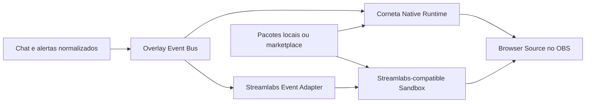

# Plano de implementação — overlays, skins e marketplace

> Como tornar chat, alertas e futuros widgets da Corneta personalizáveis sem transformar o app
> num painel de avião. O plano tem dois motores: um formato próprio, com decisões de produto da
> Corneta, e um modo compatível com widgets do Streamlabs.

- **Status:** planejamento
- **Data:** 2026-08-04
- **Escopo inicial:** app desktop Windows + Browser Source do OBS
- **Relacionado:** [`CHAT.md`](./CHAT.md), [`ALERTAS.md`](./ALERTAS.md),
  [`FEATURE-ALERTAS-EXTERNOS.md`](./FEATURE-ALERTAS-EXTERNOS.md),
  [`MONETIZACAO.md`](./MONETIZACAO.md)

---

## 1. Decisão em uma frase

A Corneta terá **uma infraestrutura de overlays e pacotes**, com dois motores sobre o mesmo fluxo
de eventos:

1. **Corneta Native:** skins declarativas, seguras e fáceis de ajustar, sem exigir HTML ou CSS.
2. **Streamlabs Compatible:** HTML, CSS, JavaScript e campos customizados executados num ambiente
   isolado que imita o contrato de eventos do Streamlabs.

O marketplace não será um terceiro formato. Ele distribuirá, versionará e venderá pacotes feitos
para um desses dois motores.



---

## 2. O que já existe e deve ser aproveitado

A feature não começa do zero:

- `src-tauri/src/overlay.rs` já sobe um servidor HTTP apenas em `127.0.0.1`, com porta estável.
- `src-tauri/assets/overlay.html` já tem fila, animação, som e renderização dos alertas.
- `src-tauri/assets/chat-overlay.html` já renderiza chat, badges, plataforma, emotes, limite e fade.
- `/alerts`, `/chat`, `/alerts-ws` e `/chat-ws` já funcionam como Browser Source e WebSocket.
- `ChatMessage` e `Alert` já são normalizados antes de chegar ao overlay.
- A Corneta já adiciona ou atualiza o Browser Source diretamente no OBS.
- O painel atual já testa alertas e mensagens sem poluir o histórico da live.

O principal limite atual é estrutural: cada overlay é um HTML fixo embutido no executável, e as
opções via query string não formam um tema versionado, exportável ou vendável.

### Mudança de arquitetura

O servidor atual deve virar um **runtime de instâncias**:

```text
hoje
Alert/Chat -> broadcast fixo -> HTML fixo -> OBS

destino
Alert/Chat -> evento versionado -> instância -> pacote + preferências -> renderer -> OBS
```

---

## 3. Princípios do produto

### 3.1 Simples primeiro, avançado quando pedido

Quem só quer mudar cor, fonte, posição e animação não deve encontrar código, camadas ou vinte abas.
O editor abre no modo **Ajustar**, com preview grande e controles daquilo que está na tela. O modo
**Criar** expõe composição, variações, código e diagnóstico.

### 3.2 O preview é o centro da tela

O streamer está decidindo como a live vai aparecer. A maior área da interface deve ser a imagem
final, não a lista de propriedades.

### 3.3 Uma entrada na navegação

Não criar itens separados para “Skins”, “Temas”, “Widgets” e “Marketplace”. A entrada é
**Overlays**; dentro dela ficam “Meus overlays” e “Marketplace”. A configuração atual escondida na
aba do Chat migra para essa área sem adicionar mais coisas à navbar.

### 3.4 A live não pode depender do editor

Fechar a tela de edição, perder internet ou sair da conta não pode derrubar um overlay já instalado.
O OBS usa a cópia local do pacote e suas preferências.

### 3.5 Código de terceiros nunca entra na interface principal

HTML/CSS/JS compatível com Streamlabs pode rodar no preview e no Browser Source, dentro de sandbox.
Ele não pode alterar a janela da Corneta, acessar comandos Tauri, ler arquivos ou conversar com
outros serviços sem uma permissão explícita.

### 3.6 Local continua grátis

Criar, importar, exportar e instalar um pacote local deve continuar grátis. Uma skin paga é conteúdo
vendido por outro creator, não um botão local artificialmente bloqueado. A parte paga do marketplace
cobre catálogo, conta, pagamento, entrega, atualização e repasse.

### 3.7 Sem DRM que quebra no meio da live

Uma compra baixada precisa continuar funcionando offline. A Corneta pode validar recibos, assinar
pacotes e sincronizar direitos, mas não deve consultar o servidor a cada abertura do Browser Source.

---

## 4. Duas frentes, um só produto

### 4.1 Frente A — Corneta Native

É o formato recomendado para a maioria dos streamers e para creators que não querem manter código.
O pacote descreve intenção e composição; a Corneta controla o HTML final.

### O que será personalizável

#### Chat

- fonte, tamanho, peso, altura da linha e alinhamento;
- cor do autor, mensagem, fundo, borda e sombra;
- formato e posição de plataforma, origem, badges e horário;
- espaçamento, largura máxima e quantidade de mensagens;
- crescimento de cima para baixo ou de baixo para cima;
- entrada, saída, duração e fade por mensagem;
- comandos, mensagens apagadas, mensagens de bot e plataformas visíveis;
- emotes nativos e de terceiros;
- planos de fundo, molduras e assets decorativos;
- variação por plataforma sem duplicar o overlay inteiro.

#### Alertas

- layout entre imagem/vídeo, título, mensagem, valor e plataforma;
- imagem, vídeo, som e volume por tipo de evento;
- template de texto com variáveis como `{name}`, `{amount}`, `{months}`, `{gifter}` e `{count}`;
- duração, atraso de texto, entrada, permanência e saída;
- fila, prioridade, intervalo entre alertas e comportamento em rajadas;
- estilos específicos para follow, sub, resub, gift, bits, tip, raid, member e super chat;
- variações por valor, quantidade, meses, plataforma, origem ou usuário;
- área segura e posição no canvas;
- redução de movimento e alternativa silenciosa.

#### Janela de chat da Corneta

- um perfil visual nativo poderá afetar a janela flutuante de chat e alertas;
- contraste, foco, moderação, seleção, scroll e estados de conexão continuam controlados pela Corneta;
- skins com JavaScript nunca serão aplicadas dentro da janela operacional.

Essa separação é deliberada: o overlay exibido na live pode ser teatral; a janela que o streamer usa
para moderar precisa continuar legível e previsível.

### A opinião da Corneta sobre chat

- O autor e a mensagem são a informação principal; decoração não pode empurrá-los para fora.
- Origem e plataforma aparecem quando resolvem ambiguidade, principalmente no multistream.
- Texto comprido quebra sem aumentar a largura do canvas.
- Uma imagem que falha não apaga o resto da mensagem.
- Mensagem removida não reaparece no overlay.
- Em rajadas, o sistema reduz animações antes de começar a perder mensagens.
- O creator escolhe a aparência, mas o renderer preserva escaping, limites e sanitização.

### A opinião da Corneta sobre alertas

- A fila pertence ao runtime, não à skin. Uma skin quebrada não pode travar os próximos alertas.
- Todo alerta tem início, permanência, saída e timeout de segurança.
- Variações são regras explícitas e ordenadas; a primeira regra mais específica vence.
- O preview oferece eventos realistas de todas as plataformas da Corneta.
- Som, vídeo e TTS respeitam um limitador global para evitar duas fontes falando ao mesmo tempo.
- Um pacote nunca deve depender de nome, moeda ou mensagem estarem presentes.

### Editor nativo

O editor terá dois níveis sobre o mesmo documento:

1. **Ajustar:** aparência, conteúdo visível, posição, tempo, som e variações prontas.
2. **Criar:** árvore de elementos, regras, estados, campos publicados pelo creator e assets.

Estrutura recomendada:

```text
┌ Superfície: Chat | Alertas              Testar evento | Salvo ┐
├──────────────┬──────────────────────────────────┬──────────────┤
│ Elementos    │                                  │ Ajustes      │
│ ou presets   │          PREVIEW 16:9            │ contextuais  │
│              │                                  │              │
├──────────────┴──────────────────────────────────┴──────────────┤
│ 1920×1080 | 1280×720 | Vertical | Fundo de teste | Zoom       │
└────────────────────────────────────────────────────────────────┘
```

No modo **Ajustar**, a coluna de elementos desaparece. No modo **Criar**, ela volta. O preview não
deve encolher para acomodar controles raros.

---

### 4.2 Frente B — Streamlabs Compatible

O Streamlabs permite Custom Widgets com campos, HTML, CSS e JavaScript, entregues como Browser
Source. O contrato público dispara eventos por `document.addEventListener("onEventReceived", ...)`,
e os widgets podem carregar bibliotecas externas. A própria documentação alerta para o risco de
executar código que a pessoa não escreveu.

A compatibilidade da Corneta deve cobrir três famílias diferentes:

1. **Custom Widget:** HTML, CSS, JS, campos e eventos em tempo real.
2. **Alert Box customizado:** templates, assets, animações, variações e Custom HTML/CSS/JS.
3. **Chat Box customizado:** estrutura de DOM e CSS esperados pelos temas de chat.

O [guia oficial de Custom Widgets](https://support.streamlabs.com/hc/en-us/articles/46771000147739-How-to-Get-Started-with-Streamlabs-Custom-Widgets)
documenta HTML/CSS/JS, campos, Browser Source, `onEventReceived`, payloads e bibliotecas externas. O
[guia oficial de Alert Box](https://streamlabs.com/content-hub/post/setting-up-your-streamlabs-alerts)
documenta edição global, ajustes por evento, variações, testes, assets e Custom HTML/CSS/JS. O
[guia de Chat Box](https://support.streamlabs.com/hc/en-us/articles/360043747714-How-to-Add-a-Chat-Box-Overlay-to-Streamlabs-Desktop)
confirma temas e CSS personalizado.

### O que “100% compatível” significa

Não basta aceitar um arquivo CSS. Um pacote marcado como compatível precisa:

- montar o DOM esperado;
- preencher campos customizados com os mesmos tipos e defaults;
- disparar os mesmos nomes de eventos;
- adaptar cada `Alert` e `ChatMessage` para o payload esperado;
- reproduzir placeholders, variações e testes;
- carregar assets e fontes nos mesmos formatos suportados;
- preservar ordem, concorrência e ausência de fila quando o contrato original assim fizer;
- informar claramente uma API ausente, em vez de falhar silenciosamente.

### Matriz de compatibilidade

| Contrato | Meta | Como provar |
|---|---|---|
| HTML, CSS e JS separados | suportar | fixture importada e comparação visual |
| Custom Fields + valores | suportar | suíte por tipo de campo e default |
| `onEventReceived` | suportar | payloads dourados por plataforma/evento |
| `onWidgetLoad` e `fieldData` | validar no spike | fixtures capturadas no ambiente real |
| Helpers externos/CDN | suportar com permissão | teste por origem declarada |
| Fila criada pelo próprio widget | suportar | eventos simultâneos e timers falsos |
| Alert Box: placeholders | suportar | matriz oficial de `{name}`, `{amount}`, `{months}`, `{gifter}`, `{count}` |
| Alert Box: variações | suportar | regras por valor, meses e quantidade |
| Alert Box: mídia e som | suportar | PNG, GIF, JPEG, WebP, WebM, MP4, MP3, OGG e WAV |
| Chat Box: DOM e classes | suportar | corpus de temas CSS com mensagens reais |
| URL privada do Streamlabs | não importar automaticamente | exige exportação/código autorizado pelo dono |
| Tema premium sem licença | fora de escopo | não contornar compra, login ou proteção do Streamlabs |

Os formatos de mídia acima seguem a lista publicada no
[guia oficial do Alert Box](https://streamlabs.com/content-hub/post/setting-up-your-streamlabs-alerts).

### Limite honesto da promessa

“100% compatível” só poderá aparecer na interface ou no site depois que a suíte de conformidade
passar integralmente. Até lá, o rótulo será **Compatibilidade Streamlabs — beta**.

Mesmo depois disso, a promessa não significa:

- importar automaticamente compras privadas da conta Streamlabs;
- redistribuir assets sem licença;
- garantir pixel idêntico entre versões diferentes de Chromium/CEF e fontes ausentes;
- dar acesso às APIs internas ou não documentadas do Streamlabs;
- manter uma biblioteca externa funcionando se o CDN dela sair do ar.

O objetivo verificável é compatibilidade funcional e visual do formato suportado, não afiliação
com a Streamlabs. O nome e as marcas pertencem aos seus respectivos titulares.

### Fluxo de importação

1. A pessoa escolhe **Importar widget do Streamlabs**.
2. Cola ou seleciona HTML, CSS, JS, Custom Fields, valores e assets que tem direito de usar.
3. A Corneta valida arquivos, campos, URLs externas e APIs usadas.
4. Um relatório mostra: compatível, precisa de permissão ou não suportado.
5. O widget abre no preview isolado com eventos de teste.
6. A pessoa salva como instância local e adiciona ao OBS.

Não pedir token da conta Streamlabs para essa importação. Um widget URL privado pode conter
credenciais e não é um formato de pacote.

---

## 5. Modelo de domínio

Separar quatro conceitos evita que “tema”, “skin” e “overlay” virem a mesma coisa no código:

| Conceito | Significado |
|---|---|
| **Package** | artefato versionado criado por um creator |
| **Surface** | lugar que o pacote sabe renderizar: chat, alertas, event list, goal etc. |
| **Instance** | pacote instalado + preferências de um streamer |
| **Scene Binding** | ligação entre uma instância e uma fonte/cena do OBS |

### Superfícies iniciais

- `broadcast.chat`
- `broadcast.alerts`
- `operator.chat`
- `operator.alerts`

### Superfícies preparadas para o futuro

- `broadcast.event-list`
- `broadcast.goal`
- `broadcast.viewer-count`
- `broadcast.chat-highlight`
- `broadcast.combined`

Não implementar todas no v1, mas não limitar o manifesto a apenas chat e alertas.

### Envelope de evento interno

```json
{
  "schemaVersion": 1,
  "eventId": "uuid",
  "type": "alert.trigger",
  "occurredAt": 1785816000000,
  "source": {
    "platform": "twitch",
    "channel": "main"
  },
  "payload": {},
  "context": {
    "isTest": false,
    "isReplay": false
  }
}
```

Eventos previstos no primeiro schema:

- `runtime.ready`
- `runtime.settings-changed`
- `chat.message`
- `chat.message-deleted`
- `chat.cleared`
- `alert.trigger`
- `viewer.count-changed`
- `preview.background-changed`

O adapter do Streamlabs recebe esse envelope e produz `CustomEvent`s no formato esperado. O motor
nativo consome o envelope diretamente.

---

## 6. Formato de pacote

Extensão sugerida: `.corneta-overlay` — internamente, um ZIP com estrutura validada.

```text
my-overlay.corneta-overlay
├── manifest.json
├── native.json                 # engine corneta-native
├── streamlabs/
│   ├── widget.html             # engine streamlabs
│   ├── widget.css
│   ├── widget.js
│   ├── fields.json
│   └── values.json
├── assets/
│   └── <content-hash>.<ext>
├── previews/
│   ├── cover.webp
│   ├── chat.webp
│   └── alerts.webm
└── LICENSE.txt
```

### Manifesto mínimo

```json
{
  "schemaVersion": 1,
  "packageId": "creator.package-name",
  "version": "1.0.0",
  "name": "Package name",
  "engine": "corneta-native",
  "minimumAppVersion": "0.7.0",
  "surfaces": ["broadcast.chat", "broadcast.alerts"],
  "entrypoints": {
    "native": "native.json"
  },
  "canvas": {
    "width": 1920,
    "height": 1080
  },
  "capabilities": {
    "audio": true,
    "video": false,
    "externalNetwork": []
  },
  "integrity": {}
}
```

### Regras do pacote

- IDs, nomes de arquivos, chaves e paths de URL sempre em inglês.
- `packageId` e versão são imutáveis depois da publicação.
- Arquivo não pode escapar do diretório durante extração; bloquear path traversal, symlink e ZIP bomb.
- Tamanho total, quantidade de arquivos, dimensões e duração de mídia têm limites.
- MIME é conferido pelo conteúdo, não apenas pela extensão.
- Assets são content-addressed e deduplicados.
- Preferências do comprador ficam fora do pacote para sobreviver a atualizações.
- Atualização nunca troca a instância ativa durante uma live sem confirmação.
- Pacote incompatível mantém a última versão funcional instalada.

---

## 7. Runtime e servidor local

### URLs novas

Todas as rotas são em inglês, inclusive na interface em português:

```text
http://127.0.0.1:7393/overlays/{instanceId}?access_token={token}
http://127.0.0.1:7393/overlays/{instanceId}/events?access_token={token}
http://127.0.0.1:7393/assets/{packageId}/{contentHash}
http://127.0.0.1:7393/runtime/streamlabs.js
```

Compatibilidade durante a migração:

- `/alerts` continua abrindo a instância nativa de alertas existente;
- `/chat` continua abrindo a instância nativa de chat existente;
- fontes já adicionadas no OBS não quebram;
- a UI passa a gerar as URLs novas apenas para instâncias novas.

### Estrutura sugerida no Rust

```text
src-tauri/src/overlay/
├── mod.rs
├── server.rs
├── events.rs
├── instances.rs
├── packages.rs
├── assets.rs
├── security.rs
├── native.rs
├── streamlabs.rs
└── tests.rs
```

### Estrutura sugerida no frontend desktop

```text
src/overlays/
├── types.ts
├── api.ts
├── editor/
├── preview/
├── native/
├── streamlabs/
└── tests/
```

### Persistência local

Não colocar manifesto, código ou mídia dentro de `config.json`. Ele guarda apenas preferências
pequenas, IDs ativos e porta.

```text
app-data/overlays/
├── packages/{packageId}/{version}/
├── instances/{instanceId}.json
├── drafts/{draftId}/
├── receipts/{purchaseId}.json
└── cache/
```

Escritas devem ser atômicas: gravar temporário, validar e só então substituir o índice ativo.

### Protocolo do WebSocket

- primeiro frame: versão, instância, capacidades e snapshot necessário;
- frames seguintes: eventos ordenados por conexão;
- sequência monotônica permite detectar perda;
- reconexão não repete alertas já exibidos, salvo replay explícito;
- backpressure separado entre chat e alertas;
- heartbeat permite mostrar “overlay desconectado” apenas no preview, nunca na live;
- uma skin com erro é reiniciada sem interromper outras instâncias.

---

## 8. Sandbox para HTML/CSS/JS

Compatibilidade não pode significar confiança total.

### Isolamento

- O Browser Source carrega uma página-pai controlada pela Corneta.
- O código do pacote roda em `iframe sandbox` sem `allow-same-origin`.
- A ponte envia somente eventos e configurações por `postMessage`.
- Não liberar navegação superior, popups, formulários, downloads, clipboard, câmera ou microfone.
- Não expor objetos Tauri, filesystem, keyring ou comandos do app.
- Cada instância usa um `access_token` aleatório e rotacionável.
- Validar `Host` e `Origin`; não habilitar CORS genérico no servidor loopback.

### Rede externa

Três níveis:

1. **Sem rede:** padrão do Corneta Native e exigência preferida do marketplace.
2. **Origens declaradas:** pacote informa CDNs necessárias; comprador aprova antes de instalar.
3. **Código local não verificado:** o próprio streamer pode liberar origens adicionais, com aviso claro.

Pacotes pagos devem preferir dependências vendorizadas. Um creator não deve vender uma skin que
para de funcionar quando um CDN apaga um arquivo.

### Proteções operacionais

- timeout de inicialização e heartbeat do iframe;
- limite de reinícios automáticos;
- console isolado com erros, warnings e linha do pacote;
- botão **Voltar para a skin anterior**;
- modo seguro que desativa código e preserva apenas texto básico;
- relatório de compatibilidade sem incluir mensagens, nomes ou valores reais da audiência;
- teste de consumo de CPU/memória antes de permitir publicação no marketplace.

Análise estática ajuda a explicar permissões, mas não transforma JavaScript arbitrário em código
seguro. O limite de confiança precisa continuar visível.

---

## 9. Experiência dentro da Corneta

### Hub de overlays

Rotas conceituais — todas em inglês:

- `/overlays`
- `/overlays/new`
- `/overlays/{overlayId}/edit`
- `/overlays/{overlayId}/versions`
- `/marketplace`
- `/marketplace/{slug}`
- `/creator/dashboard`
- `/creator/packages/{packageId}`

O app desktop pode continuar usando estado interno em vez de router; os IDs canônicos, deep links e
futuras URLs web seguem esses paths.

### “Meus overlays”

Cada item mostra:

- preview verdadeiro do pacote;
- superfície e engine;
- instâncias no OBS;
- versão instalada e atualização disponível;
- estado: pronto, precisa de asset, incompatível ou com erro;
- ações principais: editar, testar e adicionar ao OBS;
- ações secundárias dentro do menu: duplicar, exportar, histórico e remover.

### Editor

- autosave local com indicador curto: “Salvo”, “Salvando…” ou “Não consegui salvar — tente de novo”;
- undo/redo por sessão;
- duplicar antes de editar um pacote comprado;
- comparação antes/depois de uma atualização;
- backgrounds de preview sólidos, checkerboard e screenshot escolhido pelo streamer;
- presets de canvas 1920×1080, 1280×720 e 1080×1920;
- zoom do canvas sem alterar a escala real do overlay;
- teste por evento, plataforma, moeda, nome longo, mensagem vazia e rajada;
- preview com `prefers-reduced-motion` e sem áudio;
- alerta explícito quando a fonte usada não existe na máquina.

### Importador Streamlabs

- abas para HTML, CSS, JS, Fields e Assets somente no modo avançado;
- editor de código carregado sob demanda para não aumentar o bundle inicial da Corneta;
- erros mostram arquivo, linha e uma ação possível;
- painel de eventos permite inspecionar o payload de teste;
- permissões externas aparecem antes de instalar, não escondidas num termo genérico;
- salvar como pacote local não publica nada no marketplace.

---

## 10. Marketplace

### 10.1 Proposta

O marketplace permite que creators publiquem pacotes gratuitos ou pagos, e que streamers instalem
um visual completo sem colar código nem mover arquivos.

Uma página de produto precisa mostrar o pacote funcionando: chat com mensagem longa, alerta com
valor, entrada, saída e som. Uma capa bonita sozinha não prova que o overlay aguenta uma live.

### Tipos de produto

- skin de chat;
- pacote de alertas;
- bundle de chat + alertas;
- coleção de variações e assets;
- pacote completo de widgets, quando novas superfícies existirem.

### Experiência do comprador

1. Ver preview, vídeo curto, superfícies, engine, permissões e requisitos.
2. Testar uma demonstração interativa sem dados reais.
3. Comprar ou instalar.
4. O desktop recebe o pacote assinado e cria uma instância.
5. Ajustar os campos permitidos pelo creator.
6. Adicionar ao OBS com um clique.
7. Continuar usando offline.

### Experiência do creator

1. Criar no editor ou importar um pacote autorizado.
2. Definir campos que o comprador pode alterar.
3. Rodar validação e suíte de eventos.
4. Enviar capa, previews e licença.
5. Escolher gratuito ou pago.
6. Passar por análise automática e, quando houver código, revisão manual.
7. Publicar uma versão imutável.
8. Acompanhar instalações, vendas, reembolsos e erros agregados.

### Confiança visível

| Selo | Significado |
|---|---|
| **Native** | pacote declarativo, sem JavaScript arbitrário |
| **Streamlabs Compatible** | passou na suíte pública de conformidade |
| **No external network** | funciona sem buscar código ou mídia externa |
| **Reviewed code** | versão de código revisada; nova versão exige nova revisão |
| **Accessible controls** | campos e editor funcionam por teclado e com zoom |

### Segurança e moderação

- scan de malware, ZIP, mídia, URLs e padrões de código;
- revisão manual obrigatória para primeiro pacote com JavaScript e mudanças de permissão;
- assinatura do pacote após aprovação;
- canal de denúncia e remoção emergencial do catálogo;
- revogação impede novos downloads, mas não apaga silenciosamente um pacote durante a live;
- política de copyright, música, fonte, imagem, marca e uso de IA;
- prova de licença para assets de terceiros;
- histórico de versão e rollback;
- proibição de minerador, tracking próprio oculto, captura de dados e carregamento remoto não declarado.

### Pagamentos e licença

- provedor precisa oferecer checkout, split/payout, KYC, reembolso, chargeback e impostos aplicáveis;
- percentual da Corneta, prazo de repasse e reserva contra chargeback são decisões comerciais abertas;
- recibo assinado é cacheado localmente;
- troca de máquina recupera compras após login;
- pacote gratuito e sideload continuam possíveis sem checkout;
- não prometer exclusividade se o contrato não exigir;
- código, HTML, CSS e assets carregados pelo navegador são inspecionáveis: não vender “proteção total
  contra cópia” ao creator.

Essa última limitação precisa estar no onboarding de quem vende. Ofuscação pode dificultar cópia
casual, mas não protege um asset que precisa chegar ao OBS para ser exibido.

### Backend futuro

Componentes mínimos:

- contas de comprador e creator;
- catálogo, busca, categorias e compatibilidade;
- armazenamento de packages e previews;
- assinatura e verificação de integridade;
- versões, canais beta e rollback;
- pedidos, direitos de uso, reembolsos e repasses;
- moderação, denúncias e auditoria;
- API do desktop para biblioteca, download e atualização.

O web app pode receber as rotas `/marketplace` e `/creator/dashboard`, mas elas não devem entrar na
navbar pública antes de existir catálogo útil.

---

## 11. Privacidade e telemetria

Eventos permitidos, sempre sem conteúdo de chat, nome, mensagem, valor individual, código do widget
ou nome de arquivo:

- editor aberto e engine escolhida;
- pacote importado com resultado geral;
- erro classificado do runtime;
- permissão externa solicitada/aceita/negada;
- teste executado;
- instância adicionada ao OBS;
- pacote instalado, atualizado, revertido ou removido;
- compra concluída ou falhou com código de etapa;
- compatibilidade por versão do runtime.

Não enviar:

- HTML, CSS ou JS do creator;
- payload bruto do Streamlabs;
- mensagens, autores, doadores ou valores;
- URLs privadas de widgets;
- tokens de acesso do servidor local;
- paths locais ou conteúdo de assets.

O `packageId` pode ser enviado apenas para pacotes públicos do marketplace. Pacote local recebe um
identificador efêmero ou apenas a categoria `sideloaded`.

---

## 12. Testes e qualidade

### Contrato e dados

- schema e migração de eventos;
- todos os tipos de `Alert` atuais;
- chat com emotes, badges, origem, comando, texto longo e deleção;
- moeda ausente, valor zero, campos extras e payload parcial;
- eventos simultâneos, fora de ordem, replay e reconexão.

### Pacotes

- manifesto válido e inválido;
- integridade e assinatura;
- ZIP bomb, path traversal, symlink, extensão falsa e MIME inválido;
- asset ausente, corrompido ou grande demais;
- downgrade, atualização incompatível e rollback;
- preferências preservadas entre versões.

### Runtime

- uma instância com erro não afeta as outras;
- OBS abre a URL depois de reiniciar a Corneta;
- servidor continua apenas em loopback;
- token inválido não recebe eventos nem assets privados;
- reconexão não duplica alerta;
- rajada de chat não bloqueia alerta;
- fechar editor não altera a Browser Source;
- fallback aparece se o pacote não inicializar.

### Compatibilidade Streamlabs

- corpus versionado de widgets com permissão de uso;
- fixtures de eventos capturadas no ambiente real;
- testes de contrato de `CustomEvent`;
- comparação de DOM e screenshot entre referência e Corneta;
- timers, fila própria, helpers, assets, fontes e rede externa;
- matriz no OBS Browser Source e no preview da Corneta;
- relatório público de APIs suportadas e diferenças conhecidas.

### Visual

- screenshots dourados em 1920×1080, 1280×720 e 1080×1920;
- fundo claro, escuro, movimentado e transparente;
- nome e mensagem nos limites mínimo, comum e máximo;
- preview com e sem mídia;
- redução de movimento;
- escala do Windows e zoom do editor;
- fontes ausentes e fallback.

### Performance

Na Fase 0, medir o overlay atual e usá-lo como baseline. Definir budgets antes de publicar o SDK de
pacotes para que creators recebam os mesmos limites do validador. Medir:

- tempo até `runtime.ready`;
- latência evento → primeiro frame;
- CPU e memória sem eventos e em rajada;
- frames perdidos durante animação/vídeo;
- tempo e perda na reconexão;
- tamanho instalado e transferido do pacote.

---

## 13. Migração da configuração atual

1. Na primeira inicialização da nova versão, criar dois pacotes nativos embutidos que reproduzem
   exatamente os overlays atuais.
2. Converter as opções `overlaySound`, `overlayPosition`, `overlayDurationSecs`, `overlayScale`,
   `overlayShowFollows`, `overlayChatPosition`, `overlayChatSize`, `overlayChatMax`,
   `overlayChatBadges`, `overlayChatPlatform`, `overlayChatHideCommands` e `overlayChatFadeSecs` em
   preferências de duas instâncias.
3. Manter `/alerts` e `/chat` como aliases dessas instâncias.
4. Continuar aceitando as query strings antigas enquanto existir fonte antiga no OBS.
5. Mostrar a nova biblioteca já preenchida; não pedir que o streamer “importe” o que a Corneta
   acabou de migrar.
6. Só remover campos antigos do config depois de duas versões estáveis e uma migração testada.

Rollback precisa continuar entendendo o config anterior. A migração não deve salvar um formato que
uma versão antiga interprete como configuração vazia.

---

## 14. Roadmap executável

### Fase 0 — contrato, corpus e ameaça

**Objetivo:** descobrir e congelar o contrato antes de construir o editor.

- [ ] Inventariar cada campo e comportamento dos overlays atuais.
- [ ] Medir performance atual no OBS e no navegador.
- [ ] Capturar fixtures autorizadas de Custom Widget, Alert Box e Chat Box do Streamlabs.
- [ ] Documentar `onEventReceived`, `onWidgetLoad`, fields, DOM, placeholders e payloads por evento.
- [ ] Montar a primeira matriz de conformidade e suas exclusões explícitas.
- [ ] Definir baseline visual e tolerância de screenshot.
- [ ] Criar threat model do servidor loopback, pacote, sandbox, marketplace e updater.
- [ ] Validar juridicamente importação, marca, licença, revenda e uso de temas comprados.
- [ ] Definir limites de arquivo, mídia, CPU, memória, rede e inicialização.
- [ ] Fechar o schema v1 de `OverlayEvent`, manifesto e instância.

**Gate:** nenhuma alegação de compatibilidade e nenhum SDK público antes do contrato e do threat
model aprovados.

### Fase 1 — transformar o overlay atual em runtime de instâncias

**Objetivo:** mudar a fundação sem mudar a aparência para quem já usa.

- [ ] Dividir `overlay.rs` nos módulos de servidor, eventos, instâncias e segurança.
- [ ] Criar `OverlayEvent` versionado e adaptar `Alert`/`ChatMessage` atuais.
- [ ] Implementar instâncias, access token, handshake, sequência e heartbeat.
- [ ] Criar rotas `/overlays/{instanceId}` e `/overlays/{instanceId}/events`.
- [ ] Manter aliases `/alerts` e `/chat` e todas as query strings atuais.
- [ ] Separar backpressure e métricas de chat/alertas.
- [ ] Adicionar fallback e isolamento de erro por instância.
- [ ] Cobrir servidor, auth local, reconexão, ordem e migração com testes.

**Gate:** os overlays atuais devem continuar visualmente iguais e as fontes existentes no OBS não
podem precisar ser recriadas.

### Fase 2 — pacote e renderer Corneta Native

**Objetivo:** fazer o overlay atual virar o primeiro pacote do novo formato.

- [ ] Implementar parser e validador do manifesto.
- [ ] Implementar storage content-addressed de assets.
- [ ] Definir primitives, tokens, estados, animações e regras de variação.
- [ ] Migrar chat e alertas atuais para dois entrypoints nativos.
- [ ] Implementar fila de alertas no runtime.
- [ ] Implementar filtros e ciclo de mensagens do chat no runtime.
- [ ] Criar import/export `.corneta-overlay`.
- [ ] Implementar integridade, escrita atômica, update e rollback local.
- [ ] Gerar fixtures e screenshots dourados dos pacotes embutidos.

**Gate:** nenhum HTML específico do visual padrão deve continuar hardcoded no servidor Rust.

### Fase 3 — biblioteca e editor nativo

**Objetivo:** personalizar sem código e sem bloat.

- [ ] Criar a entrada única **Overlays** e remover a configuração duplicada de dentro do Chat.
- [ ] Criar “Meus overlays” com estado, preview e ações principais.
- [ ] Criar editor com modos Ajustar/Criar e preview dominante.
- [ ] Implementar edição de chat, alertas, mídia, som, animação e variações.
- [ ] Implementar eventos de teste e matriz de casos extremos.
- [ ] Implementar autosave, undo/redo, duplicação e histórico local.
- [ ] Implementar presets de canvas, background e zoom.
- [ ] Aplicar perfil nativo opcional à janela flutuante sem perder controles operacionais.
- [ ] Adicionar/atualizar/remover cada instância no OBS.
- [ ] Carregar editor avançado e assets pesados sob demanda.

**Gate:** um streamer deve conseguir escolher uma skin, ajustar e colocar no OBS sem ver código nem
copiar URL.

### Fase 4 — sandbox e runtime Streamlabs Compatible

**Objetivo:** executar widgets autorizados sem confiar neles.

- [ ] Implementar página-pai, iframe sandbox e ponte por `postMessage`.
- [ ] Implementar CSP por pacote e permissões de origens externas.
- [ ] Implementar HTML, CSS, JS, fields e values.
- [ ] Implementar `onWidgetLoad` conforme o corpus da Fase 0.
- [ ] Implementar `onEventReceived` e adapter por evento/plataforma.
- [ ] Implementar console, heartbeat, watchdog, fallback e modo seguro.
- [ ] Implementar importador e relatório de compatibilidade.
- [ ] Implementar editor de código carregado sob demanda.
- [ ] Garantir que nenhum objeto Tauri ou segredo esteja alcançável.
- [ ] Testar helpers externos, timers, áudio, vídeo e reconexão.

**Gate:** o runtime passa na suíte de Custom Widgets e uma falha do iframe não afeta a Corneta nem
outra Browser Source.

### Fase 5 — adapters de Alert Box e Chat Box

**Objetivo:** cobrir os formatos que não são apenas Custom Widget genérico.

- [ ] Emular DOM/classes do Chat Box conforme o corpus autorizado.
- [ ] Adaptar mensagem, emote, badge, plataforma, origem e deleção.
- [ ] Implementar placeholders oficiais do Alert Box.
- [ ] Implementar layout, mídia, som, duração, atraso e animações.
- [ ] Implementar variações e precedência de condições.
- [ ] Implementar testes equivalentes aos botões de teste do Streamlabs.
- [ ] Rodar comparação visual e funcional no OBS.
- [ ] Publicar a matriz de conformidade dentro do app e da documentação.
- [ ] Trocar o selo beta por **Streamlabs Compatible** apenas se tudo suportado passar.

**Gate:** todos os fixtures do contrato declarado passam. Diferença conhecida precisa estar
documentada e não pode ficar escondida atrás do selo.

### Fase 6 — ferramentas para creators e sideload

**Objetivo:** permitir criação e distribuição antes de existir checkout.

- [ ] Criar modo creator no editor.
- [ ] Permitir publicar campos ajustáveis pelo comprador.
- [ ] Criar validador local com relatório de performance, segurança e compatibilidade.
- [ ] Gerar manifesto, hashes, previews e pacote final.
- [ ] Criar documentação do SDK Native e do adapter Streamlabs.
- [ ] Criar templates mínimos de chat, alertas e bundle.
- [ ] Criar biblioteca local com instalar, exportar, atualizar, reverter e remover.
- [ ] Distinguir Native, código revisado e sideload não verificado.
- [ ] Testar pacote entre duas instalações/máquinas.

**Gate:** creators convidados conseguem entregar pacotes gratuitos fora do marketplace sem suporte
manual do time da Corneta.

### Fase 7 — catálogo e publicação

**Objetivo:** abrir o marketplace primeiro com pacotes gratuitos e creators convidados.

- [ ] Implementar contas e perfis de creator.
- [ ] Implementar `/marketplace`, produto, busca, filtros e biblioteca.
- [ ] Implementar `/creator/dashboard` e fluxo de submissão.
- [ ] Implementar upload, versionamento imutável, assinatura e CDN.
- [ ] Implementar scan automático, fila de revisão e rollback.
- [ ] Implementar preview interativo apenas com eventos fictícios.
- [ ] Implementar instalação no desktop via deep link autenticado.
- [ ] Implementar denúncia, takedown, auditoria e política de assets/IA.
- [ ] Publicar primeiro catálogo gratuito e medir suporte/qualidade.

**Gate:** instalação, atualização e revogação operacional funcionam antes de guardar cartão ou
prometer repasse.

### Fase 8 — compras, direitos e repasses

**Objetivo:** permitir compra e venda sem transformar o overlay em refém da internet.

- [ ] Escolher provedor após validar Brasil, moedas, split, KYC e impostos.
- [ ] Definir contrato, licença, percentual, repasse, reembolso e chargeback.
- [ ] Implementar checkout e webhook idempotente.
- [ ] Implementar entitlement e recibo assinado.
- [ ] Implementar download e recuperação em outra máquina.
- [ ] Implementar cache offline e atualização de direitos.
- [ ] Implementar painel de vendas, saldo e repasses do creator.
- [ ] Implementar reembolso sem apagar pacote durante uma live.
- [ ] Fazer auditoria financeira, segurança e LGPD.

**Gate:** compra, reembolso, chargeback e recuperação de conta foram testados ponta a ponta em modo
sandbox e produção controlada.

### Fase 9 — beta público e lançamento

**Objetivo:** lançar com confiança e capacidade de voltar atrás.

- [ ] Rodar beta com creators e streamers usando OBS real.
- [ ] Testar lives longas, múltiplas instâncias e rajadas.
- [ ] Revisar consumo de CPU/GPU/memória e bundle do desktop.
- [ ] Revisar acessibilidade e redução de movimento do editor.
- [ ] Criar guias de criar, importar, instalar, vender, atualizar e recuperar.
- [ ] Criar runbook de pacote malicioso, CDN, pagamento e revogação.
- [ ] Criar dashboard de saúde sem coletar conteúdo da audiência.
- [ ] Garantir rollback do runtime e do catálogo.
- [ ] Publicar compatibilidade e limitações em linguagem direta.

**Gate:** nenhuma atualização do marketplace pode interromper um pacote já ativo no OBS.

---

## 15. Decisões que precisam ser fechadas antes do marketplace pago

- percentual da Corneta por venda;
- quem processa pagamento e repasse no Brasil e fora dele;
- licença padrão e possibilidade de licença comercial ampliada;
- política de reembolso para conteúdo digital;
- tratamento de chargeback depois do download;
- exigência ou não de exclusividade;
- política para assets e código gerados por IA;
- nível de revisão manual e prazo prometido;
- países/moedas do lançamento;
- suporte e responsabilidade entre Corneta e creator;
- se pacotes pagos podem exigir rede externa;
- como lidar com package abandonado ou incompatível com versão futura.

Essas escolhas não bloqueiam as Fases 0–6. Elas bloqueiam cobrar e repassar dinheiro.

---

## 16. Definição de pronto da feature

A primeira versão completa estará pronta quando:

- os overlays atuais tiverem sido migrados sem quebrar URLs existentes;
- uma skin nativa puder personalizar chat e alertas sem código;
- um pacote puder ser exportado, instalado, atualizado e revertido;
- o preview e o OBS receberem os mesmos eventos e preferências;
- código compatível com Streamlabs rodar isolado e passar na matriz publicada;
- o app explicar permissões e erros sem expor nomes internos;
- uma falha de skin nunca interromper chat, alertas ou a transmissão;
- compras baixadas funcionarem offline;
- creators puderem publicar uma versão nova sem alterar silenciosamente a antiga;
- telemetria não carregar conteúdo de chat, doação, widget ou asset.

O marketplace pode vir depois. O formato, o runtime e a biblioteca local precisam nascer primeiro;
é isso que evita construir checkout para um pacote que ainda não sabemos executar com segurança.
