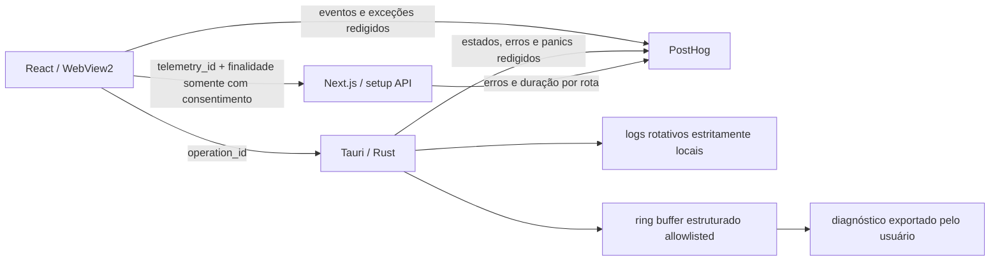

# Telemetria e diagnóstico de erros com PostHog

> **Status:** implementação técnica concluída no repositório; ativação de produção pendente dos gates externos  
> **Data:** 2026-08-01  
> **Escopo:** aplicativo desktop (React + Tauri/Rust), API Next.js e site público cookieless  
> **Princípio:** nenhuma telemetria do app sai da máquina sem uma escolha explícita; a transmissão nunca depende da telemetria. O serviço pode monitorar as próprias falhas sem associá-las a uma instalação, desde que isso esteja descrito na política e tenha base legal validada.

### Registro de execução

As fases 1 a 7 foram implementadas. A fase 0 está concluída no que pertence ao repositório
(contrato, região US, políticas, variáveis e gates), mas a coleta de produção continua bloqueada
até que um administrador configure os projetos PostHog e conclua os gates jurídicos e manuais.

| Área | Estado em 2026-08-01 |
| --- | --- |
| Desktop React/Tauri | implementado, opt-in duplo e desligado por padrão |
| Rust/motor e diagnóstico | implementado, correlacionado e fora do hot path |
| API Next.js | implementada com identidade efêmera sem consentimento |
| Site público | implementado em modo cookieless, com opt-out local e respeito a DNT/GPC |
| Source maps/CI | pipeline e gates implementados; upload real depende de credenciais do projeto |
| PostHog administrativo | pendente: projetos, IP discard, retenção, DPA, MFA, dashboards e alertas |
| Rollout | pendente: dogfood, beta, ensaio de exclusão e release real |

## 1. Objetivo

Dar respostas confiáveis para quatro perguntas:

1. A Corneta abre e permanece estável nas versões publicadas?
2. Em que etapa uma live falha: configuração, OBS, motor local, encoder, rede, destino ou OAuth?
3. Quais fluxos as pessoas conseguem concluir e onde abandonam?
4. Como correlacionar um erro visto pelo suporte com a versão e a operação sem coletar conteúdo pessoal?

O PostHog será usado para métricas de produto, eventos operacionais e agrupamento de exceções. Os logs rotativos continuam estritamente locais. O diagnóstico compartilhável é um resumo técnico estruturado e allowlisted, sem caudas de log ou texto livre do pipeline de mídia.

## 2. Decisões de arquitetura

| Decisão | Escolha |
| --- | --- |
| Provedor | PostHog Cloud, com projetos separados para produção e desenvolvimento/staging |
| Organização | Um projeto por ambiente, com a propriedade `surface` separando `desktop_ui`, `desktop_native`, `setup_api` e futuramente `marketing_site` |
| Identidade | UUID aleatório por instalação; nunca e-mail, login, canal, nome da máquina ou conta das plataformas |
| Consentimento no app | Dois opt-ins independentes, ambos desligados por padrão: **dados de uso** e **relatórios automáticos de falha** |
| Persistência do consentimento | Arquivo próprio `telemetry.json` no diretório de configuração do app; não entra no backup/importação da configuração |
| Coleta | Eventos manuais e com propriedades permitidas por esquema; `autocapture`, heatmaps, captura de `console.error`, performance de rede e Session Replay desligados |
| Erros de UI | `captureException`, `ErrorBoundary`, `window.onerror` e `unhandledrejection`, sempre depois da redação local |
| Erros nativos | SDK `posthog-rs`, erros tratados nos limites das operações e panic hook protegido pelo mesmo gate de consentimento |
| API Next.js | `posthog-node` para falhas inesperadas e métricas agregadas dos Route Handlers; nunca enviar corpo, cabeçalhos de autenticação ou resposta do provedor |
| Diagnóstico compartilhável | Gerado sob ação do usuário por `export_diagnostics`, somente com resumo técnico e ring buffer estruturado allowlisted; logs crus permanecem fora do arquivo |
| Retenção inicial | 90 dias para eventos e exceções; revisar após o beta com base na utilidade real |
| IP | Ativar “Discard client IP data” no projeto PostHog; não usar GeoIP em dashboards |
| Falha do PostHog | Silenciosa para o usuário, assíncrona, com timeout/retry limitado pelo SDK; nunca bloqueia `BORA`, FFmpeg ou encerramento da live |

### Fluxo proposto



## 3. Estado de partida e lacunas resolvidas

Esta é a fotografia **histórica** do baseline encontrado quando o plano foi criado; os itens abaixo não descrevem o estado atual:

- `src/components/ErrorBoundary.tsx` evitava que um erro de render derrubasse todo o app, mas apenas escrevia no console;
- `src-tauri/src/lib.rs` já mantinha cinco arquivos de log de até 5 MiB com `tauri-plugin-log`;
- o exportador de diagnóstico ainda precisava ser separado dos logs livres e passar por auditoria de privacidade;
- a tela de Configurações já oferecia “Exportar diagnóstico” e “Abrir logs”;
- `web/lib/server/http.ts` já criava um `requestId`, mas uma falha inesperada não registrava o erro real em um rastreador;
- o relatório pós-live já guardava amostras e eventos em NDJSON de forma resistente a crash.

As lacunas registradas naquele momento eram:

- não havia visão agregada por versão, etapa, plataforma ou encoder;
- erros tratados em `catch` e `Result::Err` não chegavam a um local de triagem;
- não existia um ID comum entre UI, backend nativo, API e diagnóstico local;
- source maps de produção do Vite estavam desligados;
- a política de privacidade afirmava que app e site não tinham telemetria, analytics nem relatório automático de erros;
- o exportador ainda podia incluir caminhos, nomes de destinos, URLs customizadas e textos de configuração identificáveis.

Estado atual: essas lacunas de código foram resolvidas nas fases 1–7. O export compartilhável contém apenas resumo allowlisted e ring buffer estruturado; logs livres permanecem exclusivamente locais. Source maps são gerados e enviados somente no job autenticado de release, e a política atual descreve a coleta com consentimento. As pendências externas continuam listadas, sem marcação, nas fases abaixo e nos critérios de pronto da seção 11.

## 4. Limites de coleta

### 4.1 Dados permitidos

Todas as propriedades devem sair de uma allowlist versionada. O conjunto inicial é:

| Grupo | Propriedades permitidas |
| --- | --- |
| Contexto | `telemetry_schema_version`, `surface`, `environment`, `app_version`, `build_sha`, `locale` |
| Sistema | `os_family`, `arch`, `gpu_vendor`, `encoder_kind`; valores enumerados e sem modelo/hostname |
| Operação | `operation_id`, `stage`, `outcome`, `error_code`, `retryable` |
| Live | `mode`, `target_count`, `platforms`, `duration_bucket`, `reconnect_count_bucket`, `brb_enabled`, `guardian_enabled`, `record_video_enabled` |
| API | `request_id`, `route_id`, `provider`, `status_class`, `duration_bucket` |
| Erro | `error_id`, tipo, stack redigida, frame do app, `handled`, `severity`, fingerprint estável |

`platforms`, `provider`, `mode`, `stage`, `outcome`, `error_code`, `encoder_kind` e nomes de feature devem aceitar apenas enums definidos no código. Nenhum valor livre vindo de configuração, plataforma ou usuário pode virar propriedade.

### 4.2 Dados proibidos

Não enviar, mesmo com consentimento:

- chaves de transmissão, Client Secrets, access/refresh tokens, cookies ou cabeçalhos de autenticação;
- título/categoria da live, texto de chat, nome ou mensagem de alerta, nomes de canais e autores;
- watchlist, texto ou recorte do OCR, frame capturado, vídeo ou áudio;
- senha do OBS, URL RTMP completa, query string, corpo de request/response de OAuth;
- caminho completo de arquivo, nome de usuário do Windows, hostname, IP, modelo exato da GPU ou ID de hardware;
- log cru, stdout/stderr integral de FFmpeg/MediaMTX ou configuração serializada;
- conteúdo digitado em inputs, clipboard ou texto visível da interface.

### 4.3 Redação obrigatória

Criar uma implementação equivalente em TypeScript e Rust, com os mesmos fixtures de teste, para:

1. limitar profundidade, quantidade de itens e tamanho total do evento;
2. aceitar apenas nomes de propriedades conhecidos;
3. substituir tokens, segredos, `Authorization`, URLs com credenciais e JWTs;
4. trocar caminhos locais por `<local-path>`;
5. remover query string e fragmento de URLs;
6. normalizar erros conhecidos para `error_code` e evitar usar a mensagem como dimensão;
7. redigir recursivamente `$exception_list`, mensagens e stack traces antes do envio;
8. devolver `null` no `before_send` se o evento, surface ou propriedade não estiver no catálogo.

O redator precisa ser a última barreira no `before_send`; a disciplina nos call sites é uma barreira adicional, não substituta.

## 5. Consentimento, transparência e direitos

### 5.1 Modelo local

Adicionar um arquivo que não seja exportado nem importado junto com `AppConfig`:

```json
{
  "schemaVersion": 1,
  "noticeVersion": "2026-08-01",
  "usage": "unset",
  "crashReports": "unset",
  "installationId": null,
  "decidedAt": null
}
```

Regras:

- `unset` e `disabled` não enviam eventos daquela finalidade; quando as duas finalidades estão assim, não há request do app para o PostHog;
- o UUID só nasce ao habilitar pelo menos uma finalidade;
- importar configurações em outra máquina não importa o consentimento nem o UUID;
- desligar uma finalidade interrompe novos eventos imediatamente;
- desligar as duas limpa a persistência do SDK e oferece “Solicitar exclusão dos dados já enviados”;
- reativar após uma exclusão gera outro UUID, para não reutilizar um `distinct_id` apagado;
- o status de telemetria pode aparecer no diagnóstico local, mas o UUID completo só entra se a pessoa escolher incluí-lo/copiar para o suporte.

### 5.2 UX

Na primeira abertura após a mudança da política, mostrar uma tela curta, adiável e sem opção pré-marcada:

- **Enviar dados de uso:** etapas concluídas, versão, sistema em categorias e resultado das operações.
- **Enviar relatórios de falha:** exceções, código/etapa do erro e stack redigida.
- link para “Ver exatamente o que pode e não pode ser enviado”.
- botões equivalentes visualmente para aceitar e continuar sem enviar.

Em **Configurações → Dados & diagnóstico**:

- dois switches independentes;
- link para a política de privacidade;
- explicação de retenção e do PostHog como operador;
- botão para copiar o ID de telemetria;
- fluxo para solicitar exclusão;
- manter “Exportar diagnóstico” e “Abrir logs”.

Não chamar os dados de “anônimos”. O termo correto na interface e na política é **dados técnicos pseudonimizados**, pois há um identificador de instalação e o transporte passa por um endereço IP, ainda que o projeto descarte o IP na ingestão.

### 5.3 Gate jurídico e operacional

Antes do primeiro build que contenha token de produção:

- atualizar em conjunto `privacy.pt.tsx` e `privacy.en.tsx`, removendo as promessas atuais de ausência de telemetria/analytics;
- documentar finalidades, categorias, base legal validada, compartilhamento com PostHog, localização, transferência internacional, retenção, revogação e exclusão;
- decidir separadamente se o site público terá analytics; a autorização do app não se estende ao site;
- gerar e assinar o DPA dentro da organização PostHog;
- registrar PostHog e seus subprocessadores no inventário de operadores;
- limitar o acesso ao projeto por função, exigir MFA e revisar acessos trimestralmente;
- documentar o procedimento de atendimento ao titular pelo UUID;
- passar o texto e a base legal por revisão jurídica. Este plano técnico não substitui essa revisão.

## 6. Catálogo inicial de eventos

### 6.1 Uso do aplicativo

| Evento | Quando | Propriedades específicas |
| --- | --- | --- |
| `app_started` | app pronto para uso | `previous_exit`, `startup_duration_bucket` |
| `app_closed` | saída limpa | `uptime_bucket`, `live_was_active` |
| `screen_viewed` | troca de tela principal | `screen_id` enumerado |
| `onboarding_started` | primeira etapa exibida | `entry_point` |
| `onboarding_step_completed` | avanço de etapa | `step_id` |
| `onboarding_completed` | configuração mínima pronta | `duration_bucket` |
| `obs_check_completed` | check-up manual/automático | `outcome`, `error_code`, `resolution_bucket`, `fps_bucket` |
| `live_start_requested` | antes da operação | `operation_id`, `mode`, `target_count`, `platforms` |
| `live_start_completed` | entrou em `live` | `operation_id`, `duration_bucket`, `encoder_kind` |
| `live_start_failed` | falha/cancelamento | `operation_id`, `stage`, `error_code`, `cancelled` |
| `target_state_changed` | somente estados relevantes | `operation_id`, `platform`, `from`, `to`, `error_code` |
| `live_ended` | encerramento | `operation_id`, `reason`, `duration_bucket`, `reconnect_count_bucket` |
| `diagnostics_exported` | arquivo salvo | `outcome`; nunca caminho ou conteúdo |
| `update_completed` | atualização instalada/falhou | `from_version`, `to_version`, `outcome`, `error_code` |

No desktop, cada evento operacional tem um único dono. O Rust é o emissor autoritativo de
`app_started`/`app_closed` (ele conhece a saída anterior e o encerramento real) e é o único
emissor de `live_start_completed`, `live_start_failed`, `target_state_changed`, `live_ended` e
`diagnostics_exported`. A UI é a única emissora de `live_start_requested`, exatamente antes do
invoke nativo, e também emite `live_start_failed` somente se a falha ocorrer antes de haver
evidência de que o Rust recebeu a operação. Breadcrumbs continuam nas duas superfícies e
reutilizam o mesmo `operation_id`. `stage` e `error_code` são enums explícitos no contrato de cada
superfície: um token apenas sintaticamente seguro não é aceito.

`target_state_changed` precisa de deduplicação e rate limit. Não registrar métricas a cada 250 ms, amostras de CPU/GPU, progresso de encode ou cada tentativa interna; consolidar no fim da operação/live.

Cada evento deve declarar no catálogo a finalidade `usage` ou `crashReports`. Para calcular estabilidade sem forçar a telemetria de uso, `app_started` terá uma versão mínima de diagnóstico — somente versão, surface e encerramento anterior — quando apenas `crashReports` estiver habilitado.

### 6.2 Erros

- usar o evento nativo `$exception` por `captureException`/`capture_exception_with`;
- adicionar `error_id` UUID e `operation_id` quando houver;
- usar fingerprint `surface + error_code + top_app_frame` para erros normalizados;
- deixar o agrupamento automático do PostHog para exceções sem código;
- `handled=true` para falhas mostradas/recuperadas e `handled=false` para boundary, rejeição não tratada ou panic;
- não habilitar captura de `console.error`: hoje o console pode receber objetos e mensagens não auditadas;
- mostrar `error_id` nos detalhes copiáveis do `ErrorBoundary` e nos erros críticos de `BORA`.

### 6.3 API de login

| Evento | Propriedades |
| --- | --- |
| `api_request_completed` | `route_id`, `provider`, `status_class`, `duration_bucket`, `retryable` |
| `$exception` | `request_id`, `route_id`, `provider`, `error_code`; apenas em falha inesperada |

Não criar evento para cada resposta 2xx no PostHog durante o MVP se o volume/custo não justificar. É suficiente capturar falhas, duração em buckets e contadores agregados. `ApiError` esperado (400, 401, 429 etc.) vira evento operacional com código; 5xx inesperado vira exceção.

## 7. Plano de implementação

### Fase 0 — Preparar PostHog, política e contrato de dados

**Entregas**

- [ ] Criar `corneta-prod` e `corneta-dev`/`corneta-staging`.
- [x] Escolher e documentar a região US antes de gerar os tokens; não misturar hosts US/EU.
- [ ] Desligar Session Replay, autocapture remoto, heatmaps, surveys e captura de IP no projeto.
- [ ] Configurar retenção inicial de 90 dias.
- [ ] Assinar DPA, habilitar MFA e limitar acessos.
- [x] Versionar catálogo de eventos, propriedades e dados proibidos no código e neste documento.
- [ ] Obter aprovação de produto/privacidade para o catálogo versionado.
- [x] Atualizar política PT/EN no site e versionar a data do aviso.
- [ ] Publicar a política e obter a revisão jurídica da base legal.
- [x] Adicionar ao gate de release a exigência “política publicada antes do binário com telemetria”.

**Critério de saída:** ambiente de desenvolvimento recebe apenas um evento sintético sem PII, e a política nova está pronta para publicação.

### Fase 1 — Consentimento e núcleo compartilhado

**Arquivos principais**

- novo `src/lib/telemetry.ts` — facade `capture`, `captureException`, `addStep`, `setConsent` e no-op seguro;
- novo `src/lib/telemetry-schema.ts` — tipos, enums, allowlist e redator;
- novos testes `src/lib/telemetry*.test.ts`;
- novo `src-tauri/src/telemetry.rs` — estado, persistência, redator, SDK e comandos;
- `src-tauri/src/lib.rs` — registrar módulo/estado/comandos;
- `src/lib/api.ts` — `telemetryStatus`, `telemetrySetConsent` e `telemetryRegenerateId` no Tauri e no mock;
- `src/screens/SettingsScreen.tsx` e dicionários PT/EN — controles e transparência;
- `.env.example`, `src/vite-env.d.ts` e `web/.env.example` — tokens/hosts públicos e credenciais privadas de CI claramente separadas.

**Implementação**

- [x] Persistir `telemetry.json` com escrita atômica e permissões equivalentes ao restante da configuração.
- [x] Gerar UUID v4/CSPRNG somente depois do opt-in.
- [x] Manter o consentimento em memória/`AtomicBool` para que todo call site tenha um gate barato.
- [x] Fazer o redator operar sobre uma cópia e nunca alterar o erro/configuração original.
- [x] Criar um `operation_id` na UI ao iniciar operações longas e passá-lo ao command Rust correspondente.
- [x] Fazer SDK ausente, token vazio ou host inválido resultar em no-op.
- [x] Separar token público de ingestão de Personal API Key; a chave pessoal existe apenas no CI/servidor.

**Critério de saída:** testes provam zero request com as duas finalidades desligadas e remoção de todos os segredos dos fixtures.

### Fase 2 — Instrumentar o desktop React

**Dependências e segurança**

- [x] Adicionar `posthog-js`.
- [x] Preferir bundle local da extensão de Error Tracking (`module.no-external` + extensão explícita) para não permitir código remoto no WebView.
- [x] Manter `script-src 'self'`; adicionar ao `connect-src` da CSP somente o host de ingestão escolhido.
- [x] Configurar explicitamente:
  - `autocapture: false`;
  - `capture_pageview: false` e `capture_pageleave: false`;
  - `disable_session_recording: true`;
  - `capture_performance: false`;
  - `capture_dead_clicks: false` e `capture_heatmaps: false`;
  - exceções não tratadas e rejeições habilitadas apenas quando `crashReports=enabled`;
  - `capture_console_errors: false`;
  - persistência sem cookie e perfis limitados ao UUID pseudônimo;
  - `before_send` com allowlist/redação final.
- [x] Medir o impacto e manter cada chunk abaixo do budget atual de 110 KiB gzip.

**Pontos de captura**

- [x] Inicializar após carregar o status de consentimento, antes de renderizar o app.
- [x] Integrar `src/components/ErrorBoundary.tsx`, incluindo `error_id` e component stack redigida.
- [x] Integrar o boundary próprio de `src/chat-main.tsx`.
- [x] Cobrir `window.onerror` e `unhandledrejection` sem duplicar a mesma exceção do boundary.
- [x] Instrumentar navegação em `src/App.tsx` por `screen_id`, sem texto da tela.
- [x] Instrumentar onboarding, check-up do OBS, início/fim de live, atualização e exportação de diagnóstico.
- [x] Usar exception steps/breadcrumbs somente para checkpoints enumerados, nunca argumentos livres.

**Validação externa pendente:** confirmar uma stack simbolicada no projeto PostHog com o artefato
realmente publicado.

**Critério de saída:** uma exceção sintética de build de produção aparece com stack TypeScript legível, `error_id`, versão e surface; chat, inputs e configuração não aparecem no payload.

### Fase 3 — Instrumentar Tauri/Rust e o motor

**Dependência**

- [x] Adicionar `posthog-rs` 0.21 com Error Tracking. Após a atualização integral do grafo,
  `oar-ocr` 0.8.1 passou a exigir Rust 1.95; o projeto e o CI ficam fixados em Rust 1.97.1.
- [x] Usar o cliente assíncrono/background e `on_error` apenas para log local em nível debug.

**Pontos de captura**

- [x] Envolver `start_engine` e a sequência de encerramento com `operation_id`, etapa e tempo total.
- [x] Capturar apenas transições relevantes de destino (`live`, `reconnecting`, `signal-lost`, `auth-error`, `error`, `stopped`) com deduplicação.
- [x] Capturar erros nos limites entre módulos: spawn/saída do MediaMTX, compositor, FFmpeg por destino, gravação, OBS e OAuth.
- [x] Converter primeiro os caminhos críticos para `AppError { code, stage, retryable, source }`; manter a frase localizada apenas para apresentação.
- [x] Instalar panic hook somente se o gate de consentimento for aplicado antes da fila/rede. Testar explicitamente habilitar e revogar em runtime.
- [x] Registrar no boot se o encerramento anterior foi limpo por meio de marcador local; enviar apenas `previous_exit=unclean`, sem anexar cauda de log.
- [x] Fazer flush com timeout curto na saída limpa, sem atrasar ou impedir o fechamento.

**Validação manual pendente:** executar a matriz de falhas com sidecars reais no draft da release.

**Hot path**

É proibido chamar o SDK por frame, pacote, amostra do relatório ou linha de stderr. Threads de mídia só incrementam contadores atômicos/estruturados; um evento consolidado é emitido fora do hot path na mudança de estado ou no fim da live.

**Limitação conhecida no Windows**

Em 2026-08-01, o upload de símbolos Rust do PostHog não suporta PDB do Windows. Além disso, o release atual usa `strip = true`. Portanto:

- não prometer stack nativa totalmente simbolicada no MVP;
- enviar `error_code`, `stage`, cadeia redigida e call site disponível no processo;
- manter logs locais para inspeção manual e o diagnóstico estruturado compartilhável como fontes complementares para falhas nativas profundas;
- não aumentar o instalador nem publicar PDB sem uma decisão explícita;
- abrir uma tarefa futura para upload de PDB quando houver suporte oficial, com teste em binário NSIS real.

**Critério de saída:** derrubar cada sidecar em um teste controlado gera um único issue/evento com etapa correta, enquanto a live e o fluxo de recuperação mantêm o comportamento atual.

### Fase 4 — API Next.js

**Arquivos principais**

- `web/package.json` — adicionar `posthog-node`;
- novo `web/lib/server/posthog.ts` — singleton server-only e facade segura;
- `web/instrumentation.ts` — `onRequestError` no runtime Node;
- `web/lib/server/http.ts` — capturar erro real redigido junto do `requestId`;
- Route Handlers em `web/app/api/v1/**` — fornecer apenas `route_id` e `provider` enumerados.

**Implementação**

- [x] Trocar `console.error("OAuth broker request failed", { requestId })` por log local da plataforma + `captureException` com contexto seguro.
- [x] Preservar o `requestId` na resposta e adicionar o mesmo valor ao evento.
- [x] Se o app consentiu, enviar `X-Corneta-Telemetry-Id`, `X-Corneta-Telemetry-Purposes` e `X-Corneta-Operation-Id` em conjunto; aceitar somente UUIDs/finalidades válidos e nunca repassar ao provedor OAuth.
- [x] Reutilizar o UUID em evento operacional somente com consentimento de uso e em exceção somente com consentimento de erros; nos demais casos usar ID efêmero por request.
- [x] Usar captura imediata no ciclo serverless e agendamento pós-resposta, sem alongar a resposta ao cliente.
- [x] Não registrar `request.text()`, `fields`, tokens, IP ou `body` retornado por Twitch/Google/Kick.

**Critério de saída:** uma falha sintética 500 aparece no mesmo `requestId` devolvido ao cliente; os fixtures de OAuth confirmam que token e secret não estão no evento.

### Fase 5 — Source maps, releases e CI

- [x] Adicionar `@posthog/rollup-plugin` ao build Vite ou executar o PostHog CLI após o build.
- [x] No Windows, baixar o PostHog CLI versionado em step sem segredos, conferir SHA-256 fixado e passar o binário explicitamente ao plugin.
- [x] Gerar source maps de produção, fazer upload no mesmo job que produz o instalador e apagá-los antes de empacotar/publicar.
- [x] Usar `POSTHOG_API_KEY` e `POSTHOG_PROJECT_ID` somente no step shell do build Vite/upload de source maps; gate, build Tauri, scanner e publicação não recebem a Personal API Key.
- [x] No mesmo step, validar por API autenticada do PostHog US que o Project ID responde com o mesmo project token público do desktop, falhando fechado sem registrar resposta/credencial.
- [x] Adicionar `build_sha`, `app_version` e release idênticos aos eventos e source maps.
- [x] Fazer o build local e PRs funcionarem sem credenciais de upload.
- [x] Produzir EXE, NSIS e `.exe.sig` em um único `pnpm tauri build`, gerar `latest.json` v2 a partir desse par e validar que a tag é exatamente `v` + versão Tauri.
- [x] Antes de qualquer upload de artefato da release, exigir 7-Zip e escanear `dist`, binário, bundle e a árvore extraível do mesmo NSIS contra source maps, Personal API Key, token de exclusão e chaves privadas.
- [x] Publicar somente os artefatos aprovados em um draft com steps shell first-party e `gh release create/upload`.
- [x] Alimentar os kill switches Vite/Rust pela mesma variável e permitir release emergencial sem credenciais de source maps somente quando ambos estão em `1`.
- [ ] Criar um release sintético e validar a resolução de stack do chunk minificado.

**Critério de saída:** stack do React aponta para arquivo/linha original e nenhum `.map` ou segredo está no NSIS/GitHub Release. O scan automatizado cobre os arquivos que o 7-Zip consegue extrair do NSIS, mas não promete interpretar bytes comprimidos em formatos opacos que ele não abra.

### Fase 6 — Melhorar o diagnóstico local e o suporte

- [x] Criar um ring buffer local de até 100 eventos estruturados (`timestamp`, `code`, `stage`, `operation_id`), sem payload livre.
- [x] Incluir esse buffer, versão, build SHA e IDs de operação no diagnóstico exportado.
- [x] Remover caudas de log de `export_diagnostics` e gerar o arquivo apenas de estruturas allowlisted, sem paths, URLs customizadas, nomes de fontes/destinos ou títulos.
- [x] Mostrar `error_id`, `operation_id` e `request_id` nos detalhes copiáveis quando existirem.
- [x] Documentar um roteiro de suporte: buscar ID no PostHog → conferir versão/issue → pedir diagnóstico local somente se necessário.
- [x] Nunca implementar upload automático do arquivo de diagnóstico como parte deste plano.

**Critério de saída:** com um ID copiado pela pessoa, o suporte encontra o issue e o evento; com o arquivo exportado, correlaciona a mesma operação sem receber segredo.

### Fase 7 — Site público cookieless com decisão separada

Foi adotada coleta mínima cookieless, independente do consentimento do app, com opt-out local e
respeito a DNT/GPC. A ativação em produção ainda depende da revisão jurídica e do projeto:

- [x] adicionar `instrumentation-client.ts` conforme o Next.js 16;
- [x] usar modo cookieless no cliente;
- [ ] confirmar a configuração cookieless no projeto PostHog;
- [x] manter replay, autocapture, heatmaps e captura de texto desligados;
- [x] capturar apenas página por rota/idioma, CTA de download e erro de render;
- [x] remover query/hash no cliente antes do envio;
- [x] oferecer opt-out local e respeitar DNT/GPC;
- [ ] obter revisão jurídica da decisão de transparência/opt-out;
- [x] não tentar ligar automaticamente a visita do site ao UUID da instalação.

## 8. Dashboards e alertas

### Dashboards mínimos

1. **Saúde por release**
   - instalações ativas por `app_version`;
   - taxa de sessões sem exceção;
   - issues novos e regressões por versão/surface;
   - encerramentos anteriores não limpos.

2. **Confiabilidade da live**
   - `live_start_completed / live_start_requested`;
   - tempo para entrar ao vivo por bucket;
   - pedidos por `platforms`/`mode`, conclusões por `encoder_kind` e falhas por
     `stage`/`error_code`/`cancelled`, respeitando o schema de cada evento;
   - sessões com reconexão/sinal perdido;
   - duração até a primeira falha.

3. **Setup e ativação**
   - onboarding iniciado → concluído;
   - OBS check aprovado;
   - primeira live iniciada;
   - exportação de diagnóstico após falha.

4. **Setup API/OAuth**
   - erros por rota/provedor/código;
   - contagem e velocidade de 5xx por deploy somando, sem duplicidade,
     `api_request_completed(status_class=5xx)` e `$exception(surface=setup_api)`; o MVP não captura
     2xx e não permite calcular taxa;
   - duração por bucket;
   - issues inesperados por deploy.

### Alertas iniciais

- novo issue não tratado em produção;
- taxa de sucesso do início da live abaixo de 95% em uma janela com volume mínimo;
- sessões sem crash abaixo de 99,5% no dia, também com volume mínimo;
- ao menos 5 falhas 5xx da setup API em 15 minutos, somando `api_request_completed` e
  `$exception` de `setup_api`; limiar provisório a validar após baseline;
- regressão concentrada na versão mais recente.

Alertas precisam de volume mínimo para evitar ruído durante o beta. Cada alerta terá owner, severidade, link para runbook e regra de encerramento.

## 9. Estratégia de testes

### Unitários

- consentimento `unset/disabled` resulta em no-op;
- UUID só é gerado no opt-in e não é copiado no import/export;
- allowlist rejeita propriedade/evento desconhecido;
- redator cobre JWT, Bearer, stream key, secret, URL, query, path Windows/Unix, e-mail e texto longo;
- buckets e enums são determinísticos;
- deduplicação impede tempestade de `target_state_changed`;
- o mesmo `operation_id` atravessa UI e Rust.

### Integração

- servidor HTTP falso recebe payload e snapshots aprovados provam ausência de PII;
- host PostHog offline não altera tempo/resultado de `start_engine` e `stop_engine`;
- opt-out em runtime impede todo evento novo nas duas SDKs;
- exceção do ErrorBoundary não é duplicada por `window.onerror`;
- `requestId` da API coincide com o evento;
- diagnóstico exportado continua redigido.

### Release/manual

- inspecionar requests do WebView2 e da API com contas de teste;
- buscar no payload cada segredo conhecido dos fixtures;
- validar source map do binário realmente publicado;
- provocar panic, rejeição JS, falha do MediaMTX, erro de chave e timeout OAuth;
- confirmar que o instalador funciona sem internet e que a live não espera telemetria;
- conferir budget de bundle e ausência de `.map`/Personal API Key, inclusive na listagem e árvore
  extraída do NSIS pelo 7-Zip.

## 10. Rollout e rollback

1. **Dogfood:** projeto dev, somente máquinas da equipe, eventos sintéticos e inspeção manual de payload.
2. **Beta:** opt-in real, sem Session Replay, com amostragem determinística por hash do UUID se o volume exigir.
3. **Produção:** liberar para todos, ainda opt-in, somente após duas semanas sem vazamento/impacto e dashboards úteis.
4. **Revisão de 30 dias:** remover eventos sem uso, ajustar retenção e documentar decisões.

Mecanismos de rollback:

- token/host ausente transforma as facades em no-op;
- transformação/drop rule no PostHog pode rejeitar imediatamente um evento problemático;
- flag de build `TELEMETRY_DISABLED` desliga as duas SDKs em release emergencial;
- o diagnóstico estruturado e a abertura local dos logs continuam funcionando mesmo com PostHog desligado.

## 11. Critérios de pronto

- [ ] Política publicada e DPA assinado antes da coleta de produção.
- [x] Os dois consentimentos são explícitos, independentes, revogáveis e desligados por padrão.
- [x] Zero evento de uma finalidade desligada; zero request do app quando as duas estão desligadas.
- [x] Nenhum dado da lista proibida aparece nos fixtures e testes automatizados.
- [ ] Concluir a inspeção manual dos requests com contas de teste.
- [x] Erros de React carregam release, `error_id`, contexto seguro e pipeline de source map.
- [ ] Confirmar a stack React simbolicada no PostHog com a release real.
- [x] Erros Rust têm código/etapa e a limitação de símbolos Windows está documentada.
- [x] UI, Rust, API, logs e diagnóstico podem ser correlacionados por IDs opacos.
- [x] A indisponibilidade do PostHog é fail-safe e fica fora do hot path da live.
- [x] Dashboards e alertas estão especificados com owners e runbook.
- [ ] Criar os dashboards e alertas nos projetos PostHog.
- [ ] Exclusão por UUID foi ensaiada ponta a ponta.
- [x] `pnpm check`, Clippy, testes Rust, `cargo audit`, `cargo deny` e gates locais passam.
- [ ] Executar os gates manuais no draft assinado da release.

## 12. Riscos e mitigação

| Risco | Mitigação |
| --- | --- |
| Segredo em mensagem/stack | allowlist, redator recursivo no último `before_send`, fixtures ofensivos e inspeção de payload |
| Perda de confiança pela mudança de promessa | opt-in real, copy transparente, política publicada antes do binário e coleta mínima |
| Impacto na transmissão | eventos fora do hot path, SDK assíncrono, consolidação, rate limit e testes com host offline |
| Bundle/CSP mais permissivos | extensão empacotada localmente, `script-src 'self'` e host exato apenas em `connect-src` |
| Custo/cardinalidade | enums, buckets, deduplicação, retenção de 90 dias e remoção de eventos inúteis |
| Stack Rust incompleta no Windows | códigos estáveis + logs locais; acompanhar suporte oficial a PDB |
| Evento duplicado | `error_id`, fingerprint e dedupe por janela curta |
| Exclusão difícil | UUID visível ao titular, perfil sem PII e runbook testado de Right to Be Forgotten |
| Dados de teste em produção | projetos separados e build dev sem token de produção |

## 13. Referências

Documentação oficial consultada em 2026-08-01:

- [PostHog JavaScript SDK e opt-in/opt-out](https://posthog.com/docs/libraries/js)
- [Configuração do posthog-js](https://posthog.com/docs/libraries/js/config)
- [Controles de privacidade e `before_send`](https://posthog.com/docs/product-analytics/privacy)
- [Privacidade de Session Replay](https://posthog.com/docs/session-replay/privacy)
- [Error Tracking e captura de exceções](https://posthog.com/docs/error-tracking/capture)
- [Integração e Error Tracking no Next.js](https://posthog.com/docs/error-tracking/installation/nextjs)
- [SDK Rust e captura de exceções/panics](https://posthog.com/docs/error-tracking/installation/rust)
- [Upload de source maps do Vite](https://posthog.com/docs/error-tracking/upload-source-maps/vite)
- [Símbolos Rust e limitação atual de PDB no Windows](https://posthog.com/docs/error-tracking/upload-source-maps/rust)
- [Armazenamento, descarte de IP e exclusão](https://posthog.com/docs/privacy/data-storage)
- [DPA do PostHog](https://posthog.com/dpa)
- [Resolução CD/ANPD nº 2/2022](https://www.gov.br/anpd/pt-br/acesso-a-informacao/institucional/atos-normativos/regulamentacoes_anpd/resolucao-cd-anpd-no-2-de-27-de-janeiro-de-2022)
