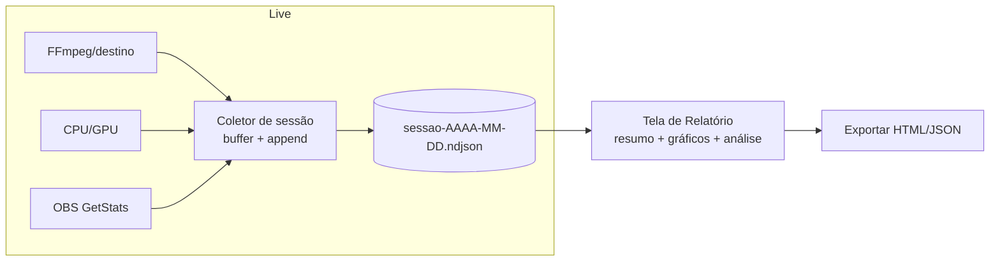

# Relatório pós-live (diagnóstico de transmissão)

> Planejamento da feature que, **ao final de cada live**, gera um **relatório** do que aconteceu —
> métricas de cada plataforma ao longo do tempo, uso de CPU/GPU, reconexões, erros e **janelas de
> travamento/lentidão** — para diagnosticar com calma depois, **sem mexer na transmissão ao vivo**.

- **Status:** Rascunho para discussão (v0.1) · 2026-06-23
- **Relacionado:** [`PLANEJAMENTO.md`](./PLANEJAMENTO.md) (§8 métricas), [`PENDENCIAS.md`](./PENDENCIAS.md)

---

## 1. Problema

Durante a live, travamentos e lentidões acontecem, mas **diagnosticar ao vivo prejudica o conteúdo**
(abrir o gerenciador de tarefas, mexer no OBS, olhar logs). O streamer quer **descobrir depois**:
o que travou, quando, em qual plataforma e **por quê** — sem interromper nada enquanto transmite.

**Objetivo:** registrar tudo silenciosamente durante a live e, ao encerrar, entregar um **relatório
navegável** com linha do tempo, métricas por plataforma e uma **análise automática dos gargalos**.

---

## 2. O que o relatório mostra

1. **Resumo da sessão** — duração, plataformas, modo de encoding, "saúde geral" (ex.: 2 reconexões,
   3 janelas de queda de bitrate), e um veredito ("provável gargalo: encoding/CPU").
2. **Por plataforma** — curva de **bitrate ao longo do tempo**, **frames perdidos** acumulados, **fps**,
   **reconexões** (marcadores na linha do tempo) e **erros** (com horário e mensagem).
3. **Máquina** — curvas de **CPU** e **GPU** ao longo da sessão (já temos a amostragem ao vivo).
4. **OBS** (se conectado via obs-websocket) — **encoder/render lag**, **frames perdidos por rede** e
   **congestionamento**: é o que melhor explica os travamentos que o espectador vê.
5. **Linha do tempo de eventos** — início/fim, OBS conectou/caiu, destino reconectou, pico de CPU, etc.
6. **Janelas problemáticas destacadas** — "Aos 23:40, Twitch caiu por 8s e a CPU estava em 98% →
   provável gargalo de encoding". Correlaciona os sinais.

---

## 3. Dados a coletar (durante a sessão)

Hoje o motor já produz, a cada ~1–2s: **bitrate/fps/quedas/estado por plataforma** (um FFmpeg por
destino) e **CPU/GPU** reais. Falta **gravar a série temporal** disso (hoje só guardamos o último snapshot).

| Fonte | Sinais | Já temos? |
|---|---|---|
| FFmpeg por destino | bitrate, fps, frames perdidos, estado (live/reconnecting/error) | ✅ (em tempo real) |
| Amostrador do sistema | CPU %, GPU % | ✅ (recém-adicionado) |
| Eventos do motor | start/stop, reconexão por destino, erro (mensagem) | ✅ (parcial) |
| **OBS (obs-websocket `GetStats`)** | render lag, encoding lag, frames perdidos (rede), fps de saída | ⛔ (temos o cliente; falta puxar stats) |

> **Insight-chave:** os travamentos que o público sente costumam vir de **lag de render/encode do OBS**
> ou **congestionamento de rede** — e o **OBS reporta isso** via `GetStats`/`GetStreamStatus`. Como já
> temos um cliente obs-websocket (do auto-config), dá pra **assinar essas estatísticas** durante a live
> e incluir no relatório. Isso transforma o diagnóstico de "achismo" em causa-raiz.

---

## 4. Arquitetura



- **Coletor (Rust):** durante a sessão, anexa **amostras** (a cada ~1–2s) e **eventos** a um arquivo
  **NDJSON** (uma linha por amostra/evento — robusto a crash; nada se perde se o app fechar).
- **Armazenamento:** `app_data_dir/sessions/<inicio>.ndjson` (+ um `index.json` com metadados leves
  pra listar rápido). Uma sessão = um arquivo. Retenção configurável (ex.: últimas 50).
- **Finalização:** ao parar, escreve um cabeçalho/resumo (`<inicio>.summary.json`) com duração,
  plataformas e métricas agregadas (médias, mínimos, contagem de reconexões).
- **Tela de Relatório (frontend):** lista o histórico; ao abrir uma sessão, lê o NDJSON e desenha
  os gráficos + a análise.
- **Análise (frontend ou Rust):** heurísticas que varrem a série e marcam janelas problemáticas.

---

## 5. Detecção de travamentos/lentidão (a parte que importa)

Não dá pra medir diretamente o "travou na tela do espectador", mas dá pra inferir com alta confiança
correlacionando sinais. Janela problemática quando, num intervalo curto, ocorre ≥1:

- **Frames perdidos** sobem (FFmpeg `drop=` ou OBS "frames perdidos por rede").
- **Bitrate** cai bem abaixo do alvo (ex.: < 70% por > 3s).
- **fps** despenca.
- **Reconexão** de algum destino.
- **OBS encoding/render lag** > 0 de forma sustentada (encoder não dá conta → trava).
- **CPU ou GPU** saturadas (> ~92%).

A análise então **classifica a causa provável**:
- lag de encode + CPU/GPU alta → **gargalo de encoding** (reduzir bitrate/resolução, usar encoder de HW).
- frames perdidos por rede + bitrate caindo, CPU ok → **gargalo de upload/rede** (reduzir bitrate, menos plataformas).
- reconexões num destino só, resto ok → **problema na plataforma X** (ingest/chave/instabilidade do lado deles).
- render lag no OBS → **cena pesada** (fontes/efeitos), não é a Corneta.

> Cada janela vira um card no relatório: horário, duração, sinais e **recomendação**.

---

## 6. Decisões de stack & tradeoffs

| Decisão | Opção recomendada | Alternativas | Tradeoff |
|---|---|---|---|
| Formato de gravação | **NDJSON** (append por linha) | JSON único, SQLite | NDJSON é à prova de crash e simples; SQLite seria melhor pra muitas sessões/consultas |
| Onde coletar | **Rust** (já tem os dados + roda fora da UI) | Frontend acumulando | Rust não perde dados se a janela fechar/minimizar |
| Stats do OBS | **obs-websocket `GetStats`** (reusa o cliente) | só FFmpeg | OBS dá a causa-raiz (encode/render lag); sem ele, diagnóstico é parcial |
| Gráficos na UI | **SVG custom leve** ou **uPlot** | Recharts/visx | uPlot é minúsculo e rápido p/ séries longas; Recharts é mais fácil porém pesado |
| Amostragem | **1–2s** | 250ms (detalhe) | 1–2s mantém o arquivo pequeno (3h ≈ 5–10k linhas) e é suficiente p/ diagnosticar |
| Retenção | últimas N sessões (config) | manter tudo | limita disco; exportar antes de descartar |

> Para os gráficos, **uPlot** é a escolha forte: rende dezenas de milhares de pontos sem travar e pesa
> ~40KB. Se quiser zero-dependência, um line chart SVG próprio resolve o MVP.

---

## 7. UX do relatório

**Histórico** (nova entrada na sidebar: "Relatórios"):
```
Relatórios
┌───────────────────────────────────────────────┐
│ 23/06  21:14–23:02 (1h48)   ⚠ 2 quedas         │
│ 22/06  20:05–21:30 (1h25)   ✓ sem incidentes   │
└───────────────────────────────────────────────┘
```

**Detalhe da sessão**:
```
Live de 23/06 · 1h48 · Twitch, YouTube, Kick · modo Caprichado
Veredito: provável gargalo de ENCODING (2 janelas, CPU ~97%)

[ bitrate por plataforma ──────────╮ reconexão ]   [ CPU/GPU ───────── ]
   Twitch ▁▂▆▆▆▅▂(queda)▆▆▆
   YouTube ▆▆▆▆▆▆▆▆▆▆
   Kick    ▆▆▆▆▆▆▆▆▆▆

Janelas problemáticas
• 23:40 (8s) — Twitch reconectou · drop↑ · CPU 98% → reduza o bitrate ou use NVENC
• 22:10 (4s) — bitrate do YouTube caiu 60% · rede → menos upload

Eventos: 21:14 início · 22:10 YouTube instável · 23:40 Twitch caiu/voltou · 23:02 fim
[ Exportar HTML ]  [ Exportar JSON ]
```

---

## 8. Roadmap por fases

| Fase | Entrega | Critério de pronto |
|---|---|---|
| **1 — Gravar** | Coletor Rust → NDJSON por sessão (métricas/destino + CPU/GPU + eventos) | Arquivo de sessão criado e fechado corretamente |
| **2 — Relatório** | Tela Histórico + Detalhe com gráficos (bitrate/quedas/CPU-GPU) + eventos | Abrir uma sessão e ver as curvas + linha do tempo |
| **3 — Análise** | Heurísticas de janelas problemáticas + veredito + recomendações | Janelas destacadas com causa provável |
| **4 — OBS deep** | Puxar `GetStats` do OBS (encode/render lag, drops de rede) durante a live | Lag do OBS aparece no relatório e na análise |
| **5 — Extras** | Exportar (HTML/JSON), retenção, comparar sessões | Export funcional + limpeza automática |

---

## 9. Riscos & mitigações

| Risco | Mitigação |
|---|---|
| Arquivo cresce demais em lives longas | amostrar a 1–2s; rotacionar; resumo agregado separado |
| Crash perde dados | NDJSON com append + flush; o resumo é recomputável do NDJSON |
| OBS sem WebSocket ativo | feature degrada graciosamente (relatório só com dados de FFmpeg/sistema) |
| "Travou" sem causa óbvia nos sinais | mostrar todos os sinais da janela mesmo sem veredito conclusivo |
| Overhead da coleta atrapalhar a live | coleta é leve (append de poucas linhas/s) e roda no backend, fora da UI |

---

## 10. O que já existe a favor

- **Métricas reais por plataforma** (1 FFmpeg/destino) — bitrate/fps/quedas verdadeiros por destino.
- **Amostrador de CPU/GPU** (recém-adicionado) — já temos as curvas de sistema.
- **Cliente obs-websocket** (do auto-config) — extensível para `GetStats` (Fase 4).
- **Log em arquivo** (`tauri-plugin-log`) — base pra persistência/diagnóstico.

Ou seja, a Fase 1–3 reaproveita muita coisa; o maior ganho novo é **gravar a série temporal** e a
**tela de relatório**.

---

## 11. Decisões em aberto

1. **Gráficos:** uPlot (recomendado) ou SVG próprio (zero-dep)?
2. **Stats do OBS na Fase 1** ou só na Fase 4? (alto valor de diagnóstico, custo médio).
3. **Retenção padrão** (ex.: 50 sessões) e local (app data dir).
4. **Exportar** em HTML (compartilhável) e/ou JSON (dados crus)?
